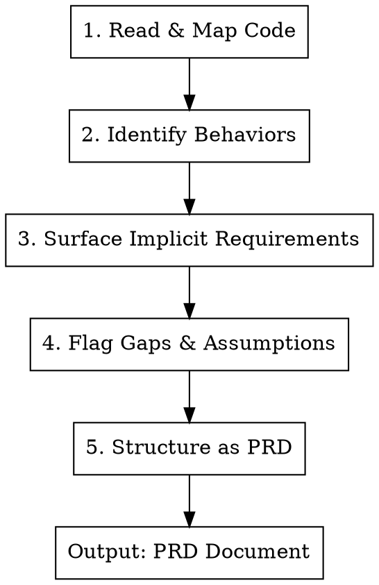

# Reverse PRD: Code → Requirements

## Overview

Extract implicit requirements from existing code into explicit, structured PRDs. Surfaces what the code actually does (vs. what someone might assume), documents edge cases, and produces specs ready for the SK-PRD-to-UX pipeline.

**Core principle:** Code is the truth, but it's not documentation. Extract the "what and why" buried in implementation details.

## When to Use

- Documenting an undocumented feature
- Onboarding to unfamiliar codebase
- Preparing for a refactor or rewrite
- Creating specs before adding to a feature
- Auditing what a feature actually does vs. what people think it does
- Handoff documentation for another developer

**Not for:** New features (use SK-PRD-Lite). Not for UX analysis (use SK-UX-Audit).

## Input

Provide one or more of:

| Source | What to Provide | Extracts |
|--------|-----------------|----------|
| **Code files** | File paths or code blocks | Logic, states, data flow |
| **Database schema** | Table definitions | Data model, constraints |
| **API endpoints** | Route definitions | Inputs, outputs, errors |
| **UI components** | Component files | User-facing behavior |
| **Tests** | Test files | Expected behaviors, edge cases |

**Best results:** Provide code + tests + any existing docs (even outdated).

## Output Location

**Write the PRD to a file in the project docs directory or feature folder.**

Naming convention:
- `{feature-name}-PRD.md`
- `docs/{feature-name}-PRD.md`
- `{feature-folder}/PRD.md`

**Do not output to conversation.** Write to file so it persists and chains to other skills.

## The Extraction Process



---

### Step 1: Read & Map Code

**Goal:** Understand the code structure before extracting requirements.

**Actions:**
1. Identify entry points (routes, exports, event handlers)
2. Trace data flow (input → processing → output)
3. Map dependencies (what this code calls/uses)
4. Note file organization (how code is structured)

**Document:**
```markdown
## Code Map

**Entry points:**
- [File:function] - [What triggers it]

**Data flow:**
[Input] → [Processing steps] → [Output]

**Key dependencies:**
- [Dependency]: [What it's used for]

**File structure:**
- [File]: [Purpose]
```

---

### Step 2: Identify Behaviors

**Goal:** Extract what the code actually does (not what you assume).

**For each behavior, document:**
- Trigger (what initiates it)
- Action (what happens)
- Result (what changes)
- Conditions (when it applies)

**Document:**
```markdown
## Behaviors

### [Behavior Name]
- **Trigger:** [What starts this]
- **Action:** [What the code does]
- **Result:** [What changes - UI, data, state]
- **Conditions:** [When this applies vs. doesn't]
```

**Watch for:**
- Conditional branches (if/else, switch)
- Early returns (guard clauses reveal constraints)
- Error handling (what can go wrong)
- Default values (implicit decisions)

---

### Step 3: Surface Implicit Requirements

**Goal:** Make hidden requirements explicit.

**Look for:**

| Code Pattern | Implicit Requirement |
|--------------|---------------------|
| Validation logic | Input constraints |
| Default values | Business decisions |
| Error messages | Failure modes |
| Conditional rendering | State-dependent UI |
| Permission checks | Access control rules |
| Timeouts/retries | Reliability requirements |
| Caching | Performance requirements |
| Logging | Audit/debugging needs |

**Document:**
```markdown
## Implicit Requirements

| Found In | Code Pattern | Implicit Requirement |
|----------|--------------|---------------------|
| [File:line] | [Pattern] | [Requirement] |

### Business Rules (extracted from code)
- [Rule 1]: Found in [location]
- [Rule 2]: Found in [location]

### Constraints (validation, limits)
- [Constraint]: [Value/logic]

### Assumptions (coded but undocumented)
- [Assumption]: [Evidence in code]
```

---

### Step 4: Flag Gaps & Assumptions

**Goal:** Identify what's unclear or potentially wrong.

**Flag these:**

| Gap Type | What to Flag |
|----------|--------------|
| **Missing error handling** | Code paths with no error case |
| **Unclear business logic** | Magic numbers, unexplained conditions |
| **Inconsistencies** | Different behavior for similar cases |
| **Dead code** | Unreachable or unused paths |
| **TODO/FIXME comments** | Acknowledged tech debt |
| **Outdated comments** | Comments that don't match code |

**Document:**
```markdown
## Gaps & Uncertainties

### Needs Clarification
| Item | Question | Location |
|------|----------|----------|
| [What] | [Question to answer] | [File:line] |

### Potential Issues
- [Issue]: [Why it might be wrong]

### Tech Debt Found
- [Debt item]: [Impact]

### Assumptions Made (verify these)
- [Assumption]: [Why I assumed this]
```

---

### Step 5: Structure as PRD

**Goal:** Output in standard PRD format for compatibility with SK-PRD-to-UX.

Use this structure (matches SK-PRD-Lite output):

```markdown
# PRD: [Feature Name]

**Status:** Extracted from existing code
**Date:** [Date]
**Source:** [Files analyzed]

## 1. Problem Statement

> [User] needs to [do X] because [reason].

*Inferred from: [What code evidence supports this]*

## 2. Current Solution

**What exists:** [Summary of implemented behavior]

**How it works:**
1. [Step 1]
2. [Step 2]
3. [Step 3]

## 3. Target User

- **Role:** [Who uses this]
- **Context:** [When/why they use it]
- **Skill level:** [Inferred from UI complexity]

## 4. Core Use Case (as implemented)

**Start condition:** [What triggers the flow]

**Steps:**
1. [User action] → [System response]
2. [User action] → [System response]
3. ...

**End condition:** [What indicates success]

## 5. Functional Requirements (extracted)

| ID | Requirement | Source | Confidence |
|----|-------------|--------|------------|
| F1 | [Requirement] | [File:line] | High/Med/Low |
| F2 | [Requirement] | [File:line] | High/Med/Low |

## 6. Business Rules (extracted)

| Rule | Implementation | Notes |
|------|----------------|-------|
| [Rule] | [How it's coded] | [Edge cases] |

## 7. Data & State

### Inputs
- [Input]: [Type, validation, source]

### Processing
- [Transform/calculation]: [Logic]

### Outputs
- [Output]: [Format, destination]

### State Management
- [State]: [Where stored, how updated]

## 8. Error Handling (as implemented)

| Error Case | Current Handling | Adequate? |
|------------|------------------|-----------|
| [Case] | [What happens] | Yes/No |

## 9. Gaps & Recommendations

### Missing or Unclear
- [Gap]: [Recommendation]

### Potential Improvements
- [Improvement]: [Rationale]

### Questions for Stakeholders
- [Question]: [Why it matters]
```

---

## Confidence Levels

Rate extracted requirements:

| Level | Meaning | Action |
|-------|---------|--------|
| **High** | Clear from code, tested, consistent | Trust it |
| **Medium** | Implied but not explicit, some ambiguity | Verify with stakeholder |
| **Low** | Inferred, could be wrong, needs validation | Flag for review |

---

## Red Flags During Extraction

| Red Flag | What It Means |
|----------|---------------|
| No tests for a behavior | Requirement may be accidental |
| Commented-out code | Feature may be deprecated |
| Multiple ways to do same thing | Inconsistent requirements |
| Error messages don't match code | Documentation drift |
| Complex conditionals | Hidden business rules |
| Hardcoded values | Undocumented constraints |

---

## Output Template

```markdown
# PRD: [Feature Name]

**Status:** Extracted from existing code
**Date:** [Date]
**Source:** [Files analyzed]
**Confidence:** [Overall High/Medium/Low]

## 1. Problem Statement
[Inferred problem]

## 2. Current Solution
[What the code does]

## 3. Target User
[Inferred user]

## 4. Core Use Case
[Step-by-step flow]

## 5. Functional Requirements
[Table of requirements]

## 6. Business Rules
[Extracted rules]

## 7. Data & State
[Data flow]

## 8. Error Handling
[Current error cases]

## 9. Gaps & Recommendations
[What's missing or unclear]

---

## Appendix: Code References
[File:line references for traceability]
```

---

## Chaining with Other Skills

After extracting a PRD:

1. **Validate UX:** SK-UX-Audit to evaluate current implementation
2. **Redesign:** SK-PRD-to-UX if improvements needed
3. **Rebuild:** SK-UX-to-Prompt for implementation prompts
4. **Document:** Use PRD as living documentation

## Tips for Better Extraction

- **Read tests first** - They often document intent better than code
- **Check git history** - Commit messages explain "why"
- **Look for comments** - Even outdated ones hint at original intent
- **Trace from UI** - User-facing behavior grounds the extraction
- **Note what's NOT there** - Missing validation, error handling = implicit assumptions
- **Ask "what if"** - Edge cases reveal hidden requirements
