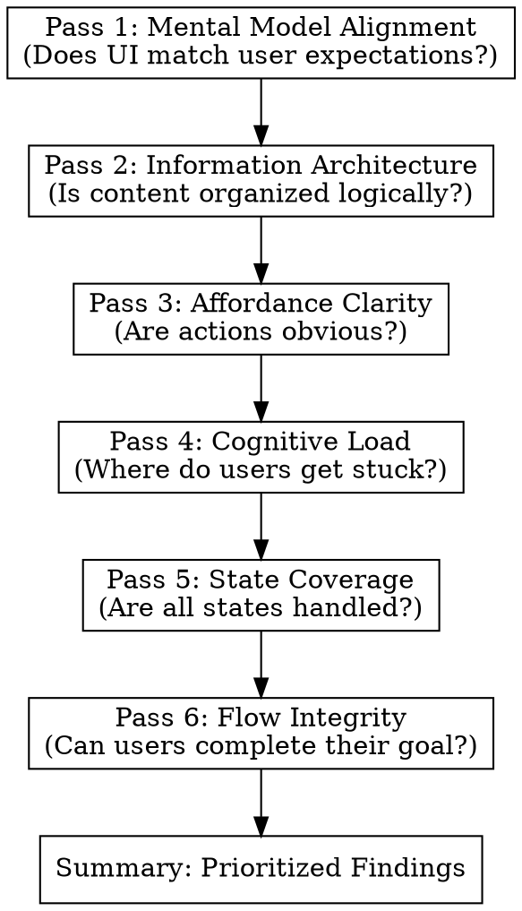

# UX Audit for Existing Projects

## Overview

Evaluate existing UI implementations against UX foundations using **6 diagnostic passes**. Each pass identifies gaps between current state and UX best practices, producing actionable improvement recommendations.

**Core principle:** Don't assume existing UI is "fine because it works." Surface hidden UX debt before it compounds.

## When to Use

- Evaluating an existing feature for UX issues
- Planning a redesign or improvement sprint
- Onboarding to an unfamiliar codebase's UI
- Preparing for user testing (know what to watch for)
- Prioritizing UX debt alongside tech debt

**Not for:** Building new features from scratch (use SK-PRD-to-UX instead).

## Input Sources

The audit can work from any of these:

| Source | How to Provide | Best For |
|--------|----------------|----------|
| **Live app** | URL or localhost | Full interaction analysis |
| **Screenshots** | Image files | Static layout analysis |
| **Codebase** | File paths | Component/state analysis |
| **User flows** | Description or recording | Journey analysis |

Combine sources for deeper analysis. Code + screenshots catches more than either alone.

## Output Location

**Write the audit to a file in the project directory.**

Naming convention:
- Feature audit: `{feature-name}-ux-audit.md`
- Full app audit: `UX-audit.md`
- Page audit: `{page-name}-ux-audit.md`

**Do not output to conversation.** Write to file so findings persist and can be tracked.

## The 6 Diagnostic Passes

Execute IN ORDER. Each pass produces findings before the next begins.



---

### Pass 1: Mental Model Alignment

**Diagnostic question:** "Does the UI match what users expect?"

**Evaluate:**
- What does the UI suggest this feature does?
- What does it actually do?
- Where might users have wrong assumptions?
- Does terminology match user language or internal jargon?

**Required output:**
```markdown
## Pass 1: Mental Model Alignment

**What UI suggests:** [What a new user would assume]

**What it actually does:** [Actual behavior]

**Misalignment gaps:**
| UI Element | User Expects | Actually Does | Severity |
|------------|--------------|---------------|----------|
| [Element] | [Expectation] | [Reality] | High/Med/Low |

**Jargon found:** [Terms that need user-friendly alternatives]
```

---

### Pass 2: Information Architecture

**Diagnostic question:** "Is content organized the way users think?"

**Evaluate:**
- How is information grouped?
- Does grouping match user mental categories?
- What's hidden that should be visible?
- What's prominent that should be secondary?

**Required output:**
```markdown
## Pass 2: Information Architecture

**Current structure:**
- [Group 1]: [Items]
- [Group 2]: [Items]

**IA issues:**
| Issue | Location | Problem | Recommendation |
|-------|----------|---------|----------------|
| [Type] | [Where] | [What's wrong] | [Fix] |

**Visibility problems:**
- Hidden but should be visible: [List]
- Prominent but should be secondary: [List]
```

---

### Pass 3: Affordance Clarity

**Diagnostic question:** "Can users tell what's interactive?"

**Evaluate:**
- Are clickable elements obviously clickable?
- Are non-interactive elements mistaken for buttons?
- Do inputs look editable?
- Is the difference between states visually clear?

**Required output:**
```markdown
## Pass 3: Affordance Clarity

**Affordance audit:**
| Element | Looks Like | Actually Is | Clear? |
|---------|------------|-------------|--------|
| [Element] | [Appearance] | [Function] | Yes/No |

**False affordances:** [Things that look interactive but aren't]

**Hidden affordances:** [Interactive things that don't look it]

**Recommended fixes:**
- [Fix 1]
- [Fix 2]
```

---

### Pass 4: Cognitive Load

**Diagnostic question:** "Where will users hesitate or abandon?"

**Evaluate:**
- How many decisions per screen?
- Are there smart defaults?
- What requires explanation vs. is self-evident?
- Where is unnecessary complexity exposed?

**Required output:**
```markdown
## Pass 4: Cognitive Load

**Decision points:**
| Screen/Step | Decisions Required | Can Be Reduced? |
|-------------|-------------------|-----------------|
| [Location] | [Count & type] | [How] |

**Missing defaults:**
- [Field/option that should have a default]

**Unnecessary complexity:**
| Complexity | Who Needs It | Recommendation |
|------------|--------------|----------------|
| [What] | [Power users only?] | [Hide/simplify/remove] |

**Cognitive load score:** [High/Medium/Low] - [Justification]
```

---

### Pass 5: State Coverage

**Diagnostic question:** "Are all states handled gracefully?"

**Evaluate for each major component:**
- Empty state
- Loading state
- Success state
- Partial/incomplete state
- Error state
- Edge cases (permissions, offline, etc.)

**Required output:**
```markdown
## Pass 5: State Coverage

### [Component/Screen]

| State | Implemented? | Quality | Issue |
|-------|--------------|---------|-------|
| Empty | Yes/No | Good/Poor/Missing | [Problem if any] |
| Loading | Yes/No | Good/Poor/Missing | [Problem if any] |
| Success | Yes/No | Good/Poor/Missing | [Problem if any] |
| Partial | Yes/No | Good/Poor/Missing | [Problem if any] |
| Error | Yes/No | Good/Poor/Missing | [Problem if any] |

**Dead ends found:** [States where user is stuck with no guidance]

**Missing error handling:** [Failures that show nothing or crash]
```

---

### Pass 6: Flow Integrity

**Diagnostic question:** "Can users actually complete their goal?"

**Evaluate:**
- Walk through the primary use case
- Note every friction point
- Identify abandonment risks
- Check recovery paths (back, undo, cancel)

**Required output:**
```markdown
## Pass 6: Flow Integrity

**Primary flow tested:** [Description]

**Step-by-step findings:**
| Step | Action | Friction | Severity |
|------|--------|----------|----------|
| 1 | [What user does] | [Issue or "None"] | High/Med/Low/None |
| 2 | ... | ... | ... |

**Abandonment risks:**
- [Where users might give up and why]

**Recovery gaps:**
- Missing back/undo: [Where]
- No cancel option: [Where]
- Destructive with no confirm: [Where]

**Flow verdict:** [Completable / Completable with friction / Broken]
```

---

## Summary: Prioritized Findings

After all passes, synthesize findings:

```markdown
## UX Audit Summary

**Overall UX health:** [Good / Needs Work / Critical Issues]

### Critical (Fix immediately)
| Finding | Pass | Impact | Effort |
|---------|------|--------|--------|
| [Issue] | [#] | [User impact] | [Dev effort] |

### High Priority (Fix soon)
| Finding | Pass | Impact | Effort |
|---------|------|--------|--------|

### Medium Priority (Plan for)
| Finding | Pass | Impact | Effort |
|---------|------|--------|--------|

### Low Priority (Nice to have)
| Finding | Pass | Impact | Effort |
|---------|------|--------|--------|

### Quick Wins (High impact, low effort)
- [Issue]: [1-line fix description]

### Recommendations
1. [Top recommendation]
2. [Second recommendation]
3. [Third recommendation]
```

## Severity Guide

| Severity | Definition | Examples |
|----------|------------|----------|
| **Critical** | Users cannot complete core task | Broken flow, crash, data loss |
| **High** | Users struggle significantly | Confusing IA, missing states, unclear affordances |
| **Medium** | Users experience friction | Extra clicks, unclear labels, missing defaults |
| **Low** | Minor polish issues | Inconsistent spacing, suboptimal wording |

## Red Flags - Common Issues to Watch For

| Red Flag | Usually Found In | Pass |
|----------|------------------|------|
| "What does this button do?" | Screenshots, testing | Pass 3 |
| Technical terms in UI | Copy, labels | Pass 1 |
| 5+ decisions on one screen | Complex forms | Pass 4 |
| Blank screen with no guidance | Empty states | Pass 5 |
| No way to go back | Multi-step flows | Pass 6 |
| Error shows "Something went wrong" | Error states | Pass 5 |
| User asks "did it work?" | Success states | Pass 5 |

## Output Template

```markdown
# UX Audit: [Feature/App Name]

**Date:** [Date]
**Auditor:** Claude
**Sources:** [What was analyzed]

## Pass 1: Mental Model Alignment
[Required content]

## Pass 2: Information Architecture
[Required content]

## Pass 3: Affordance Clarity
[Required content]

## Pass 4: Cognitive Load
[Required content]

## Pass 5: State Coverage
[Required content]

## Pass 6: Flow Integrity
[Required content]

---

## Summary
[Prioritized findings and recommendations]
```

## Chaining with Other Skills

After completing an audit:

1. **For redesign:** Use findings to write a PRD → SK-PRD-to-UX → SK-UX-to-Prompt
2. **For incremental fixes:** Create focused PRDs for each Critical/High issue
3. **For documentation:** Findings become input for design system updates

## Tips for Better Audits

- **Audit as a new user** - Pretend you've never seen this UI
- **Say what you see** - Describe before judging
- **Check real data** - Empty states and edge cases hide issues
- **Test the sad path** - Errors and failures reveal more than success
- **Question "obvious" things** - Obvious to devs ≠ obvious to users
