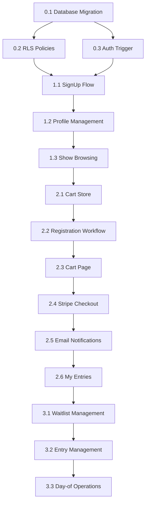

2.# Online Entry System - Implementation Plan

**Status:** Draft
**Created:** 2026-01-14
**Architecture:** [ONLINE-ENTRY-SYSTEM.md](./ONLINE-ENTRY-SYSTEM.md)
**Reference Implementation:** myK9Qv3 (`D:/AI-Projects/myK9Qv3`)

---

## Overview

This document provides step-by-step implementation tasks for building the Online Entry System. It references the architecture document for design decisions and myK9Qv3 for proven patterns.

### Key Reference Patterns from myK9Qv3

| Pattern | myK9Qv3 Location | Purpose |
|---------|------------------|---------|
| Entry data model | `src/stores/entryStore.ts` | Unified status field, visibility flags |
| Entry list hooks | `src/pages/EntryList/hooks/` | Data fetching, filtering, actions, drag-drop |
| Class management | `src/pages/ClassList/hooks/` | Class data, status transitions |
| Offline-first | `src/services/replication/` | IndexedDB + Supabase sync |
| Scoring flow | `src/stores/scoringStore.ts` | Session management, score submission |
| Timer component | `src/components/scoring/Timer.tsx` | Multi-area timers |

---

## Phase 0: Prep Work (Foundation)

### 0.1 Database Migration - New Tables

**Goal:** Create all tables needed for online entry system.

**File:** `supabase/migrations/009_online_entry_system.sql`

#### Tasks

- [x] **0.1.1** Create `exhibitor_profiles` table
  ```sql
  -- Links auth users to people with subscription info
  -- See ONLINE-ENTRY-SYSTEM.md for full schema
  ```
  - References: `people(id)`, `stripe_customers(stripe_customer_id)`
  - Indexes: auth_user_id (unique), person_id, stripe_customer_id

- [x] **0.1.2** Create `entry_carts` table
  ```sql
  -- Shopping cart with 30-minute expiration
  -- See ONLINE-ENTRY-SYSTEM.md for full schema
  ```
  - References: `exhibitor_profiles(id)`, `shows(id)`
  - Indexes: exhibitor_id, show_id, status, expires_at

- [x] **0.1.3** Create `entry_cart_items` table
  ```sql
  -- Individual entries within a cart
  -- See ONLINE-ENTRY-SYSTEM.md for full schema
  ```
  - References: `entry_carts(id)`, `dogs(id)`, `classes(id)`, `people(id)`
  - Unique constraint: (cart_id, dog_id, class_id) - prevent duplicates

- [x] **0.1.4** Create `waitlist_entries` table
  ```sql
  -- Waitlist positions with offer tracking
  -- See ONLINE-ENTRY-SYSTEM.md for full schema
  ```
  - References: `classes(id)`, `exhibitor_profiles(id)`, `dogs(id)`
  - Partial unique index: (class_id, position) WHERE status = 'waiting'

- [x] **0.1.5** Create `public.has_role()` helper function
  ```sql
  -- Efficient role checking for RLS policies
  -- Note: Uses public schema (auth schema is protected in Supabase)
  ```
  - SECURITY DEFINER for performance
  - Handles club_id scoping and expiration

- [x] **0.1.6** Create `check_class_availability()` function
  ```sql
  -- Returns available spots and waitlist position
  -- See ONLINE-ENTRY-SYSTEM.md for implementation
  ```

- [x] **0.1.7** Create `add_to_waitlist()` function
  ```sql
  -- Thread-safe waitlist position assignment
  -- Uses advisory lock to prevent race conditions
  ```

- [x] **0.1.8** Add updated_at triggers for new tables

**Acceptance Criteria:**
- [x] Migration runs without errors locally
- [x] All foreign keys valid
- [x] Indexes created
- [x] Functions callable from SQL

---

### 0.2 Database Migration - RLS Policies

**Goal:** Add row-level security for exhibitor access.

**File:** `supabase/migrations/009_online_entry_system.sql` (continued)

#### Tasks

- [x] **0.2.1** Add RLS policy: `exhibitor_profiles_own` (SELECT/UPDATE own profile)
  ```sql
  CREATE POLICY "users_manage_own_profile" ON exhibitor_profiles
    FOR ALL USING (auth_user_id = auth.uid());
  ```

- [x] **0.2.2** Add RLS policy: `entry_carts_own` (SELECT/INSERT/UPDATE/DELETE own carts)

- [x] **0.2.3** Add RLS policy: `entry_cart_items_own` (via cart ownership)

- [x] **0.2.4** Add RLS policy: `waitlist_entries_own` (SELECT/INSERT own, DELETE before offer)

- [x] **0.2.5** Add RLS policy: `shows_public_read` (exhibitors see published shows)
  ```sql
  CREATE POLICY "exhibitors_see_published_shows" ON shows
    FOR SELECT USING (
      status IN ('published', 'accepting_entries', 'closed', 'in_progress', 'completed')
      OR has_role('club_admin', club_id)
      OR has_role('trial_secretary', club_id)
      OR has_role('platform_admin')
    );
  ```

- [x] **0.2.6** Add RLS policy: `classes_public_read` (via show visibility)

- [x] **0.2.7** Add RLS policy: `entries_exhibitor_read` (own entries only)

- [x] **0.2.8** Add RLS policy: `entries_exhibitor_update` (own entries before close)

**Acceptance Criteria:**
- [ ] Exhibitor can only see/edit own data
- [ ] Exhibitor can see published shows from any club
- [ ] Exhibitor cannot see draft shows
- [ ] Club admin can see all their club's shows
- [ ] Test with different user roles

---

### 0.3 Auth Trigger - Person Record Creation

**Goal:** Automatically create person record when user signs up.

**File:** `supabase/migrations/009_online_entry_system.sql` (continued)

#### Tasks

- [x] **0.3.1** Create `handle_new_user()` trigger function
  ```sql
  CREATE OR REPLACE FUNCTION public.handle_new_user()
  RETURNS TRIGGER AS $$
  DECLARE
    new_person_id UUID;
  BEGIN
    -- Create person record from auth metadata
    INSERT INTO people (
      first_name,
      last_name,
      email,
      auth_user_id
    ) VALUES (
      COALESCE(NEW.raw_user_meta_data->>'first_name', 'Unknown'),
      COALESCE(NEW.raw_user_meta_data->>'last_name', 'User'),
      NEW.email,
      NEW.id
    )
    RETURNING id INTO new_person_id;

    -- Create exhibitor profile
    INSERT INTO exhibitor_profiles (
      person_id,
      auth_user_id
    ) VALUES (
      new_person_id,
      NEW.id
    );

    -- Assign exhibitor role
    INSERT INTO user_roles (user_id, role_id)
    SELECT new_person_id, r.id
    FROM roles r WHERE r.name = 'exhibitor';

    RETURN NEW;
  END;
  $$ LANGUAGE plpgsql SECURITY DEFINER;
  ```

- [x] **0.3.2** Create trigger on auth.users
  ```sql
  CREATE TRIGGER on_auth_user_created
    AFTER INSERT ON auth.users
    FOR EACH ROW EXECUTE FUNCTION public.handle_new_user();
  ```

- [x] **0.3.3** Add `auth_user_id` column to `people` table if not exists
  ```sql
  ALTER TABLE people ADD COLUMN IF NOT EXISTS auth_user_id UUID UNIQUE;
  ```

**Acceptance Criteria:**
- [ ] New signup creates person record
- [ ] New signup creates exhibitor_profile
- [ ] New signup assigns exhibitor role
- [ ] Email stored in person record
- [ ] Names from signup form stored correctly

---

### 0.4 Review Existing Stripe Functions

**Goal:** Verify existing Stripe Edge Functions work for entry flow.

**Files:**
- `apps/myk9show/supabase/functions/stripe-checkout/index.ts`
- `apps/myk9show/supabase/functions/stripe-webhook/index.ts`

#### Tasks

- [x] **0.4.1** Review `stripe-checkout` function
  - ~~Does it accept cart metadata?~~ **Fixed:** Now accepts `mode: 'entry'` with `cart_id`
  - ~~Does it calculate platform fee?~~ **Fixed:** Calculates 3% platform fee
  - ~~Does it support line items for multiple entries?~~ **Fixed:** Builds line items from `entry_cart_items`

- [x] **0.4.2** Review `stripe-webhook` function
  - ~~Does it handle `checkout.session.completed`?~~ **Fixed:** Routes by `metadata.type`
  - ~~Does it create entries from cart?~~ **Fixed:** `handleEntryPaymentCompleted()`
  - ~~Does it update `stripe_orders` table?~~ **Fixed:** Creates record with correct schema
  - [ ] Does it queue confirmation email? **TODO:** Needs `send-email` function (Phase 2.5)

- [x] **0.4.3** Document required updates (if any)
  - **Critical Issue Found:** Schema mismatch - functions used wrong column names
  - Functions completely rewritten to match migration 005/009 schema
  - Added subscription tier sync to `exhibitor_profiles`

- [x] **0.4.4** Update `stripe-checkout` for entry carts
  ```typescript
  // ✅ Accepts mode: 'entry' with cart_id
  // ✅ Validates cart ownership via auth_user_id
  // ✅ Checks cart expiration
  // ✅ Builds line items from entry_cart_items
  // ✅ Adds 3% platform fee as separate line item
  // ✅ Sets stripe_checkout_session_id on cart
  // ✅ Syncs stripe_customer_id to exhibitor_profiles
  ```

- [x] **0.4.5** Update `stripe-webhook` for entry creation
  ```typescript
  // ✅ On checkout.session.completed (type: 'entry'):
  // ✅ 1. Get cart from metadata
  // ✅ 2. Create entries from cart items (status: 'paid')
  // ✅ 3. Update cart status to 'submitted'
  // ✅ 4. Create stripe_orders record
  // ⏳ 5. Queue confirmation email (Phase 2.5)
  // Note: Waitlist handling deferred - entries created directly
  ```

**Acceptance Criteria:**
- [x] Stripe checkout creates session with cart metadata
- [x] Webhook creates entries on successful payment
- [ ] Full classes result in waitlist entries (deferred to Phase 3.1)
- [ ] Confirmation email queued (deferred to Phase 2.5)

---

### 0.5 Environment Setup

**Goal:** Ensure all required environment variables are configured.

#### Tasks

- [ ] **0.5.1** Add Stripe secrets to Supabase
  ```bash
  supabase secrets set STRIPE_SECRET_KEY=sk_...
  supabase secrets set STRIPE_WEBHOOK_SECRET=whsec_...
  ```

- [ ] **0.5.2** Add Resend API key for emails
  ```bash
  supabase secrets set RESEND_API_KEY=re_...
  ```

- [ ] **0.5.3** Update `.env.example` files with new variables
  ```
  # Entry System
  VITE_STRIPE_PUBLISHABLE_KEY=pk_...
  ```

- [ ] **0.5.4** Configure Stripe webhook endpoint in dashboard
  - URL: `https://sojmvhhwsjxmfistvzbe.supabase.co/functions/v1/stripe-webhook`
  - Events: checkout.session.completed, charge.refunded, customer.subscription.*

**Acceptance Criteria:**
- [ ] Stripe test mode works locally
- [ ] Webhook endpoint receives events
- [ ] Resend can send test emails

---

## Phase 1: Foundation (Exhibitor Registration & Show Browsing)

### 1.1 Update SignUp Flow

**Goal:** Collect required exhibitor info during signup.

**Files:**
- `apps/myk9show/src/pages/SignUpPage.tsx`
- `apps/myk9show/src/services/auth/authService.ts`
- `apps/myk9show/src/hooks/useExhibitorProfile.ts` (new)
- `apps/myk9show/src/components/exhibitor/ExhibitorOnboardingModal.tsx` (new)
- `apps/myk9show/src/components/exhibitor/ExhibitorOnboardingChecker.tsx` (new)

#### Tasks

- [x] **1.1.1** Add required fields to SignUpPage
  - First name (required) ✅
  - Last name (required) ✅
  - Email (required, from Supabase) ✅
  - Confirm password field added ✅
  - Phone deferred to profile page (keeps signup simple)

- [x] **1.1.2** Update `signUp()` to pass metadata
  - Already supported in `useAuth.ts` and `authService.ts`
  - SignUpPage now passes `{ firstName, lastName }` metadata

- [x] **1.1.3** Add post-signup onboarding check
  - Created `useExhibitorProfile` hook
  - Checks for `exhibitor_profiles` record on login
  - Shows modal if profile missing (existing users)

- [x] **1.1.4** Create ExhibitorOnboardingModal component
  - `ExhibitorOnboardingModal.tsx` - Collects missing profile info
  - `ExhibitorOnboardingChecker.tsx` - Wrapper that triggers modal
  - Creates `people` and `exhibitor_profiles` records
  - Assigns `exhibitor` role
  - Integrated into `App.tsx`

**Acceptance Criteria:**
- [x] New users have complete profiles after signup (via auth trigger)
- [x] Existing users prompted to complete profile (via onboarding modal)
- [x] Profile data matches person record

**Reference:** myK9Qv3 doesn't have exhibitor signup (passcode auth), but follow the existing SignUpPage patterns in myK9Show.

---

### 1.2 Exhibitor Profile Management

**Goal:** Allow exhibitors to view and edit their profile.

**Files:**
- `apps/myk9show/src/pages/exhibitor/ExhibitorProfilePage.tsx` (new)
- `apps/myk9show/src/services/exhibitorService.ts` (new)

#### Tasks

- [x] **1.2.1** Create `exhibitorService.ts`
  - `getProfile(authUserId)` - fetch profile with person data
  - `updatePerson(personId, data)` - update personal info
  - `getDogs(personId)` - fetch exhibitor's dogs
  - `createDog(personId, data)` - add new dog
  - `updateDog(dogId, personId, data)` - update dog with ownership check
  - `deleteDog(dogId, personId)` - soft delete (mark deceased)

- [x] **1.2.2** Create ExhibitorProfilePage
  - Personal info section (editable) ✅
  - Dogs section (list with add/edit) ✅
  - Subscription status display ✅
  - Dog form dialog with full details ✅

- [x] **1.2.3** Create DogManagement component
  - Integrated into ExhibitorProfilePage as `DogCard` and `DogFormDialog`
  - List of exhibitor's dogs ✅
  - Add/edit dog form ✅
  - Dog registration numbers (AKC, microchip) ✅

- [x] **1.2.4** Add routes to router
  - `/profile` ✅
  - `/exhibitor/profile` ✅
  - `/exhibitor/account` → profile ✅

- [x] **1.2.5** Add profile link to navigation
  - "My Profile" added to user dropdown menu ✅

**Acceptance Criteria:**
- [x] Exhibitor can view their profile
- [x] Exhibitor can edit personal info
- [x] Exhibitor can add/edit dogs
- [x] Changes persist to database

---

### 1.3 Show Browsing Enhancements

**Goal:** Enhance existing BrowseShowsPage for exhibitor entry flow.

**Files:**
- `apps/myk9show/src/pages/BrowseShowsPage.tsx` (existing)
- `apps/myk9show/src/utils/entryStatusUtils.ts` (new)
- `apps/myk9show/src/components/shows/EntryStatusBadge.tsx` (new)

#### Tasks

- [x] **1.3.1** Add "Entry Status" badge to ShowCard
  - ✅ Created `entryStatusUtils.ts` with status calculation logic
  - ✅ Created `EntryStatusBadge.tsx` component
  - ✅ Integrated into both grid and list views in BrowseShowsPage
  - Status badges: "Accepting Entries" (green), "Closing Soon" (amber), "Entries Closed" (gray), "Entry Submitted" (blue), "Not Yet Open" (muted)

- [ ] **1.3.2** Add availability indicator
  - "X spots available" for classes
  - "Waitlist available" for full classes
  - **Note:** Deferred to Phase 1.4 (ClassAvailability component)

- [x] **1.3.3** Add "Enter Show" button to ShowCard
  - ✅ "Enter Show" button added to grid and list views
  - ✅ Only visible when entries are accepting or closing soon
  - ✅ Only shown to authenticated users
  - Links to `/shows/{showId}/enter`

- [x] **1.3.4** Updated entry status filter
  - ✅ Filter dropdown uses proper entry status calculation
  - ✅ Filter options: Open, Closing Soon, Closed
  - **Note:** "My Entries" tab already exists in tab system

- [ ] **1.3.5** Ensure RLS filters apply
  - Exhibitors only see published+ shows
  - Draft shows hidden from exhibitors
  - **Testing task** - requires manual verification

**Acceptance Criteria:**
- [x] Exhibitors see clear entry status
- [x] "Enter Show" button works
- [x] Entry status filter works correctly
- [ ] Own entries easily accessible (tab exists)
- [ ] Draft shows not visible (RLS testing)

**Reference:** myK9Qv3 `ClassList.tsx` for status badges and filtering patterns.

---

### 1.4 Show Detail Page Updates

**Goal:** Show class availability and entry options.

**Files:**
- `apps/myk9show/src/pages/ShowDetailsPage.tsx` (existing)
- `apps/myk9show/src/components/shows/ShowDetails/ShowDetailsEnhancedApple.tsx` (existing)
- `apps/myk9show/src/components/shows/ClassAvailability.tsx` (new) ✅
- `apps/myk9show/src/hooks/useClassAvailability.ts` (new) ✅

#### Tasks

- [x] **1.4.1** Create ClassAvailability component
  - ✅ Created `useClassAvailability.ts` hook to fetch class data with entry counts
  - ✅ Created `ClassAvailability.tsx` component showing spots available per class
  - ✅ Groups classes by trial with date display
  - ✅ Shows availability badges (spots available, closing soon, full, waitlist)
  - ✅ Supports compact mode for smaller displays

- [x] **1.4.2** Add class list with availability to ShowDetailPage
  - ✅ Added "Classes" tab to ShowDetailsEnhancedApple
  - ✅ Shows class availability with "Enter" buttons
  - ✅ Grouped by trial/day

- [x] **1.4.3** Add "Enter This Show" CTA button
  - ✅ Prominent "Enter Show" button in header (with Ticket icon)
  - ✅ Disabled with status text when entries closed/not open
  - ✅ Also available in Classes tab and Registration tab

- [x] **1.4.4** Show entry deadline prominently
  - ✅ Countdown badge in header when entries are open
  - ✅ Urgent styling (amber) when < 3 days or < 24 hours remaining
  - ✅ Countdown text: "X days left", "X hours left", "Closes tomorrow"
  - ✅ Urgent banner in Registration tab with call-to-action
  - ✅ EntryStatusBadge in header shows overall entry status

**Acceptance Criteria:**
- [x] Class availability visible
- [x] Entry deadline clear with countdown
- [x] Easy path to entry flow

---

### 1.5 Phase 1 Unit Tests

**Goal:** Create unit tests for Phase 1 components and utilities.

**Files:**
- `apps/myk9show/src/test/utils/entryStatusUtils.test.ts` (new)
- `apps/myk9show/src/test/components/shows/EntryStatusBadge.test.tsx` (new)
- `apps/myk9show/src/test/hooks/useClassAvailability.test.ts` (new)
- `apps/myk9show/src/test/hooks/useExhibitorProfile.test.ts` (new)

#### Tasks

- [x] **1.5.1** Unit tests for `entryStatusUtils.ts`
  - ✅ Test `getEntryStatus()` returns correct status for all date scenarios (24 tests)
  - ✅ Test `getEntryStatusBadgeStyle()` for all status types
  - ✅ Test `userHasEntriesForShow()` with various entry formats
  - ✅ Test edge cases: same-day open/close, past dates, future dates

- [x] **1.5.2** Unit tests for `EntryStatusBadge.tsx`
  - ✅ Test renders correct badge variant for each status (17 tests)
  - ✅ Test size prop renders correct classes
  - ✅ Test with mock show data for all status types
  - ✅ Test icon display and custom className

- [x] **1.5.3** Unit tests for `useClassAvailability.ts`
  - ✅ Mock Supabase client (12 tests)
  - ✅ Test loading state
  - ✅ Test successful data fetch and transformation
  - ✅ Test computed values (totalSpotsAvailable, fullClasses)
  - ✅ Test refetch functionality and showId changes

- [x] **1.5.4** Unit tests for `useExhibitorProfile.ts`
  - ✅ Mock Supabase client and auth context (14 tests)
  - ✅ Test profile loading states
  - ✅ Test `needsOnboarding` logic
  - ✅ Test profile not found scenario
  - ✅ Test hook interface shape and types

**Acceptance Criteria:**
- [x] All utility functions tested (67 tests total)
- [x] Hooks tested with mocked dependencies
- [x] Tests pass in CI (`pnpm test`)

---

## Phase 2: Entry Flow (Cart, Checkout, Confirmation)

### 2.1 Entry Cart State Management

**Goal:** Implement cart state with Zustand (following myK9Qv3 patterns).

**Files:**
- `apps/myk9show/src/stores/cartStore.ts` (new)

#### Tasks

- [x] **2.1.1** Create cartStore with Zustand
  ```typescript
  // Following myK9Qv3 entryStore pattern
  interface CartState {
    cart: EntryCart | null;
    items: EntryCartItem[];
    isLoading: boolean;
    error: string | null;

    // Actions
    loadCart: (showId: string) => Promise<void>;
    addItem: (item: NewCartItem) => Promise<void>;
    removeItem: (itemId: string) => Promise<void>;
    updateItem: (itemId: string, updates: Partial<EntryCartItem>) => Promise<void>;
    clearCart: () => Promise<void>;

    // Computed
    totalEntryFees: number;
    platformFee: number;
    totalAmount: number;
    itemCount: number;
  }
  ```
  **Implemented:** `apps/myk9show/src/stores/cartStore.ts`

- [x] **2.1.2** Add persistence with localStorage backup
  ```typescript
  // Persist cart ID for recovery
  // Handle cart expiration (30 min)
  ```
  **Implemented:** Zustand persist middleware with `myk9-cart-storage` key

- [x] **2.1.3** Add real-time availability checks
  ```typescript
  // Before adding item, check class availability
  // Show warning if class nearly full
  // Block if class full (offer waitlist)
  ```
  **Implemented:** `apps/myk9show/src/hooks/useCartAvailability.ts`

- [x] **2.1.4** Implement cart expiration handling
  ```typescript
  // Track expires_at
  // Show countdown when < 5 min
  // Prompt to extend or checkout
  ```
  **Implemented:** `apps/myk9show/src/hooks/useCartExpirationTimer.ts`

**Acceptance Criteria:**
- [x] Cart persists across page refreshes (localStorage backup)
- [x] Items validated against availability (useCartAvailability hook)
- [x] Expiration clearly shown (useCartExpirationTimer hook)
- [x] Total calculated correctly (cartStore computed getters)

**Reference:** myK9Qv3 `entryStore.ts` for Zustand patterns, `scoringStore.ts` for persistence.

---

### 2.2 Update RegistrationWorkflow for Cart

**Goal:** Connect existing RegistrationWorkflow to cart system.

**Files:**
- `apps/myk9show/src/components/shows/RegistrationWorkflow/RegistrationWorkflow.tsx`
- `apps/myk9show/src/components/shows/RegistrationWorkflow/ClassSelectionStep.tsx`

#### Tasks

- [x] **2.2.1** Update ClassSelectionStep to show availability
  ```typescript
  // For each class, show:
  // - Entry limit
  // - Current entries
  // - Spots available
  // - Waitlist count (if full)
  ```
  **Implemented:** Uses `useClassAvailability` hook, shows badges with spots/limit

- [x] **2.2.2** Add "Add to Cart" instead of immediate entry
  ```typescript
  // Don't create entry on selection
  // Add to cart instead
  // Show cart summary in sidebar
  ```
  **Implemented:** `ClassSelectionStep.tsx` now uses `cartStore` for selections with real-time sync

- [x] **2.2.3** Add cart preview panel
  - Shows items being added
  - Running total
  - "Continue Shopping" / "Checkout" buttons
  **Implemented:** `apps/myk9show/src/components/cart/CartPreviewPanel.tsx`

- [x] **2.2.4** Handle full classes
  ```typescript
  // If class full, show options:
  // 1. "Join Waitlist" (free, no payment)
  // 2. "Choose Different Class"
  ```
  **Implemented:** Full classes disabled with "Join Waitlist" button

- [x] **2.2.5** Validate entry eligibility
  ```typescript
  // Check dog meets class requirements:
  // - Breed restrictions
  // - Height requirements
  // - Title requirements
  // - Handler requirements
  ```
  **Implemented:** `apps/myk9show/src/hooks/useEntryEligibility.ts` validates breed, height, title, age, registration

**Acceptance Criteria:**
- [x] Availability visible during selection
- [x] Items added to cart, not database
- [x] Full classes offer waitlist
- [x] Eligibility enforced

**Reference:** myK9Qv3 `useEntryListFilters.ts` for filtering patterns.

---

### 2.3 Cart Review Page

**Goal:** Allow exhibitors to review cart before checkout.

**Files:**
- `apps/myk9show/src/pages/CartPage.tsx` (new) ✅
- `apps/myk9show/src/components/cart/CartItemCard.tsx` (new) ✅
- `apps/myk9show/src/components/cart/CartSummary.tsx` (new) ✅

#### Tasks

- [x] **2.3.1** Create CartPage
  - List all cart items ✅
  - Edit/remove items ✅
  - Show totals breakdown ✅
  - Checkout button ✅

- [x] **2.3.2** Create CartItemCard
  ```typescript
  // Shows:
  // - Dog name + breed ✅
  // - Class name + level ✅
  // - Handler (if different from owner) ✅
  // - Entry fee ✅
  // - Remove button ✅
  ```

- [x] **2.3.3** Create CartSummary
  ```typescript
  // Shows:
  // - Subtotal (entry fees) ✅
  // - Platform fee ($X × N entries) ✅
  // - Total ✅
  // - Expiration countdown ✅
  ```

- [x] **2.3.4** Add route `/cart` to router

- [x] **2.3.5** Add cart icon to header with item count

**Acceptance Criteria:**
- [x] All cart items visible
- [x] Can remove items
- [x] Totals accurate
- [x] Clear path to checkout

---

### 2.4 Stripe Checkout Integration

**Goal:** Connect Cart to Stripe Checkout.

**Files:**
- `apps/myk9show/src/lib/stripe.ts` ✅
- `apps/myk9show/src/pages/CartPage.tsx` ✅
- `apps/myk9show/src/pages/CheckoutSuccessPage.tsx` (new) ✅
- `apps/myk9show/src/pages/CheckoutCancelPage.tsx` (new) ✅

#### Tasks

- [x] **2.4.1** Update CartPage to trigger Stripe Checkout
  ```typescript
  // Cart checkout flow:
  // 1. Call createEntryCheckoutSession(cartId)
  // 2. Redirect to Stripe Checkout
  // 3. Handle success/cancel redirects
  ```

- [x] **2.4.2** Add `createEntryCheckoutSession()` to stripe.ts
  ```typescript
  // Calls stripe-checkout Edge Function with mode: 'entry'
  // Passes cart_id and success/cancel URLs
  // Redirects to Stripe Checkout on success
  ```

- [x] **2.4.3** Add `verifyCheckoutSession()` to stripe.ts
  ```typescript
  // Queries stripe_orders by checkout session ID
  // Returns order details including entry IDs
  // Handles webhook delay with polling
  ```

- [x] **2.4.4** Create success page `/checkout/success`
  - Polls for order confirmation (handles webhook delay) ✅
  - Shows entry details after verification ✅
  - Clears cart on success ✅
  - Links to My Entries ✅

- [x] **2.4.5** Create cancel page `/checkout/cancel`
  - Return to cart button ✅
  - Cart preserved ✅
  - Continue shopping option ✅

- [x] **2.4.6** Add routes for checkout pages
  - `/checkout/success` ✅
  - `/checkout/cancel` ✅

**Acceptance Criteria:**
- [x] Stripe Checkout redirect works from cart
- [x] Success page polls for confirmation
- [x] Cancel page preserves cart
- [x] Routes configured correctly

**Note:** Actual payment testing requires Stripe secrets to be configured (Phase 0.5)

---

### 2.5 Email Notifications

**Goal:** Send confirmation emails via Resend.

**Files:**
- `apps/myk9show/supabase/functions/send-email/index.ts` (new) ✅
- `apps/myk9show/supabase/functions/stripe-webhook/index.ts` (updated) ✅

#### Tasks

- [x] **2.5.1** Create `send-email` Edge Function
  - Resend API integration ✅
  - Supports multiple email types (entry_confirmation, payment_receipt, welcome) ✅
  - HTML template generation built-in ✅
  - Error handling and logging ✅

- [x] **2.5.2** Create entry confirmation email template
  - Show name and date ✅
  - Entries with class/dog details ✅
  - Total breakdown (subtotal, platform fee, total) ✅
  - Confirmation number ✅
  - Next steps section ✅

- [x] **2.5.3** Create payment receipt email template
  - Itemized fees ✅
  - Platform fee ✅
  - Total ✅
  - Payment method support ✅
  - Receipt number ✅

- [x] **2.5.4** Update stripe-webhook to send email
  ```typescript
  // Direct call to send-email function (simplified from queue approach)
  // After creating entries:
  await sendEntryConfirmationEmail(cart, entryIds, session);
  ```

- [x] **2.5.5** Email sending is synchronous within webhook
  - Non-blocking (errors don't fail payment) ✅
  - Logs success/failure ✅
  - Can add queue later if needed

**Acceptance Criteria:**
- [x] Confirmation email sent after payment
- [x] Email contains all entry details
- [x] Receipt template available
- [x] Failed emails logged (non-blocking)

**Note:** Requires RESEND_API_KEY secret to be configured (Phase 0.5)

---

### 2.6 My Entries Page

**Goal:** Show exhibitor their submitted entries.

**Files:**
- `apps/myk9show/src/pages/MyEntriesPage.tsx` (exists, enhanced) ✅
- `apps/myk9show/src/services/database/queries/entryQueries.ts` (added `getUserEntries`)
- `apps/myk9show/src/routes/publicRoutes.tsx` (updated routes)
- `apps/myk9show/src/routes/routeRegistry.ts` (updated routes)

#### Tasks

- [x] **2.6.1** Enhance MyEntriesPage with entry details
  - ✅ Connected to database via `getUserEntries()` query
  - ✅ Fetches from `entry` + `class_entry` tables with joins to shows, dogs, classes
  - ✅ Groups entries with all classes per entry (multi-class support)
  - ✅ Shows entry status, payment status with badges
  - ✅ Shows classes with fees, jump heights, run orders
  - ✅ Progress bar shows entry completion state
  - ✅ Updated routes: `/my-entries`, `/exhibitor/entries`, `/exhibitor/entries/history`

- [x] **2.6.2** Add entry modification (before close)
  - ✅ Created `EntryEditDialog.tsx` component
  - ✅ Added database functions: `updateClassEntry`, `updateEntryHandler`, `withdrawClassEntry`, `canModifyEntry`
  - ✅ Checks if show is still accepting entries before allowing modifications
  - ✅ Supports scratch (withdraw) with confirmation dialog
  - ✅ Supports handler name change
  - ✅ Supports jump height change
  - ✅ Edit button shown for PENDING and ACCEPTED entries

- [x] **2.6.3** Add entry receipt download
  - ✅ Created `EntryReceipt.tsx` component with printable receipt view
  - ✅ Opens in new print window for browser Print/Save as PDF
  - ✅ Shows: confirmation number, show info, dog/handler, classes, fees, payment status
  - ✅ Clean, professional print-friendly styling
  - ✅ Receipt button added to entry cards in MyEntriesPage

- [x] **2.6.4** Show upcoming entries prominently
  - ✅ Tab filters: All, Pending, Accepted, Waitlist, Upcoming
  - ✅ Upcoming tab shows accepted entries with future show dates
  - ✅ Entries sorted by show date
  - ✅ Show date displayed prominently with countdown potential

**Acceptance Criteria:**
- [x] All entries visible
- [x] Can modify before close
- [ ] Results shown when available
- [x] Receipt downloadable

**Reference:** myK9Qv3 entry list patterns, but for exhibitor view instead of steward view.

---

## Phase 3: Trial Secretary Tools

### 3.1 Waitlist Management

**Goal:** Allow secretaries to manage class waitlists.

**Files:**
- `apps/myk9show/src/pages/secretary/WaitlistManagementPage.tsx` ✅
- `apps/myk9show/src/services/database/queries/waitlistQueries.ts` ✅

#### Tasks

- [x] **3.1.1** Create WaitlistManagementPage
  - Select show and class to manage
  - View waitlist with positions (ordered by created_at)
  - Class capacity stats (limit, accepted, waitlist, available)
  - Promote from waitlist ("Offer Spot" action)
  - Remove from waitlist

- [x] **3.1.2** Create waitlist database queries
  ```typescript
  // Created in waitlistQueries.ts:
  // - getWaitlistByShow()
  // - getWaitlistByClass()
  // - getClassesWithWaitlistCounts()
  // - offerWaitlistSpot()
  // - removeFromWaitlist()
  // - getWaitlistPosition()
  ```

- [x] **3.1.3** Implement "Offer Spot" action (basic)
  ```typescript
  // 1. Update class_entry status to 'accepted'
  // 2. Send in-app notification via NotificationService
  // Note: Email notification deferred to Phase 4 (Stripe/email integration)
  ```

- [x] **3.1.4** Implement waitlist expiration cron
  ```typescript
  // Edge Function: cron-waitlist-expiration
  // ✅ Run every 15 minutes
  // ✅ Find offers where offer_expires_at < NOW()
  // ✅ Update status to 'expired'
  // ✅ Auto-offer to next in line
  // ✅ Send notification email via send-email function
  ```

- [x] **3.1.5** Add waitlist section to class management
  - ✅ Waitlist count badge in ClassManagementPage
  - ✅ "Manage Waitlist" button linking to WaitlistManagementPage
  - ✅ "View Waitlist" option in class row dropdown menu

**Acceptance Criteria:**
- [x] Secretary can view waitlist
- [x] Can offer spots manually
- [x] Expired offers auto-advance (via cron)
- [x] Exhibitor notified of offer (in-app and email)

---

### 3.2 Entry Management Enhancements

**Goal:** Enhanced entry management for secretaries.

**Files:**
- `apps/myk9show/src/pages/secretary/EntryManagementPage.tsx` ✅ (enhanced)
- `apps/myk9show/src/services/database/queries/secretaryEntryQueries.ts` ✅ (new)

#### Tasks

- [x] **3.2.0** Connect to database
  - Show selector for managing entries
  - Load entries from database via `getEntriesForShow()`
  - Real-time status/check-in updates

- [x] **3.2.1** Add bulk check-in functionality
  ```typescript
  // Select multiple entries via checkboxes
  // Bulk check-in all class entries via bulkCheckIn()
  ```

- [x] **3.2.2** Add armband assignment
  ```typescript
  // Auto-assign sequential armbands via autoAssignArmbands()
  // Manual assignment via assignArmband()
  // Conflict detection via checkArmbandConflicts()
  ```

- [x] **3.2.3** Add move-up request handling
  - ✅ MoveUpRequestsTab component for EntryManagementPage
  - ✅ View pending move-up requests with dog/class info
  - ✅ Approve → select target class, move entry
  - ✅ Deny → notify exhibitor with reason
  - ✅ Queries: getPendingMoveUpRequests, approveMoveUpRequest, denyMoveUpRequest

- [x] **3.2.4** Add scratch management
  - ✅ ScratchManagementTab component for EntryManagementPage
  - ✅ View pending scratch requests and processed scratches
  - ✅ Approve with optional refund processing
  - ✅ Deny with reason
  - ✅ Refund status tracking (eligible, processed, denied, N/A)
  - ✅ Queries: getPendingScratchRequests, getScratchedEntries, approveScratchRequest, denyScratchRequest, updateRefundStatus

- [x] **3.2.5** Add entry export
  ```typescript
  // Export to CSV via getEntriesForExport() + handleExportCSV()
  // PDF catalog - deferred
  // AKC reporting - deferred
  ```

**Acceptance Criteria:**
- [x] Bulk operations work (check-in, status change)
- [x] Armbands assigned correctly (manual + auto)
- [x] Move-ups processed via Move-Ups tab
- [x] Scratches handled via Scratches tab

**Reference:** myK9Qv3 `useEntryListActions.ts` for action patterns.

---

### 3.3 Day-of Operations

**Goal:** Support day-of-show operations.

#### Tasks

- [x] **3.3.1** Day-of entry support
  ```typescript
  // If class has space, allow:
  // - Secretary adds entry
  // - Payment at venue (mark as 'waived' or 'check')
  // - Immediate armband assignment
  ```
  - Created `dayOfOperationsQueries.ts` with `createDayOfEntry()`, `getClassesWithCapacity()`
  - Dog search, class selection with capacity check, payment method, auto armband assignment

- [x] **3.3.2** Day-of move-ups
  ```typescript
  // Judge qualifies dog
  // Handler requests move-up
  // Secretary approves if space
  // Entry moved to new class
  ```
  - Created `processMoveUp()`, `getMoveUpEligibleEntries()` queries
  - Move-Up tab with target class selection and capacity validation

- [x] **3.3.3** Scratch handling at venue
  ```typescript
  // Mark entry as scratched
  // No refund for day-of
  // Entry excluded from class
  ```
  - Created `scratchEntry()`, `getScratchableEntries()` queries
  - Scratch tab with confirmation dialog and reason field

**Files Created:**
- `src/services/database/queries/dayOfOperationsQueries.ts` - All day-of database operations
- `src/pages/secretary/DayOfOperationsPage.tsx` - Day-of operations UI with tabs
- Route: `/secretary/day-of`

**Acceptance Criteria:**
- [x] Day-of entries possible
- [x] Move-ups processed quickly
- [x] Scratches reflected immediately

---

## Phase 4: Premium Features

### 4.1 Exhibitor Subscriptions

#### Tasks

- [ ] **4.1.1** Create subscription management page
- [ ] **4.1.2** Integrate Stripe subscription checkout
- [ ] **4.1.3** Handle subscription webhooks
- [ ] **4.1.4** Gate premium features by subscription tier

### 4.2 Title Tracking

#### Tasks

- [ ] **4.2.1** Design title tracking data model
- [ ] **4.2.2** Create title progress component
- [ ] **4.2.3** Calculate legs toward next title
- [ ] **4.2.4** Show predicted completion date

### 4.3 Competition Analytics

#### Tasks

- [ ] **4.3.1** Design analytics data model
- [ ] **4.3.2** Create analytics dashboard
- [ ] **4.3.3** Qualifying rates by venue/judge/element
- [ ] **4.3.4** Historical trends

---

## Phase 5: Platform Operations

### 5.1 Revenue Dashboard

#### Tasks

- [ ] **5.1.1** Create admin revenue dashboard
- [ ] **5.1.2** Show entries by show/club
- [ ] **5.1.3** Calculate club payouts
- [ ] **5.1.4** Generate payout reports

### 5.2 Stripe Connect (Optional)

#### Tasks

- [ ] **5.2.1** Club onboarding to Stripe Connect
- [ ] **5.2.2** Automatic fee splitting
- [ ] **5.2.3** Club payout dashboard

### 5.3 Cron Jobs

#### Tasks

- [ ] **5.3.1** Cart expiration job (every 5 min)
- [ ] **5.3.2** Waitlist offer expiration job (every 15 min)
- [ ] **5.3.3** Notification queue processor (every 1 min)
- [ ] **5.3.4** Sync status cleanup (daily)

---

## Testing Checklist

### Unit Tests

**Phase 1:** ✅ Complete (67 tests)
- [x] `entryStatusUtils` - status calculation logic (24 tests)
- [x] `EntryStatusBadge` - component rendering (17 tests)
- [x] `useClassAvailability` - hook with mocked Supabase (12 tests)
- [x] `useExhibitorProfile` - hook with mocked auth/Supabase (14 tests)

**Phase 2+:**
- [ ] Cart store actions
- [ ] Availability calculations
- [ ] Fee calculations
- [ ] Entry validation

### Integration Tests

- [ ] Signup → profile creation
- [ ] Add to cart → checkout → entries created
- [ ] Waitlist flow
- [ ] Move-up flow

### E2E Tests (Playwright)

- [ ] Complete entry submission flow
- [ ] Payment with test card
- [ ] Entry modification before close
- [ ] Waitlist promotion

### Manual Testing

- [ ] Stripe webhook with test events
- [ ] Email delivery
- [ ] Mobile responsiveness
- [ ] Offline behavior

---

## Dependencies



---

## Files to Create/Modify

### New Files

| File | Phase | Purpose |
|------|-------|---------|
| `supabase/migrations/009_online_entry_system.sql` | 0.1 | New tables, functions, RLS ✅ |
| `apps/myk9show/src/hooks/useExhibitorProfile.ts` | 1.1 | Profile check hook ✅ |
| `apps/myk9show/src/components/exhibitor/ExhibitorOnboardingModal.tsx` | 1.1 | Onboarding modal ✅ |
| `apps/myk9show/src/components/exhibitor/ExhibitorOnboardingChecker.tsx` | 1.1 | Onboarding wrapper ✅ |
| `apps/myk9show/src/services/exhibitorService.ts` | 1.2 | Exhibitor data operations ✅ |
| `apps/myk9show/src/pages/exhibitor/ExhibitorProfilePage.tsx` | 1.2 | Profile management ✅ |
| `apps/myk9show/src/utils/entryStatusUtils.ts` | 1.3 | Entry status calculations ✅ |
| `apps/myk9show/src/components/shows/EntryStatusBadge.tsx` | 1.3 | Entry status badge ✅ |
| `apps/myk9show/src/hooks/useClassAvailability.ts` | 1.4 | Class availability hook ✅ |
| `apps/myk9show/src/components/shows/ClassAvailability.tsx` | 1.4 | Class availability display ✅ |
| `apps/myk9show/src/test/utils/entryStatusUtils.test.ts` | 1.5 | Entry status unit tests |
| `apps/myk9show/src/test/components/shows/EntryStatusBadge.test.tsx` | 1.5 | Badge component tests |
| `apps/myk9show/src/test/hooks/useClassAvailability.test.ts` | 1.5 | Class availability hook tests |
| `apps/myk9show/src/test/hooks/useExhibitorProfile.test.ts` | 1.5 | Exhibitor profile hook tests |
| `apps/myk9show/src/stores/cartStore.ts` | 2.1 | Cart state management ✅ |
| `apps/myk9show/src/pages/CartPage.tsx` | 2.3 | Cart review ✅ |
| `apps/myk9show/src/components/cart/CartItemCard.tsx` | 2.3 | Cart item display ✅ |
| `apps/myk9show/src/components/cart/CartSummary.tsx` | 2.3 | Order summary ✅ |
| `apps/myk9show/src/pages/WaitlistManagementPage.tsx` | 3.1 | Waitlist admin |
| `apps/myk9show/src/components/cart/*` | 2.3 | Cart UI components |
| `apps/myk9show/src/components/waitlist/*` | 3.1 | Waitlist UI components |
| `supabase/functions/send-email/index.ts` | 2.5 | Email sending |

### Modified Files

| File | Phase | Changes |
|------|-------|---------|
| `apps/myk9show/src/pages/SignUpPage.tsx` | 1.1 | Add profile fields |
| `apps/myk9show/src/services/auth/authService.ts` | 1.1 | Pass metadata |
| `apps/myk9show/src/pages/BrowseShowsPage.tsx` | 1.3 | Entry status, availability |
| `apps/myk9show/src/components/shows/RegistrationWorkflow/*` | 2.2 | Cart integration |
| `apps/myk9show/supabase/functions/stripe-checkout/*` | 0.4 | Cart support |
| `apps/myk9show/supabase/functions/stripe-webhook/*` | 0.4 | Entry creation |

---

## Changelog

| Date | Author | Change |
|------|--------|--------|
| 2026-01-14 | Claude | Initial plan created |
