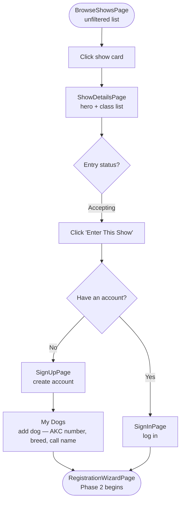
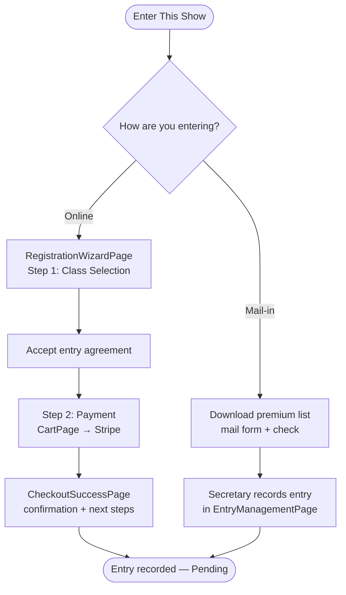
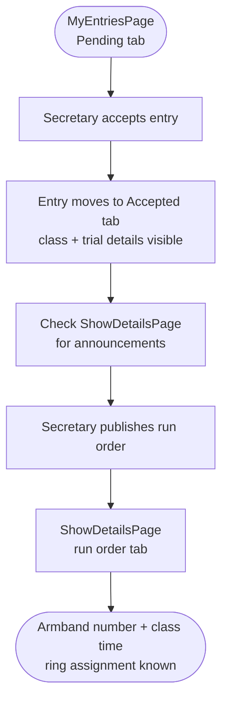
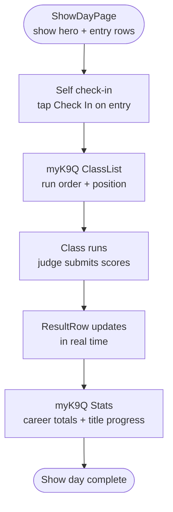

# Exhibitor Journey

> **Role intent:** "I trust this with my day."
> **Scope:** Fall 2026 deliverables only. See [`docs/roles/exhibitor.md`](../roles/exhibitor.md) for the full role definition.

---

## Phase 1: Discovery

You have a dog, an event date in mind, and want to find a show worth entering. myK9Show lets you browse without logging in, so you can filter by date and location before committing to anything. By the end of this phase you have found a show, confirmed the entry window is open, and are ready to enter.

### Steps

1. You open `BrowseShowsPage` → see a list of upcoming shows with entry status badges.
2. You filter by date range or location → the list narrows.
3. You click a show card → `ShowDetailsPage` opens with the show hero, trial schedule, class list, and entry status.
4. The hero shows **Accepting Entries** → you click **Enter This Show**.
5. **Returning exhibitor:** you are prompted to sign in → `SignInPage` → after login you proceed directly to the registration wizard.
6. **First-time exhibitor:** you are prompted to create an account → `SignUpPage` → after account creation you are taken to `My Dogs` → you add your dog (AKC number, breed, call name) → once at least one dog is saved you are routed into the registration wizard.

### Current-state notes

- Browse is open to unauthenticated users — no login required to discover shows. This is intentional.
- Entry status (Accepting / Closing Soon / Closed) is derived from `getEntryStatus` and displayed on both the card and the `ShowDetailsPage` hero — a positive current-state finding, no gap.
- "Enter This Show" CTA is present on `ShowDetailsPage` and routes directly into the registration wizard. One tap from detail to entry.
- The sign-in / sign-up gate is triggered by clicking "Enter This Show," not before. Exhibitors should never be asked to log in just to browse.
- After account creation, the exhibitor must add at least one dog before the wizard can proceed — the wizard assumes a dog profile exists. The handoff from `SignUpPage` → dog creation → wizard is a Phase 2 implementation gap to verify end-to-end.
- Show search/filter capability is a fall 2026 deliverable; current browse is an unfiltered list. Geographic or organization filters are post-fall.

### Mermaid flowchart

---

## Phase 2: Entry & Payment

You have chosen a show and are ready to commit. The online wizard is short — three steps — because myK9Show already knows your dog and handler profile. You select a class, review the fee, pay via Stripe, and receive an immediate confirmation. Mail-in exhibitors follow a parallel path: they send a paper form and check, and the secretary records the entry on their behalf.

### Steps

**Online path:**

1. `RegistrationWizardPage` opens at Step 1 (Class Selection) → your dog is pre-selected; you choose the class and element.
2. You review the entry agreement → accept it → click **Next**.
3. Step 2 (Payment) → you review the entry fee → click **Pay with Card** → `CartPage` opens → Stripe checkout.
4. Payment clears → `CheckoutSuccessPage` appears with your order confirmation number and "What happens next?" guidance.

**Mail-in path (alternative):**

1. You download the premium list entry form from the club's website.
2. You mail the completed form and a check to the trial secretary.
3. The secretary records the entry in `EntryManagementPage` → your entry appears in your account as Pending (no wizard interaction required from you).

### Current-state notes

- The exhibitor wizard is 3 steps (`class-selection → payment → confirmation`), not 5. Dog is auto-selected and handler is auto-assigned via `WORKFLOW_CONFIGS.exhibitor.smartDefaults` — a significant UX simplification vs. the secretary flow.
- The wizard auto-saves a draft every 30 seconds (`useDraftPersistence`, `autoSaveInterval: 30000`) — abandoning mid-flow does not lose progress.
- `CheckoutSuccessPage` includes a "What happens next?" section (`CheckoutSuccessPage.tsx:260–290`) addressing the "silence after payment is the scariest state" concern from the role doc. This is a current-state positive finding.
- **Order confirmation gap (Phase 2):** Today `CheckoutSuccessPage` shows a raw UUID from `stripe_orders`. The `registrations` table has a proper `MK9-000001` sequence but is never written to during checkout. Phase 2 must wire these together so exhibitors see a human-readable order confirmation number. The `registrations` table should also be renamed `enrollments` — "registration" in the dog sport world means a dog's AKC/UKC registration number, not a show enrollment, and the naming will cause confusion in the UI and in support conversations.
- Entry agreement acceptance is required before submission (fall 2026 deliverable — `org_agreements` migration is live; frontend enforcement is in progress).
- Mail-in exhibitors receive no online confirmation at entry time; their first visibility into their entry status is when the secretary marks them Accepted.

### Mermaid flowchart

---

## Phase 3: Pre-Show

Your entry is in. Now you wait — but you should never feel abandoned. myK9Show shows your entry status at a glance, surfaces announcements from the club, and reveals the run order as soon as the secretary publishes it. By show morning you know exactly when you run and what to expect at the gate.

### Steps

1. You open `MyEntriesPage` → see your entry under the Pending tab.
2. The secretary reviews and accepts your entry → your entry moves to the Accepted tab → you see **Accepted** with the class and trial details.
3. You check back periodically → the club posts an announcement → you see it on `ShowDetailsPage` or in the announcements component.
4. The secretary publishes the run order → you navigate to `ShowDetailsPage` → open the run order tab → see your armband number, class time, and ring assignment.

### Current-state notes

- `MyEntriesPage` has three tabs: Pending / Accepted / Waitlisted. There is no Completed or Results tab — post-show history is not yet surfaced here (fall 2026 gap, audit finding #4).
- Exhibitor display name is currently derived from email prefix (audit finding #21) — this creates a quality gap on the Accepted confirmation and run order views where the exhibitor's real name should appear.
- Announcement delivery (push notifications) is a post-fall deliverable; announcements are visible in-app but do not yet trigger push alerts.
- Waitlisted exhibitors see their position in `MyEntriesPage` (Waitlisted tab); spot-offer notifications are a fall 2026 deliverable in active development.
- Run order is published by the secretary via `RunOrderPage`; exhibitors view it through `ShowDetailsPage` once published — the run order is not surfaced directly in `MyEntriesPage` (navigation gap for Phase 2).

### Mermaid flowchart

---

## Phase 4: Show Day

You are at the show. You need to check in, know when your class runs, see your result the moment the judge signs the sheet, and review your dog's career stats after the last class. myK9Show handles check-in and live results; myK9Q is the show-day companion for run order and stats. By the end of the day you have your results and your dog's record is updated.

### Steps

1. You open `ShowDayPage` in myK9Show → see the show hero with today's schedule and your entries.
2. Self check-in is enabled for your class → you tap **Check In** on your entry row → status updates immediately.
3. You open myK9Q → `ClassList` → see your class's run order and your position in it.
4. Your class runs → the judge submits scores → `ResultRow` on `ShowDayPage` updates in real time with your result (Pass / NQ).
5. After the show → you open myK9Q `Stats` → review your dog's career totals, title progress, and qualifying run history.

### Current-state notes

- Self check-in on `ShowDayPage` requires the secretary to enable it per class first via `SelfCheckinSection` in myK9Q Admin — exhibitors cannot check themselves in until the secretary opens that window.
- Real-time result updates are powered by `useShowDayRealtime` and Supabase subscriptions — no page refresh needed.
- `INTENT.md §6` states exhibitors "should never need to open myK9Q," but the fall 2026 role doc permits myK9Q for day-of check-in and run order as an alternative path. Primary path is `ShowDayPage`; myK9Q is the fallback for exhibitors already familiar with it.
- myK9Q `ClassList` / `EntryList` also supports check-in — exhibitors who prefer myK9Q can check in from either app.
- A live scoreboard visible to spectators is a post-fall deliverable (not an exhibitor-facing feature in fall 2026).

### Mermaid flowchart

