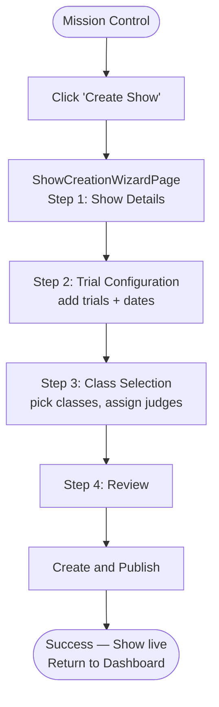
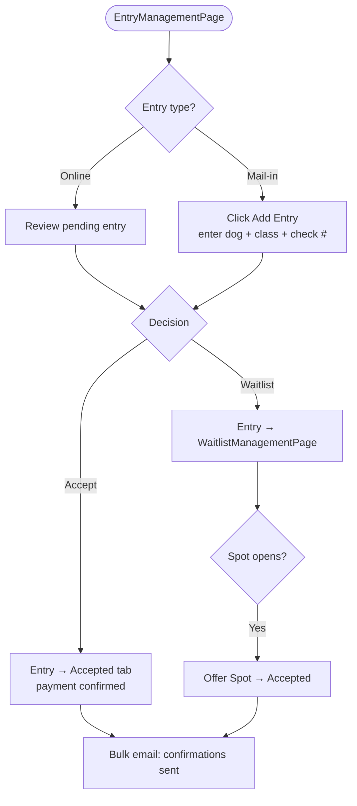
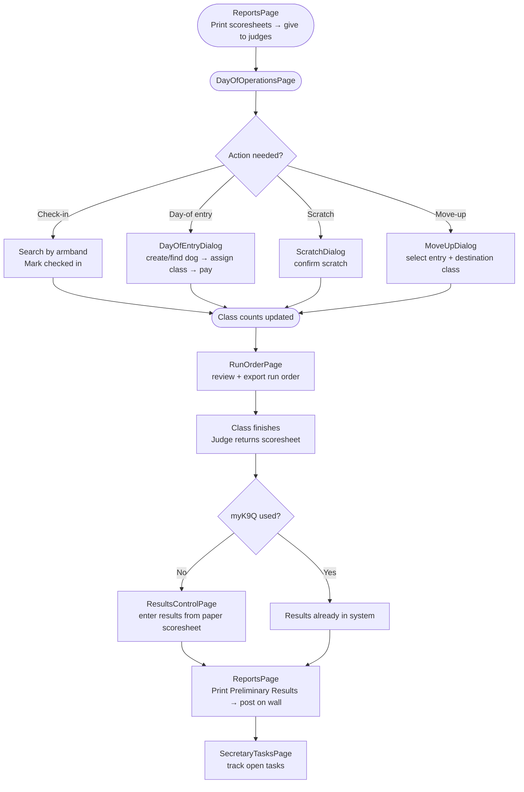
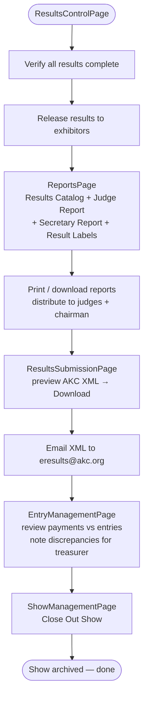

# Secretary Journey

> **Role intent:** "In control of this show."
> **Scope:** Fall 2026 deliverables only. See [`docs/roles/secretary.md`](../roles/secretary.md) for the full role definition.

---

## Phase 1: Show Setup

You have a show date, a premium list, and a list of judges. Your job is to translate that into a live show that exhibitors can find and enter. myK9Show walks you through the full structure — show, trials, and classes — in a single guided wizard, then publishes it in one click. By the end of this phase the show is live, judges are assigned, and your entry window is open.

### Steps

1. You open **Mission Control** (the secretary home screen) → review your upcoming shows list.
2. You click **Create Show** → `ShowCreationWizardPage` opens at Step 1 (Show Details).
3. You fill in show name, sanctioning organization (AKC / UKC / Other), start/end dates, entry fees, and entry open/close dates → click **Next**.
4. You are on Step 2 (Trial Configuration) → add each trial with its date/time, event number, and trial type; repeat for every trial in the show → click **Next**.
5. You are on Step 3 (Class Selection) → for each trial, pick class templates (element × level × section); assign a judge to each class → click **Next**.
6. You are on Step 4 (Review) → scan the full show structure for errors → click **Create and Publish**.
7. The success screen confirms "Show Created!" → you click **Go to Dashboard**.

### Current-state notes

- mySWT (§3.9–3.11) creates show, trial, and classes in three separate dialogs triggered from the Home ribbon. myK9Show consolidates all three into the 4-step wizard — a net reduction in steps.
- mySWT assigns a judge per class at class-creation time (§3.11); myK9Show does the same in wizard Step 3, so parity is maintained.
- mySWT has no publish concept — the local Access database is always the source of truth. myK9Show's "Create and Publish" makes the show visible to exhibitors online; "Save Draft" keeps it hidden.
- mySWT is AKC-only (§3.4); myK9Show supports AKC, UKC, and Other in the `organization` field, matching the fall multi-org requirement.
- Volunteer scheduling (`VolunteerSchedulingPage`) is a separate post-wizard step; it is not yet integrated into the creation flow.

### Mermaid flowchart

---

## Phase 2: Entry Management

Entries start arriving — online via Stripe and by mail with paper checks. You review each entry, decide whether to accept, waitlist, or reject it, and record payment details for every check that clears. Exhibitors are waiting to hear back, so you also send confirmation and waitlist notifications from a single place. By the end of this phase every entry has a status, every payment is recorded, and exhibitors know where they stand.

### Steps

1. You open `EntryManagementPage` for the show → see all entries grouped by status (Pending / Accepted / Waitlisted).
2. You review a pending entry → click **Accept** → entry moves to the Accepted tab; Stripe-paid online entries are already marked paid.
3. A class fills to its limit → you click **Waitlist** on the next pending entry → entry appears in `WaitlistManagementPage`.
4. A spot opens (someone scratches) → you open `WaitlistManagementPage` → click **Offer Spot** on the next waitlist entry → entry is promoted to Accepted.
5. A paper check arrives in the mail → you click **Add Entry** in `EntryManagementPage` → search for the dog/person (or create records if new) → select the class → enter check number and amount paid → **Save**.
6. You select all accepted entries → click the bulk email action → `SecretaryMessagesPage` opens → send entry confirmations; you send a separate message to waitlisted exhibitors.

### Current-state notes

- mySWT emails exhibitors via Outlook or webmail using 10 message templates (§3.14); outbound email (confirmations, waitlist notices, rejections) is a fall 2026 deliverable in active development — `SecretaryMessagesPage` is routed and scaffolded but not fully wired.
- mySWT handled waitlists on paper; `WaitlistManagementPage` is a purpose-built replacement with judge capacity visibility (`JudgeCapacityOverview`).
- Rejection notices (outbound email on reject) are a fall deliverable; the status change itself works today but the triggered email does not yet fire.
- Pre-show exhibitor-initiated move-ups are a post-fall deliverable per `docs/roles/secretary.md`; class changes requested before show day are handled manually and recorded as a new entry/scratch pair.
- Mail-in check payment recording is live in `EntryManagementPage` (check number + amount paid fields). Online entries are auto-marked paid via Stripe with no secretary action needed.

### Mermaid flowchart

---

## Phase 3: Day-of Operations

Show morning. The entry window is closed, the show is running, and your desk is the center of everything. Exhibitors arrive to check in, a few want to enter on the day, some need to scratch, and others hand you move-up forms. At the same time judges need to know the run order and your stewards need to know where to be. myK9Show keeps all of this on one page — you never need to leave the check-in desk to handle a change.

### Steps

1. You open `ReportsPage` → print scoresheets for each class → hand them to the judges before the first class starts. Judges are required to retain the handwritten scoresheets for one year.
2. You open `DayOfOperationsPage` for the show → see the class availability table and the check-in queue.
3. An exhibitor arrives → you search by armband number or name → click **Check In** → status updates instantly.
4. A new exhibitor arrives without a pre-entry → you open `DayOfEntryDialog` → find or create the dog and person records → assign to an available class → record payment → **Save**.
5. An exhibitor cannot run → you open `ScratchDialog` → select the entry → confirm the scratch → class count updates.
6. An exhibitor hands you a move-up form → you open `MoveUpDialog` → select the entry and the destination class → confirm → armband carries over.
7. You open `RunOrderPage` for the trial → review the class sequence, ring assignments, and start times; drag to reorder if needed → **Export** the run order for ring stewards.
8. A class finishes → the judge returns the completed scoresheet → **if myK9Q is not used for scoring:** you open `ResultsControlPage` → select the class → enter each dog's result (Pass / NQ / Absent) from the paper scoresheet → **Save**.
9. You open `ReportsPage` → print the **Preliminary Results** sheet for that class → post it on the wall for exhibitors to view. (Electronic release to exhibitor accounts is a future step; paper posting is the current standard.)
10. You check the task board → `SecretaryTasksPage` (Kanban) → move open tasks to Done as stewards report back.

### Current-state notes

- mySWT check-in is entirely paper: you print check-in sheets (§3.24) and a gate steward marks them by hand. `DayOfOperationsPage` is the digital replacement — a significant workflow improvement.
- **Two scoring paths:** (1) myK9Q in use — judges score directly in the app, secretary has no data-entry step; (2) paper scoresheets only — secretary enters results class-by-class in `ResultsControlPage` as each class finishes. Both paths must work in fall 2026.
- mySWT has a live Scoreboard (§3.19) designed for a second monitor. The myK9Show equivalent is not yet built (post-fall).
- `VolunteerSchedulingPage` lets you publish the volunteer schedule; real-time day-of volunteer reassignment is deferred to post-fall per `docs/roles/secretary.md`.
- `RunOrderPage` currently uses mock personnel data (`RunOrderPage/mockPersonnel.ts`) — real personnel data from `VolunteerSchedulingPage` is not yet wired in.

### Mermaid flowchart

---

## Phase 4: Closeout

The last dog has run. Now you need to verify every result is correct, release them publicly, generate the official reports the judges and AKC require, submit the results electronically, and close the books on the financials. mySWT required you to print and mail paper forms; myK9Show generates the AKC XML and all reports in a few clicks.

### Steps

1. You open `ResultsControlPage` → review each trial's classes; confirm all entries have a recorded result (pass / NQ / absent) → cross-check against paper scoresheets where needed.
2. You toggle **Release Results** → results become visible to exhibitors in their accounts.
3. You open `ReportsPage` → generate the following in order:
   - Show Catalog (required AKC submission — printed and mailed to AKC along with the electronic results)
   - Results Catalog (full results per class, equivalent to mySWT §3.26)
   - Judge Report (per judge, equivalent to mySWT AKC Judge Certification)
   - Trial Secretary Report (equivalent to mySWT §3.15 AKC Trial Secretary Report)
   - Result labels (for qualifying ribbons, equivalent to mySWT §3.28)
4. You print / download each report → distribute to judges and the club's trial chairman → mail the printed Show Catalog to AKC.
5. You open `ResultsSubmissionPage` → select the show → preview the generated AKC XML → click **Download XML** → email the file to eresults@akc.org with the club name, event dates, and event numbers in the message body.
6. You return to `EntryManagementPage` → filter by show → review the accepted entries list against payments recorded → note any outstanding balances for the club treasurer.
7. You open `ShowManagementPage` → click **Close Out Show** → all open trials and classes are marked closed. _(Fall 2026 deliverable — not yet built; verify action name and cascade behavior before Phase 2 implementation.)_

### Current-state notes

- mySWT auto-populates fillable AKC PDF forms (Trial Secretary Report, High in Trial, §3.15) by writing directly into PDFs via Adobe Reader. `ReportsPage` generates equivalent reports; the exact AKC PDF format fidelity should be verified against AKC's current submission requirements before the first fall show.
- mySWT closes show/trial/class in explicit steps from three separate ribbon buttons (§3.30); a **Close Out Show** action in `ShowManagementPage` that cascades to all trials and classes is a fall 2026 deliverable — not yet built.
- Financial reconciliation is a fall 2026 deliverable; today `EntryManagementPage` shows payment data per entry but there is no dedicated reconciliation report or totals view.
- Result labels (§3.28, ribbon stickers for qualifying dogs) appear in `ReportsPage` — confirm label template format against Avery 18262 stock before first use.
- The AKC XML submission path (`ResultsSubmissionPage`) downloads the file; the secretary still emails it manually to eresults@akc.org, matching the mySWT workflow (§3.14 Send Results to AKC).

### Mermaid flowchart

