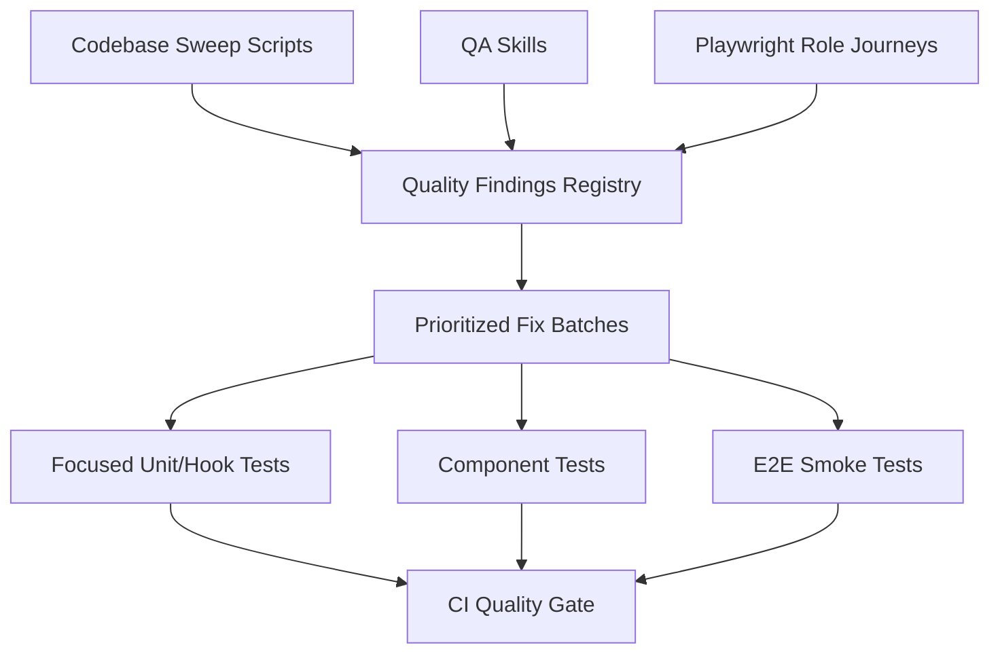

# Proactive Quality System Plan

## Goal

Build a repeatable system that finds "small but user-breaking" bugs before Richard has to manually click through every page.

The target bug class includes:

- Buttons that appear clickable but do nothing.
- Save flows that silently return without feedback.
- Validation rules that do not match visible fields.
- Role-specific pages that load but show empty or contradictory data.
- Mutations that succeed locally but fail remotely without clear UI feedback.
- UI actions that lack success, failure, loading, or disabled-state explanations.

The system should preserve the myK9 intent: calm, obvious, respectful workflows where users are never left wondering whether something happened.

## Recommendation

Use the existing QA assets as the foundation. Do not start by creating a new custom agent.

- **Existing skills** already cover most of the operating model:
  - `qa-feature` for real-browser feature audits and golden-path walks.
  - `audit-pages` for role-based route health, console/network checks, and mobile sanity.
  - `harden` for adversarial review of recently changed code.
  - `debugging-patterns` for recurring bug class lookup.
  - `commit` for risk-based validation before saving work.
- **Existing Playwright specs** already cover many workflows. The immediate gap is not "no tests"; it is that the tests are not organized into a clear, reliable QA cadence.
- **Deterministic scripts** should fill gaps that browser tests do not cover cheaply: silent returns, swallowed errors, mutation feedback, route/test inventory.
- **CI/nightly gates** should make the existing assets run consistently and produce readable artifacts.
- **A custom QA agent** should be considered only after the process is stable. The first win is orchestration: know which existing command/skill/spec to run, when, and how to record the result.

## Existing Assets To Leverage

### Skills

- `.agents/skills/qa-feature/SKILL.md`
  - Already defines a real-browser audit workflow.
  - Already requires root-cause fixes, committed Playwright specs, and focused unit tests.
  - Best fit for feature-level audits like Dogs CRUD, Account page, Entry Management, Show Creation.
- `.agents/skills/audit-pages/SKILL.md`
  - Already defines role route groups and per-page checks.
  - Best fit for periodic route health sweeps across public, exhibitor, secretary, judge, club-admin, and admin routes.
- `.agents/skills/harden/SKILL.md`
  - Already defines adversarial review categories.
  - Best fit after implementing a fix but before commit.
- `.agents/skills/debugging-patterns/SKILL.md`
  - Already has the exact bug families we keep seeing: silent async failures, stale cache, derived-state drift, RLS surprises, stale closures.

### Existing Commands

Root:

- `pnpm typecheck`
- `pnpm lint`
- `pnpm test`

myK9Show:

- `pnpm --filter @myk9/show typecheck`
- `pnpm --filter @myk9/show lint`
- `cd apps/myk9show && npx vitest run <files>`
- `cd apps/myk9show && pnpm test:e2e:clean <spec>`
- `cd apps/myk9show && pnpm test:e2e:workflows`
- `cd apps/myk9show && pnpm quality:quick`

### Existing E2E Coverage

The repo already contains broad Playwright coverage under `apps/myk9show/src/test/e2e/`, including:

- `uat/secretary/*`
- `entities/*CRUD.spec.ts`
- `entities/*UI.spec.ts`
- `registration/*`
- `scoring/scoringWorkflow.spec.ts`
- `cross-role-workflows.spec.ts`
- page objects for login, secretary dashboard, and show creation wizard

Immediate need: classify these specs into a smaller set of named suites:

- PR smoke
- nightly role smoke
- feature audit replay
- flaky/debug/manual-only

### Existing Plans

- `docs/plans/qa/2026-05-11-qa-regression-proof.md`
  - Good model for proof matrices.
  - Should remain specific to the 2026-05-10 secretary remediation batch.
- `OPEN-TODOS.md`
  - Holds active strategic QA work such as Dogs CRUD audit.
- `docs/plans/strategy/2026-04-11-north-star-fall-2026.md`
  - Existing source of truth for Phase 2/3 golden path work.

## System Shape

## Artifacts To Create Or Consolidate

### 1. Quality Findings Registry

Create `docs/qa/findings.md` as the durable index of proactive findings.

Each finding should include:

- `id`: stable ID such as `QA-SILENT-001`.
- `status`: open, in-progress, fixed, deferred.
- `role`: exhibitor, secretary, judge, steward, admin, all.
- `surface`: page/route/component.
- `pattern`: silent-no-op, missing-feedback, role-scope-empty, mutation-stale-cache, etc.
- `evidence`: code reference, test output, screenshot, or Playwright trace.
- `severity`: blocker, high, medium, low.
- `fix owner`: file/module area.
- `proof`: test or command that must pass before closing.

### 2. QA Asset Inventory

Create `docs/qa/assets.md`.

This is the missing map. It should list:

- skill name
- purpose
- when to run it
- command(s)
- output artifact
- owner/cadence
- known limitations

Example rows:

| Asset | Use When | Command Or Invocation | Output | Cadence |
| --- | --- | --- | --- | --- |
| `qa-feature` | Auditing one feature end to end | `/qa-feature dogs CRUD as secretary` | E2E spec + fixes | Feature hardening |
| `audit-pages` | Broad page health sweep | `/audit-pages secretary` | `OPEN-TODOS.md` entries | Weekly/nightly |
| `harden` | Before commit on risky changes | `/harden apps/myk9show/src/hooks/useProfileForm.ts` | Findings/fixes | Per PR |
| UAT secretary proof | Secretary regression proof | `pnpm test:e2e:clean src/test/e2e/uat/secretary/qa-regression-proof.spec.ts` | Playwright trace | Pre-release |

### 3. E2E Suite Classification

Create `docs/qa/e2e-suite-map.md`.

Every current Playwright spec should be classified as:

- `pr-smoke`: fast, stable, high signal.
- `nightly`: valuable but too slow/broad for every PR.
- `feature-audit`: run when touching that feature.
- `manual-debug`: useful locally but should not block CI.
- `candidate-delete`: stale or duplicated.

This turns the existing test pile into a usable testing strategy.

### 4. Risk Pattern Sweep Scripts

Create `scripts/qa/` with small TypeScript scripts that output markdown/JSON findings.

Initial scripts:

- `find-silent-returns.ts`
  - Search save/submit handlers for `if (...) return` before mutation or notification.
  - Flag functions named `save`, `submit`, `handleSave`, `handleSubmit`, `onSave`.
- `find-empty-catches.ts`
  - Flag `catch {}` and catches that only log without user feedback.
- `find-unawaited-mutations.ts`
  - Flag mutation calls in handlers that are not awaited or not handled through `mutateAsync`/callbacks.
- `find-disabled-without-reason.ts`
  - Flag disabled buttons with no adjacent explanatory text or validation display.
- `find-visible-required-mismatch.ts`
  - Pair simple form schemas/errors with rendered inputs where feasible; flag required fields not rendered on the same form.
- `route-inventory.ts`
  - Emit route, required roles, page component, and nearest tests.
- `mutation-feedback-inventory.ts`
  - Inventory React Query/Zustand mutation paths and whether they show success/error feedback and invalidate/refetch.

Outputs:

- `docs/qa/generated/silent-returns.md`
- `docs/qa/generated/mutation-feedback.md`
- `docs/qa/generated/route-inventory.md`
- JSON equivalents for future automation.

### 5. QA Skills

Prefer improving existing skills before adding new ones.

Existing skills to update:

- `qa-feature`
  - Add a "silent action checklist" section.
  - Require findings to be logged in `docs/qa/findings.md`.
  - Require suite classification for any new Playwright spec.
- `audit-pages`
  - Add generated route inventory support.
  - Add links to `docs/qa/assets.md` and `docs/qa/e2e-suite-map.md`.
- `harden`
  - Add myK9-specific checks for hidden validation, mutation feedback, and RLS/UI mismatch.

New skills only if gaps remain:

Create project-local skills under `.agents/skills/`.

#### `qa-silent-actions`

Use when investigating buttons/saves that do nothing.

Workflow:

1. Locate visible action.
2. Trace handler to hook/service/mutation.
3. Identify every early return.
4. Confirm each return either has visible UI state or notification.
5. Add a focused test for the specific failure mode.
6. Fix root cause.
7. Run related tests, typecheck, and lint.

#### `qa-role-journey`

Use for role-specific route walks.

Workflow:

1. Pick role and journey.
2. Load role intent from `docs/INTENT.md`.
3. Inventory routes/components involved.
4. Run or create Playwright journey.
5. Record failures in `docs/qa/findings.md`.
6. Fix only golden-path blockers unless explicitly widening scope.

#### `qa-mutation-feedback`

Use when auditing a data-changing feature.

Workflow:

1. Find mutation source.
2. Confirm loading, success, failure, invalidation, and stale-cache behavior.
3. Confirm offline/replication behavior if using replicated tables.
4. Add tests for success and failure.
5. Add UI feedback where missing.

#### `qa-route-smoke`

Use for page-load and console/network health sweeps.

Workflow:

1. Generate route list.
2. Visit routes as each supported role.
3. Fail on owned 4xx/5xx, page errors, error boundary, and known warning classes.
4. Record screenshots/traces for failures.

### 6. Playwright Golden Journey Suite

First, map existing specs. Then add only missing golden journeys.

Create a stable smoke suite in `apps/myk9show/src/test/e2e/qa/`.

Initial specs:

- `account-profile.spec.ts`
  - Sign in.
  - Open `/account`.
  - Change phone/name.
  - Save.
  - Assert success feedback.
  - Reload and assert persisted value.
- `secretary-show-management.spec.ts`
  - Secretary dashboard loads managed shows.
  - Open one show.
  - Edit a harmless field.
  - Save and verify feedback.
- `entry-review.spec.ts`
  - Secretary sees pending entries.
  - Open entry detail.
  - Accept/reject disposable seeded entry.
  - Verify status update.
- `exhibitor-entry.spec.ts`
  - Exhibitor browses published show.
  - Starts entry flow.
  - Reaches confirmation with no dead end.
- `judge-scoring-smoke.spec.ts`
  - Judge route loads assigned class.
  - Score one disposable entry in a seeded fixture.
  - Verify feedback and row state.
- `route-health-by-role.spec.ts`
  - Visit route inventory for each role.
  - Assert no error boundary, no blank main region, no critical console/network errors.

Use tags:

- `@smoke` for fast CI.
- `@journey` for nightly or pre-release.
- `@destructive-fixture` only for flows that mutate seeded disposable data.

### 7. Seed Data Contract

Create `docs/testing/qa-seed-contract.md`.

Define stable seeded accounts and fixture data:

- secretary
- exhibitor
- judge
- site admin
- one disposable show per smoke suite
- disposable entries for status mutations
- reset procedure

Avoid tests that depend on Richard's live/manual data.

If shared Supabase data is used, mutations need explicit approval in local agent sessions and safe reset scripts in CI.

### 8. CI Integration

Add tiers:

#### PR Gate

- `pnpm --filter @myk9/show typecheck`
- `pnpm --filter @myk9/show lint`
- Focused unit/component tests related to changed files.
- `qa-sweep` scripts in warning mode.

#### Nightly Gate

- Full myK9Show Vitest suite excluding known slow/debug groups.
- Playwright `@smoke` for all roles.
- Route-health sweep.
- Generated findings diff.

#### Pre-Release Gate

- Full golden journeys.
- Strict browser health.
- Manual real-user checklist for highest-risk workflows only.

### 9. Quality Dashboard

Start simple with generated markdown.

Later, add a small local report page or static HTML artifact that summarizes:

- open findings by severity
- repeated risky patterns by module
- untested routes
- flows with no Playwright coverage
- mutation paths without failure feedback

## Implementation Phases

### Phase 0 — Inventory And Rationalize Existing QA Assets

Deliverables:

- `docs/qa/assets.md`
- `docs/qa/e2e-suite-map.md`
- Update this plan with discovered gaps.

Tasks:

- Inventory `.agents/skills/*` and classify which QA jobs they already cover.
- Inventory `apps/myk9show/src/test/e2e/**/*.spec.ts`.
- Identify duplicate/debug/stale Playwright specs.
- Identify specs that should become PR smoke vs nightly vs feature-audit replay.
- Inventory existing package scripts and decide whether aliases are enough or new root scripts are needed.
- Link current QA-related plans and TODOs.

Testing phase:

- Run a small sample from each proposed suite category.
- Confirm commands work from documented directories.
- Confirm outputs are understandable to a future agent.

Exit criteria:

- We can answer "what should I run for this kind of change?" from a single document.
- No new tools are proposed where an existing skill/spec already covers the job.

### Phase 1 — Define The Bug Taxonomy And Registry

Deliverables:

- `docs/qa/findings.md`
- `docs/qa/bug-taxonomy.md`
- `docs/testing/qa-seed-contract.md`

Tasks:

- Define pattern categories.
- Define severity rubric.
- Define finding template.
- Pick initial golden journeys.

Testing phase:

- Validate the finding template by logging the two recent bugs:
  - duplicate roles in avatar menu
  - account profile save silently blocked
- Confirm each finding has a proof command and closure criteria.

Exit criteria:

- New QA findings have one obvious place to go.
- The taxonomy is specific enough to classify silent saves, role-scope bugs, stale cache, and mutation-feedback gaps.

### Phase 2 — Make Existing Skills Operational

Deliverables:

- Updates to `qa-feature`, `audit-pages`, and `harden`.
- `docs/qa/runbook.md`

Tasks:

- Add a concise runbook:
  - "Changed a form/save flow" -> run focused tests, `qa-silent-actions` checklist, maybe Playwright smoke.
  - "Changed role scoping/auth" -> run role route smoke and relevant UAT spec.
  - "Changed mutation/data flow" -> run mutation feedback checklist and focused tests.
  - "Preparing release" -> run nightly/pre-release suite.
- Add findings registry usage to existing skills.
- Add stop conditions and proof requirements.

Testing phase:

- Dry-run the runbook against the two recent bugs.
- Confirm the documented process would have caught both.

Exit criteria:

- The method is clear enough that we can ask Codex "run proactive QA for Account page" and get consistent behavior.

### Phase 3 — Build Static Sweep Scripts

Deliverables:

- `scripts/qa/find-silent-returns.ts`
- `scripts/qa/find-empty-catches.ts`
- `scripts/qa/mutation-feedback-inventory.ts`
- `scripts/qa/route-inventory.ts`
- `pnpm qa:sweep`

Tasks:

- Implement scripts as read-only TypeScript.
- Output markdown plus JSON.
- Keep first version noisy but useful.
- Add ignore comments or allowlist file for false positives.

Testing phase:

- Unit test parser helpers with representative handler snippets.
- Run scripts against current repo.
- Manually classify top 20 findings.
- Confirm recent account-profile bug would have been flagged.

Exit criteria:

- `pnpm qa:sweep` completes locally.
- Generated reports identify at least the known bug class with manageable false positives.

### Phase 4 — Fill Skill Gaps Only If Needed

Deliverables:

- Either updates to existing skills, or if truly distinct:
  - `.agents/skills/qa-silent-actions/SKILL.md`
  - `.agents/skills/qa-mutation-feedback/SKILL.md`

Tasks:

- Encode workflows from this plan.
- Include exact evidence requirements.
- Include commands and stop conditions.
- Require `docs/INTENT.md` before UX-facing changes.

Testing phase:

- Dry-run each skill against one known fixed bug and one open route.
- Verify the skill output produces a finding, proof command, or fix plan.
- Update skill instructions for ambiguity found during dry run.

Exit criteria:

- Future agents can run the same audit with consistent outputs.
- Skills prevent "I poked around and fixed something nearby" drift.

### Phase 5 — Add Or Promote Playwright Smoke Journeys

Deliverables:

- Existing specs promoted into named suites where possible.
- New specs only for missing gaps:
  - account profile save
  - route-health-by-role if existing route tests are insufficient
- `pnpm test:e2e:qa-smoke` or documented equivalent.

Tasks:

- Start with account profile because it just failed.
- Add strict console/page/network health helper.
- Reuse existing test auth helpers where possible.
- Keep flows short and deterministic.
- Prefer disposable seeded data for mutations.

Testing phase:

- Run each new spec locally against `pnpm dev:show`.
- Confirm failure output includes screenshot/trace.
- Verify account profile spec fails if save handler silently returns.
- Verify route-health spec catches error boundaries and blank pages.

Exit criteria:

- QA smoke suite runs in under 10 minutes locally.
- At least account profile, route health, and one secretary journey are covered.

### Phase 6 — Wire CI And Nightly Checks

Deliverables:

- GitHub workflow or update existing workflow for `qa:sweep`.
- Nightly Playwright smoke workflow.
- Artifact upload for generated reports and traces.

Tasks:

- Add PR warning mode first.
- Add nightly failure mode after false positives are under control.
- Add labels or issue templates for generated findings if useful.

Testing phase:

- Run workflow on a test branch.
- Confirm artifacts upload.
- Intentionally introduce a harmless fixture failure and verify CI catches it.
- Confirm known flaky tests do not block the wrong gate.

Exit criteria:

- CI gives a useful signal without drowning the team.
- New silent-save style regressions are caught before merge or overnight.

### Phase 7 — Build Optional QA Orchestrator Agent

Only do this after Phases 1-5 prove useful.

Deliverables:

- `qa-sentinel` custom agent prompt or Codex skill bundle.
- Standard command:
  - run sweeps
  - choose top findings
  - reproduce if possible
  - propose fix batches
  - write findings report

Tasks:

- Teach agent to use the skills.
- Keep it read-only by default.
- Require explicit permission before code changes.
- Require proof commands for every proposed fix.

Testing phase:

- Run agent on current repo.
- Compare output against manually known issues.
- Measure false positives and missed issues.
- Tune prompts and allowlists.

Exit criteria:

- The agent produces actionable findings with file references and proof plans.
- It does not mutate code unless invoked in fix mode.

## Prioritization

Start with highest signal:

1. Account/profile/save flows.
2. Secretary dashboard and show management.
3. Entry management and registration.
4. Role route health.
5. Mutation feedback inventory.
6. Broader static sweeps.

## Definition Of Done

The proactive QA system is "real" when:

- A new agent can run `pnpm qa:sweep` and produce a findings report.
- Account profile save is covered by Playwright.
- At least one golden journey per major role exists.
- New silent-save bugs require either a failing test or an explicit finding entry.
- The nightly QA run produces a readable artifact.
- Fixes close findings by linking proof commands, not by assertion.

## Open Decisions

- Whether QA smoke should mutate local seeded Supabase data or use a resettable local-only fixture.
- Whether to run Playwright on every PR or nightly only.
- Whether findings should live only in markdown or also become GitHub issues.
- Whether the optional QA orchestrator should be a project skill, a custom Codex agent, or a GitHub Actions scheduled job that asks Codex to inspect results.

## First Sprint Proposal

Scope: one week.

1. Create `docs/qa/assets.md`.
2. Create `docs/qa/e2e-suite-map.md`.
3. Create `docs/qa/findings.md` and taxonomy.
4. Update `qa-feature` and `audit-pages` to write findings and use suite categories.
5. Classify existing Playwright specs into PR smoke/nightly/feature-audit/manual-debug.
6. Add or promote an account profile save Playwright smoke.
7. Only then build `find-silent-returns.ts` if the inventory confirms no existing tool covers it.
8. Log and fix the top 3 high-confidence silent-action findings.

Testing phase:

- Focused unit tests for script helpers.
- `pnpm qa:sweep`
- `npx vitest run` for changed unit tests.
- `pnpm --filter @myk9/show typecheck`
- `pnpm --filter @myk9/show lint`
- Playwright account profile smoke against local dev server.
