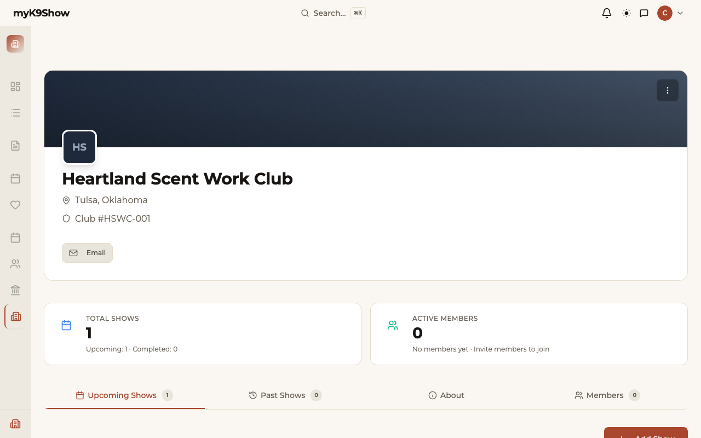
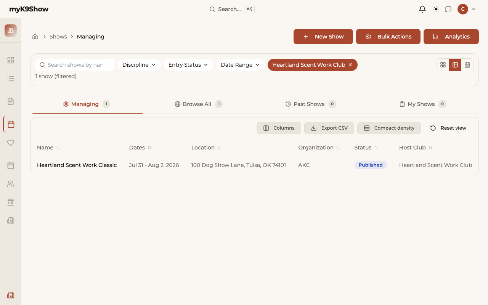
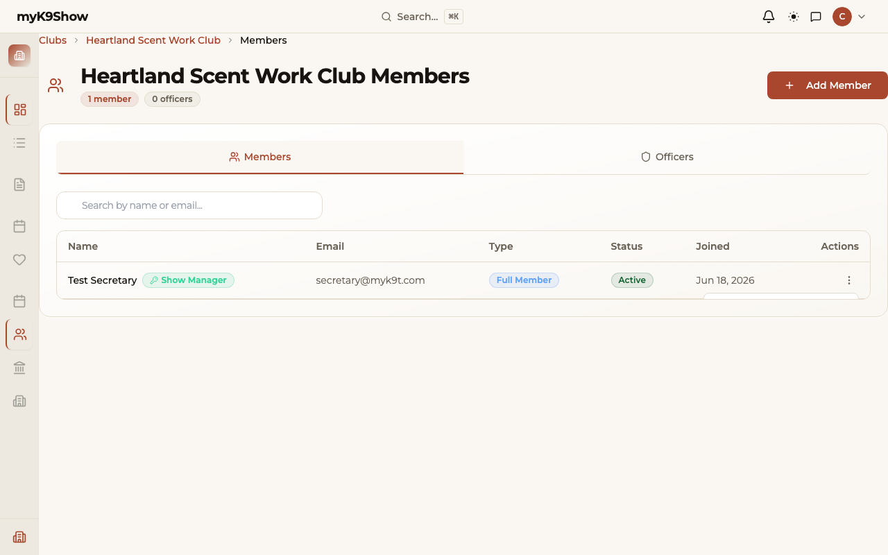
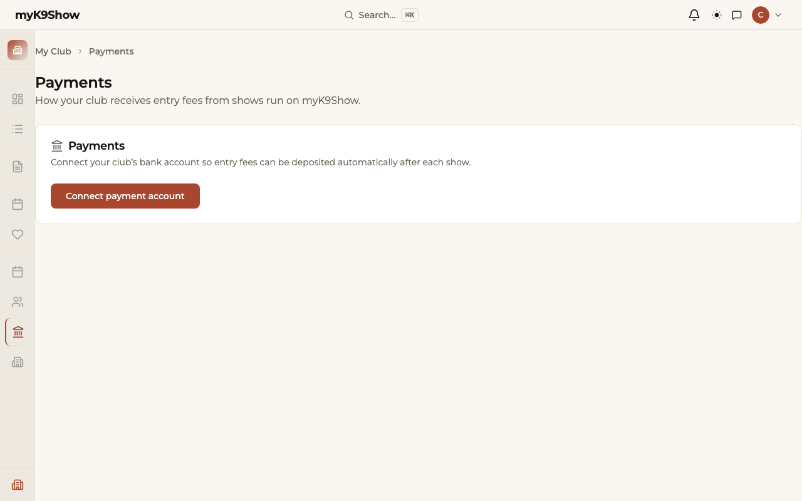
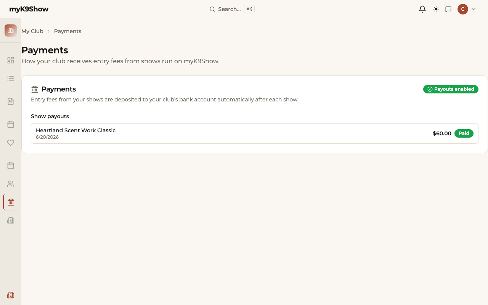
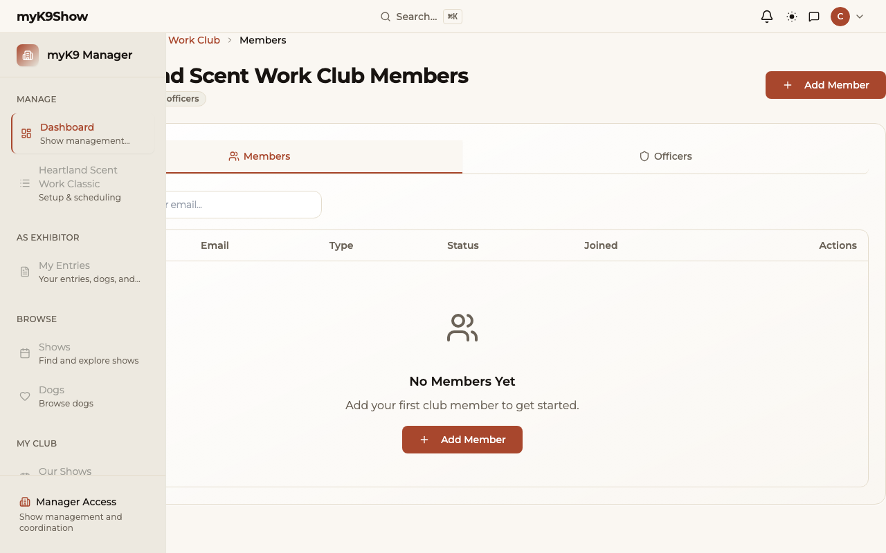
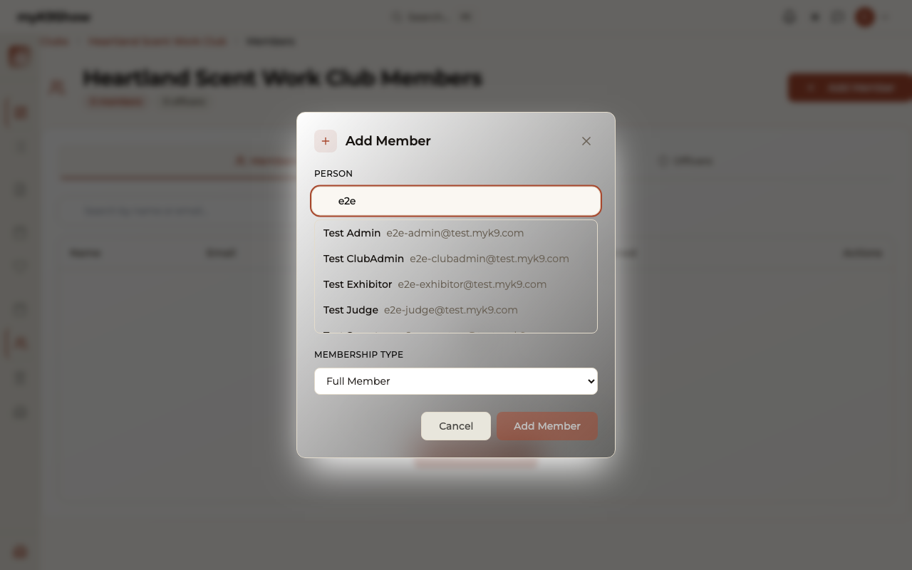

# Club Admin and Treasurer Guide

**Status:** `qa-draft`
**Audience:** Club administrators and treasurers
**Last verified:** 2026-06-19
**Verified by:** walkthrough against outline (`docs/user-guides/club-admin-guide-outline.md`)

> **Note:** This is a QA-draft guide — written against the live app as a testing instrument. Ready screenshots are embedded; shots marked `blocked:` in the checklist below require specific seed data or conditions before they can be captured. Do not publish to customers until status is `verified`.

---

## What this guide covers

How to set up your club's profile, assign secretaries to shows, and connect your bank account to receive show payouts.

If you've used other show-management software before, the main change is that entries, payments, and results all flow through one place — you do not collect checks or log into a separate payment processor to see your balance.

---

## The platform and Stripe — who does what

Your club receives entry fees through a payment processor called Stripe. Here is the boundary between what myK9Show does and what Stripe does:

| myK9Show does | Stripe does |
|---|---|
| Hosts the show and collects entries | Processes exhibitor credit card payments |
| Calculates the amount owed to your club | Holds the money during the show period |
| Initiates the deposit to your club after the show | Deposits the money into your bank account |
| Shows payout history and status | Sends identity verification requests directly to the treasurer |
| Deducts a platform fee per entry before the payout | Deducts their own processing fee (standard card rate) |

**Why Stripe contacts the treasurer directly:** Stripe is legally required to verify the identity of the account holder before releasing funds. This is a U.S. regulatory requirement, not a myK9Show request. When you receive an email from Stripe asking for information, respond directly to them.

---

## Section 1 — Club Profile Setup

Your club profile holds the information that flows into every show your club hosts and every AKC results submission: club name, AKC/UKC club numbers, mailing address, and contact information. Keeping this current saves corrections later.

**Your club is already in the system** when you first sign in — a myK9Show admin created it from your club's request. You are here to review and update it, not create it from scratch. If your club is not in myK9Show yet, contact us.

1. Sign in with your Club Admin account.
2. In the sidebar, open **Club Settings**.
3. Review each field:
   - Club name (as it appears on AKC paperwork)
   - AKC club number
   - Mailing address
   - Contact email and phone
4. Update any field that is out of date → click **Save**.

Changes take effect immediately on all future shows. Existing shows that have already been submitted to AKC are not retroactively changed.

---

## Section 2 — View Your Club's Shows

The **Shows** page lists every show your club is hosting or has hosted. It is a read-only list — shows are created by secretaries or site admins.

1. In the sidebar, open **Shows**.
2. Each show card displays the show name, dates, and entry status.
3. Click a show to open its workbench.

From the show workbench you can see entry counts, the assigned secretary, and show status. You do not manage entries or run day-of operations from here — that is the secretary's job.

---

## Section 3 — Grant Show Access to a Secretary

Show access is managed from the **Members** page, not from the show itself. When you grant an active member show access, they can manage any of your club's shows: entries, run order, show-day operations, and AKC results submission.

**The person must already be an active club member before you can grant club-wide show access.** If they are not yet in the members list, add them first (see Section 6). Lapsed, suspended, and resigned members cannot receive or retain effective club-wide show access.

1. In the sidebar, open **Members**.
2. Find the person you want to make secretary.
3. Click **⋮** (the action menu) next to their name.
4. Under **Show Access**, click **Grant Show Access**.

The member's row now shows a **Show Manager** badge (key icon) indicating active show access. They can sign in and immediately access show management for all of your club's shows.

**To revoke access:** open the same **⋮** menu and click **Revoke Show Access**. The person loses management access immediately — they remain a club member.

> **Note:** Show access is club-wide — an active member you authorize can manage all of your club's shows, not just one. If you need to assign an external professional to one specific show, contact your platform administrator; that show-scoped assignment is separate from club membership. Judges are assigned to shows or classes separately and do not need to be club members.

---

## Section 4 — Connect Your Bank Account to Receive Payouts

Before your club can receive entry fee revenue, a treasurer needs to complete Stripe's onboarding. This takes about 10 minutes and only needs to be done once per club.

**Have this ready before you start:**

- Your club's EIN (it's on the club's tax paperwork)
- The club's legal name and mailing address
- One of the club's checks — use the club's bank account, not a personal one
- The treasurer's name, date of birth, home address, and the last 4 digits of their Social Security number

> **Why the SSN?** Stripe is required by law to verify the identity of the account representative. They ask for the last 4 digits only — not the full number.

**Steps:**

1. In the sidebar, open **Payments**.
2. Click **Connect bank account**.
3. Review the checklist on screen — confirm you have everything listed above.
4. Click **Continue to Stripe** → you leave myK9Show and enter Stripe's onboarding form.
5. Fill in your club's details as prompted. When you finish, Stripe returns you to myK9Show.

Once onboarding is complete, the Payments page shows a **Payouts enabled** badge. Your club will receive a deposit automatically after each show closes — you do not need to request it.

**Onboarding incomplete?** If you close the browser mid-way, return to **Payments** and click **Continue setup** to pick up where you left off.

**Account under review?** Stripe sometimes reviews new accounts before enabling payouts. The Payments page will show **Under review by Stripe**. This typically resolves within 1–2 business days. If it takes longer, contact Stripe directly — they handle verification, not myK9Show.

For the full step-by-step treasurer walkthrough with screenshots, see [Club Treasurer Guide — Receiving Show Payouts](../operations/stripe-treasurer-guide.md).

---

## Section 5 — Payout Timing and History

After your show's end date, myK9Show automatically initiates a deposit to your club's linked bank account. The Payments page shows the history of all past payouts.

**When does the deposit arrive?**

Three days after the show's end date, myK9Show sends the transfer. Your bank typically posts it the following business day. Weekends and bank holidays may add one day.

**What is the deposit amount?**

> Total online entries collected − platform fee − any refunds issued by your secretary

The platform fee covers myK9Show's operating costs and Stripe's card processing. What arrives in your account is the net after that fee.

**Example:** 40 entries at $32 each = $1,280 collected. After a 3% platform fee and a $32 refund for one withdrawn entry, your club receives approximately $1,209.

**Viewing past payouts:**

1. In the sidebar, open **Payments**.
2. The **Show payouts** section lists each show with the deposit amount, date, and status.

| Status | Meaning |
|---|---|
| **Paid** | Deposit sent; should appear in your bank within one business day |
| **Sending** | Transfer is in progress |
| **Waiting for account** | Stripe onboarding is not yet complete |
| **Retrying** | A transfer attempt failed; Stripe will retry automatically |

**Need itemized records?** The per-entry breakdown lives in the show's Entry Management page. Ask your secretary to export a report from there for your treasurer's records.

---

## Section 6 — Common Treasurer Questions

**"Stripe is asking for my SSN — is this normal?"**
Yes. Stripe requires identity verification for all account representatives before enabling payouts. They ask for the last 4 digits of your SSN, not the full number. This is a legal requirement, not a myK9Show policy.

**"When will we get paid?"**
Three days after your show's end date. Your bank typically posts it the following business day. See [Section 5](#section-5--payout-timing-and-history).

**"Stripe says our account is under review. What do we do?"**
Wait 1–2 business days. Stripe reviews new accounts before enabling payouts. If it takes longer, contact Stripe directly at the email address they provided during onboarding.

**"How do we update our bank account in Stripe?"**
Log in to your Stripe Express dashboard at **express.stripe.com** using the email address you used during onboarding. From there you can update bank details, view transfer history, and manage the account.

**"What if we need to refund an entry after the show?"**
Your secretary handles refunds from Entry Management. If a refund is issued after the payout has already been sent, Stripe will deduct it from the next payout. Contact us if a refund exceeds the next payout amount.

**"What does the platform fee cover?"**
myK9Show's operating costs and Stripe's standard card processing rate. The exact rate is shown on the Payments page once your account is connected.

---

## Section 7 — Club Members

The **Members** page lists everyone with club-level access: Club Admins and Secretaries. Use it to add or remove access when your club's officers change.

> **Note:** This is not a general membership roster. It shows only people who have an account in myK9Show and have been granted a role for your club.

**View current members:**

1. In the sidebar, open **Members**.
2. The **Members** tab lists accounts with club access and their role.

**Add a member:**

1. On the Members page, click **Add Member**.
2. Search for the person's account by email.
3. Select the account and assign a role (Club Admin or Secretary).
4. Click **Save** — they now have access immediately.

If the person does not have a myK9Show account yet, they need to create one first. Send them to the show list page to sign up, then add them once their account is active.

**Remove a member:**

1. Find the member in the list → open their action menu (three-dot icon).
2. Click **Remove** → confirm.
3. Their access is revoked immediately.

**Officers tab:**

The **Officers** tab tracks the club's formal officers (president, secretary, treasurer, and event chair). This information is for your club's internal reference — it does not affect app access or AKC submissions.

---

## Still need help?

- [Club Treasurer Guide — Receiving Show Payouts](../operations/stripe-treasurer-guide.md) — full Stripe walkthrough
- [Secretary Guide](secretary-guide.md) — for the person managing show day
- Support: [placeholder — contact email or support page]

---

## Screenshot Checklist

All shots to be captured and added to `docs/training/screenshot-shot-list.md`. Status as of 2026-06-19:

| Shot ID | Section | Description | Status |
|---|---|---|---|
| C-01 | § 1 | Club Settings form — all fields visible | ready |
| C-02 | § 2 | Club Admin → Shows list | ready |
| C-03 | § 3 | Members page — member row with Show Manager badge | ready |
| C-04 | § 4 | Payments page — pre-onboarding "Connect payment account" state | ready |
| C-05 | § 5 | Payments page — payout history table | ready |
| C-06 | § 7 | Club Members page — members list | ready |
| C-07 | § 7 | Add Member dialog | ready |
