# Exhibitor Guide

**Status:** `qa-draft`
**Audience:** Dog sport exhibitors
**Last verified:** 2026-06-25 — all E-01…E-17 screenshots confirmed captured; non-author reviewer still pending
**Verified by:** walkthrough against outline (`docs/user-guides/exhibitor-guide-outline.md`); screenshots captured against staging 2026-06-19/20

> **Note:** This is a QA-draft guide — written against the live app as a testing instrument. Ready screenshots are embedded; shots marked `blocked:` in the checklist below require specific seed data or conditions before they can be captured. Do not publish to customers until status is `verified`.

---

## What this guide covers

How to find shows, enter your dog, check your entry status, get to the ring on time, and see your results — all from one place.

If you're coming from paper entries or mySWT, the main change is that entries, payments, and results are all in one account. You don't need separate logins for each club.

---

## Section 1 — Find a Show

No account needed to browse. Go to myK9Show — the shows list is the first thing you see.

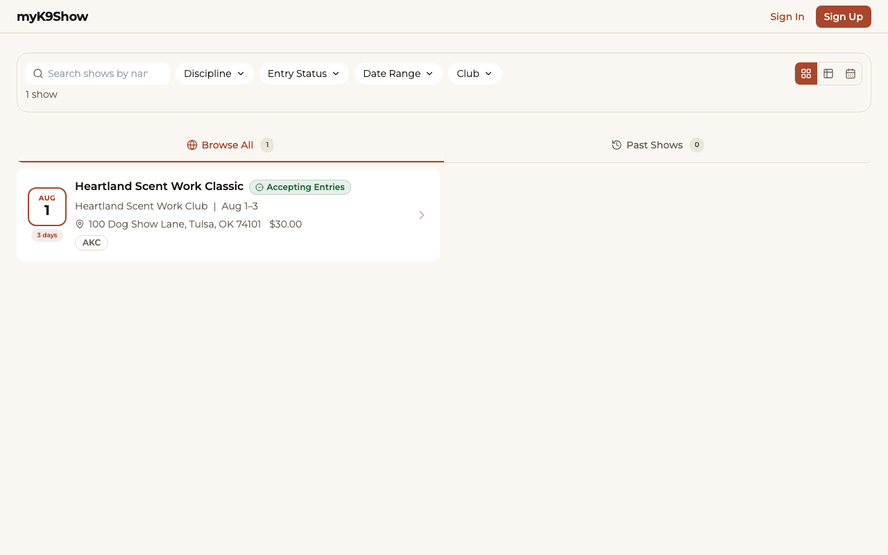

Each show card shows the name, sanctioning organization, dates, entry deadline, and status:

| Badge | Meaning |
|---|---|
| Accepting Entries | Entry window is open — you can enter now |
| Closing Soon | Entry deadline is within a few days |
| Closed | Entry window has passed |

Click any show to open its detail page — trial schedule, classes offered, entry fee, and deadline.

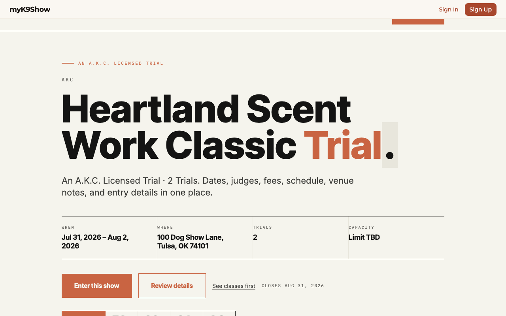

When you're ready to enter, click **Enter This Show**. If you don't have an account yet, you'll be prompted to create one (Section 2).

---

## Section 2 — Create an Account

If this is your first time, you'll need an account before entering a show.

1. From the show detail page, click **Enter This Show**.
2. On the sign-in screen, click **Create an account**.
3. Enter your email address and create a password.
4. Check your inbox for a confirmation email → click the link to verify your address.
5. You're signed in and ready to enter.

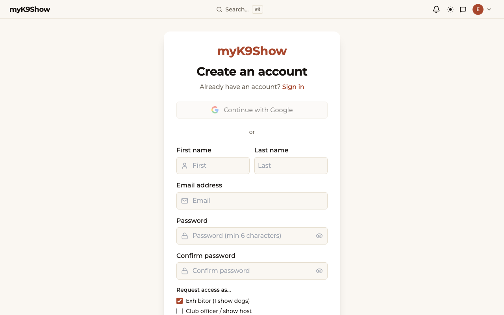

**Next step:** Add your dog before returning to enter the show — the entry wizard requires at least one dog in your profile (Section 3).

**Already have an account?** Click **Sign in** from any show detail page and skip to Section 3.

---

## Section 3 — Add Your Dog

Before entering a show, your dog needs a profile in your account.

1. Go to **My Dogs** in the navigation.
2. Click **Add Dog**.

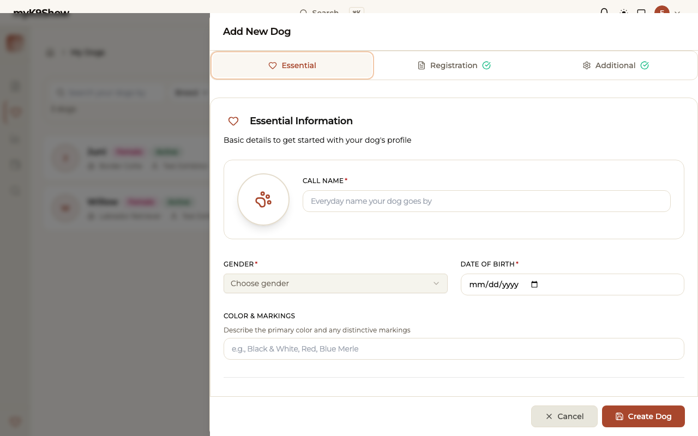

3. Fill in:
   - **Call name** (required) — the name used on the scoresheet
   - **Gender** (required)
   - **Date of birth** (required)
4. Under **Additional**: enter the AKC or UKC registration number, registered name, and breed.
5. Click **Create Dog**.

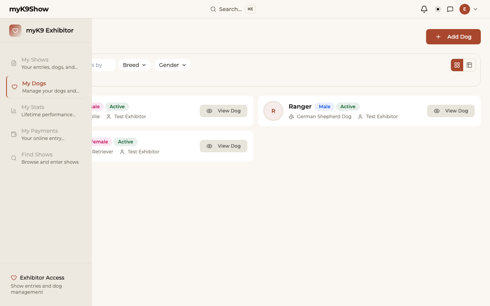

Your dog now appears in your list and is ready to enter shows.

**Tip:** Add your AKC registration number now. If it's missing when the secretary submits results to AKC, they'll need to contact you before the file can be sent. Takes 10 seconds and saves a back-and-forth.

---

## Section 4 — Enter a Show

> **Before you start:** Make sure you've added your dog first (Section 3). The wizard blocks entry if no dog is in your profile.

1. Open the show you want to enter → click **Enter This Show**.
2. The registration wizard opens with your dog already shown at the top.

**Step 1 — Select your class:**

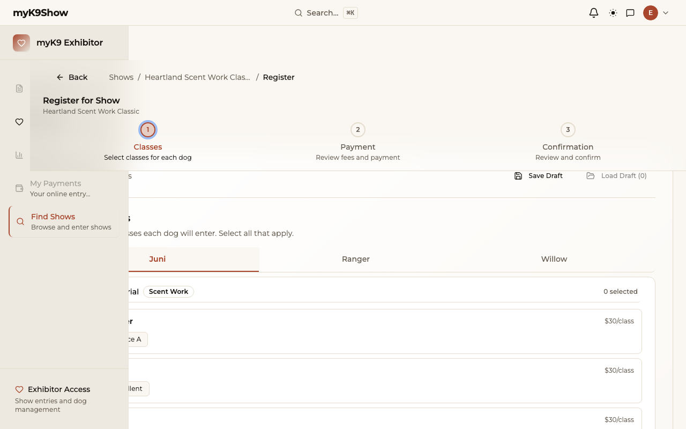

3. Classes are grouped by element (Container, Exterior, Interior, Buried) and level. Select the class or classes you want to enter. A toast confirms each selection.

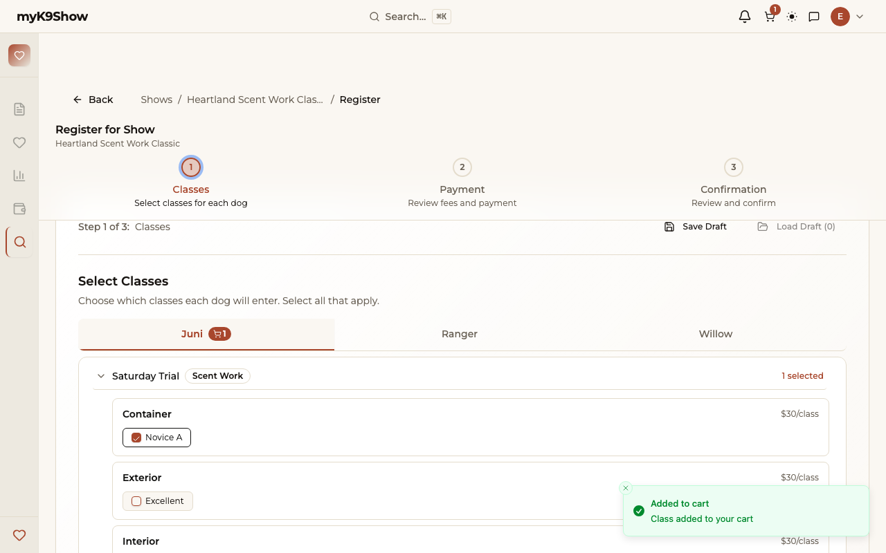

4. Click **Next**.

**Step 2 — Review and pay:**

5. Review: dog, class, and entry fee.
6. Read and accept the entry agreement → click **Pay with Card**.
7. Complete payment in the secure checkout screen.

**Step 3 — Confirmation:**

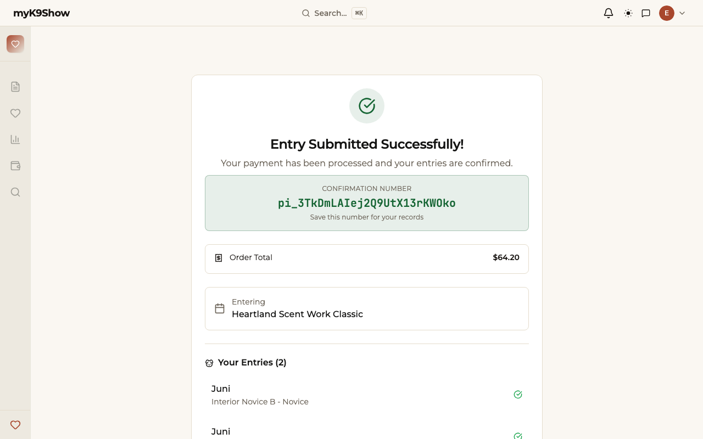

8. After payment, you're returned to myK9Show with your entry confirmed.
9. Your entry starts as **Pending** — it moves to **Accepted** once the secretary reviews it.

**Entered the wrong class?** If the entry window is still open, you can edit your entry from the **My Shows** page (see Section 5). After the entry deadline, use **Message the show team** on your entry card to contact the secretary.

---

## Section 5 — Track Your Entry

Go to **My Shows** in the navigation to see all your entries.

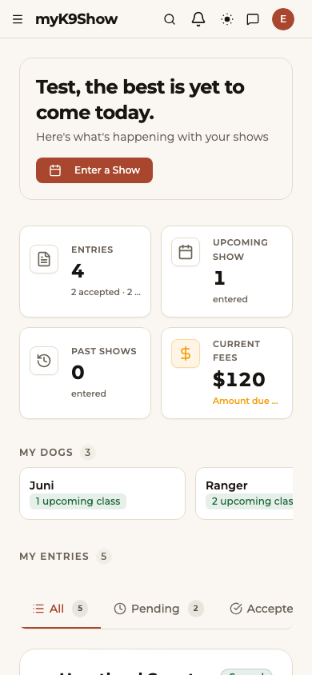

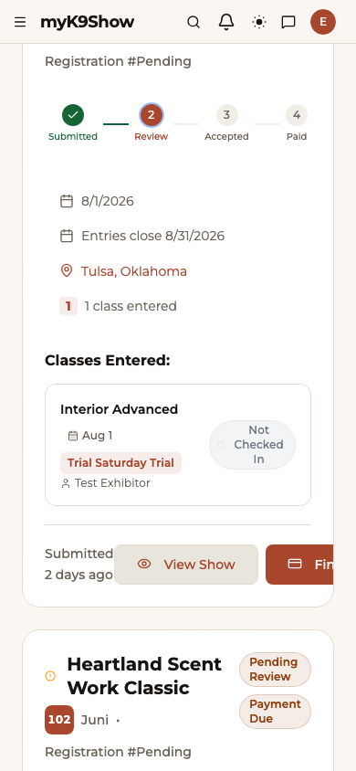
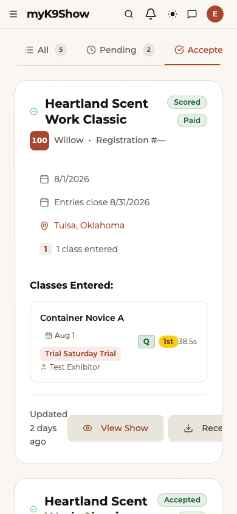

**Status meanings:**

| Status | What it means |
|---|---|
| **Pending** | Received — awaiting secretary review |
| **Accepted** | You're in |
| **Waitlisted** | Class is full; you're in queue |
| **Rejected** | Your entry was not approved — contact the secretary |

**When the status changes to Accepted,** you'll receive a push notification (if notifications are enabled on your device).

**Unpaid entries:** If you see a **Finish Payment** button, your entry is reserved but payment didn't complete. Tap it to return to checkout before the deadline.

---

## Section 6 — View the Run Order

Once the secretary publishes the run order, a **View run order** button appears on your entry card.

1. Go to **My Shows**.
2. On your entry card, tap **View run order**.
3. The Classes tab opens. Tap your class to see the run order.

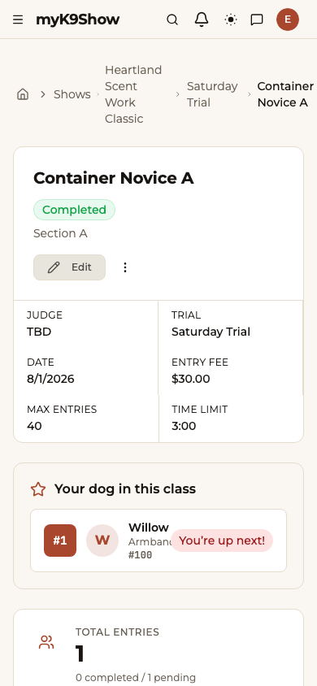

The run order shows dog names, handler names, and armband numbers. **Armband numbers** are assigned by the secretary and may not appear until close to show day.

**Ring assignments** are communicated by the secretary directly — they're not tracked in the app.

**Don't see the button?** The run order hasn't been published yet. Watch for an announcement in the Message Center.

---

## Section 7 — Check In on Show Day

Check yourself in so the secretary and stewards know you're at the show.

**Show Today banner:**

On show day, a **Show Today** banner appears at the top of My Shows when you open the app. The banner only shows on the actual day of your show.

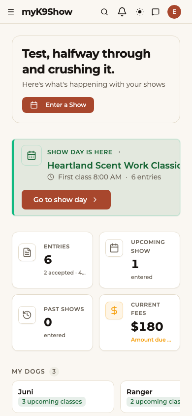

Tap the banner to jump to your entry for that show.

**Check in:**

Once the secretary opens check-in for your class, a status pill appears on each class row of your entry card. If it says **Not Checked In**, find the ring steward at the gate and confirm your presence — the steward checks you in.

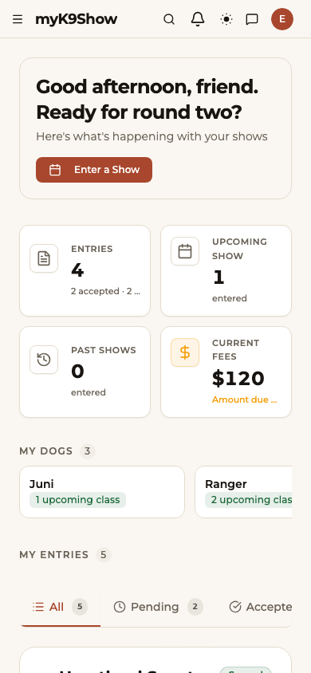

Once the steward marks you present, your card updates to **Checked In**.

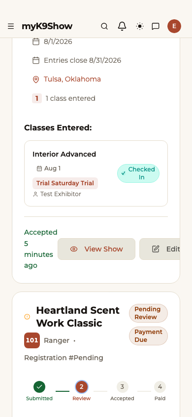

**Status not visible?** The secretary must open check-in for each class before the status pill appears. If you don't see it, check back closer to your ring time.

---

## Section 8 — View Your Results

After the class is scored and the secretary releases results, they appear on your entry card.

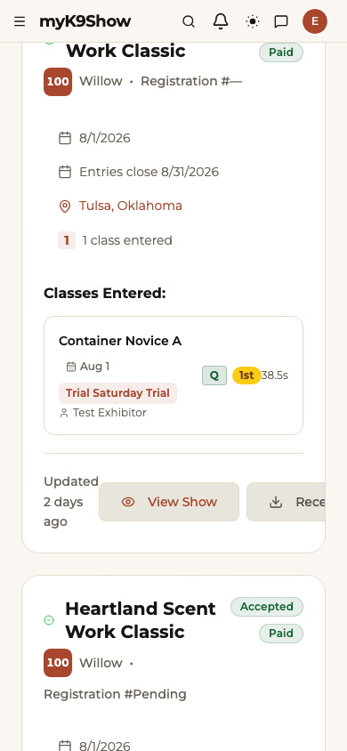

Each scored class shows:
- **Q** (qualified) or **NQ** (did not qualify)
- Your placement (1st, 2nd, 3rd, …)
- Your search time

Tap the result badge to open the full class results page.

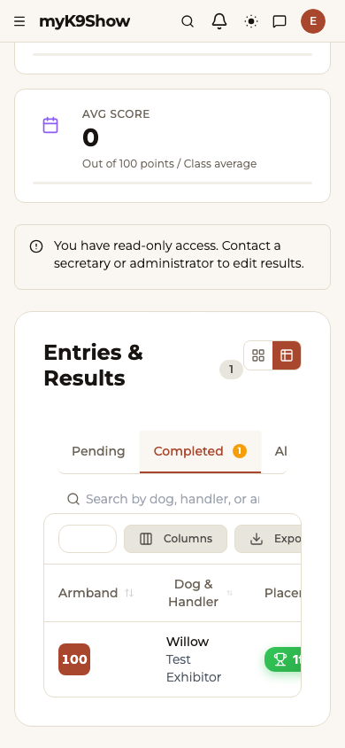

**Does a Q count toward my title?** A Q counts toward your AKC title if the class is at or above your current level and the secretary submits results to AKC. Title totals are tracked through AKC directly — myK9Show doesn't display cumulative title points.

---

## Section 9 — Withdraw an Entry

Self-serve withdrawal is not available. To withdraw from a class:

1. On your entry card, tap **Message the show team**.
2. Let the secretary know which class you need to withdraw from.
3. The secretary will pull your entry and handle any applicable refund per the club's policy.

Refund terms are in the show's entry agreement.

---

## Section 10 — Payments and Receipts

> **Status: Navigation not yet available** — A dedicated payments page is planned but not yet accessible from the navigation as of this guide's date.
>
> To review a past payment, go to **My Shows** → open the entry card. Payment status and amount appear on the card. For a receipt, contact the trial secretary.

---

## Section 11 — Manage Your Dog's Profile

1. Go to **My Dogs** in the navigation.
2. Click a dog's name → the detail page opens.
3. Click **Edit** → update any field → click **Save**.

Fields you can update: call name, registered name, AKC or UKC registration number, breed, date of birth, and gender.

**Competition history:** The **History** tab on the dog detail page shows past entries and results for that dog.

---

## Still need help?

- [KB: enter-a-show](#) — step-by-step for the registration wizard
- [KB: entry-status](#) — what each status badge means
- [KB: find-run-order](#) — how to see your class schedule
- [KB: check-in](#) — show-day check-in walkthrough
- [KB: view-results](#) — where results appear and when

---

## Screenshot Checklist

All shots from `docs/training/screenshot-shot-list.md`. Status as of 2026-06-19:

| Shot ID | Section | Description | Status |
|---|---|---|---|
| E-01 | § 1 | Shows list with entry status badges | captured 2026-06-19 |
| E-02 | § 1 | Show detail — "Enter This Show" CTA | captured 2026-06-19 |
| E-03 | § 2 | Sign-up form | captured 2026-06-19 |
| E-04 | § 3 | My Dogs list | captured 2026-06-19 |
| E-05 | § 3 | Add Dog form | captured 2026-06-19 |
| E-06 | § 4 | Registration wizard — Step 1 (class selection) | captured 2026-06-19 |
| E-07 | § 4 | Registration wizard — Step 1 with class selected + cart toast | captured 2026-06-19 |
| E-08 | § 4 | Confirmation receipt | captured 2026-06-20 |
| E-09 | § 5 | My Shows — Pending entry card | captured 2026-06-19 |
| E-10 | § 5 | My Shows — Accepted entry card | captured 2026-06-19 |
| E-11 | § 5 | My Shows — show card | captured 2026-06-19 |
| E-12 | § 6 | Class detail — run order with armband number | captured 2026-06-19 |
| E-13 | § 7 | Show Today banner | captured 2026-06-20 |
| E-14 | § 7 | Entry card — "Not Checked In" status pill | captured 2026-06-19 |
| E-15 | § 7 | Entry card — Checked In state | captured 2026-06-19 |
| E-16 | § 8 | Entry card — Q result badge | captured 2026-06-19 |
| E-17 | § 8 | Class results page | captured 2026-06-19 |
