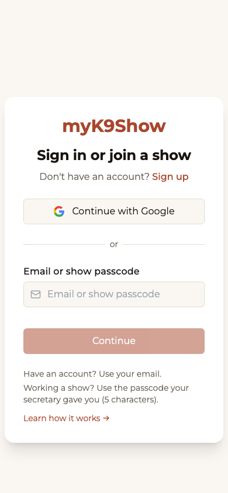
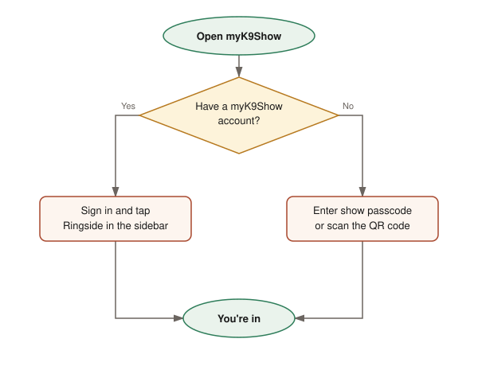
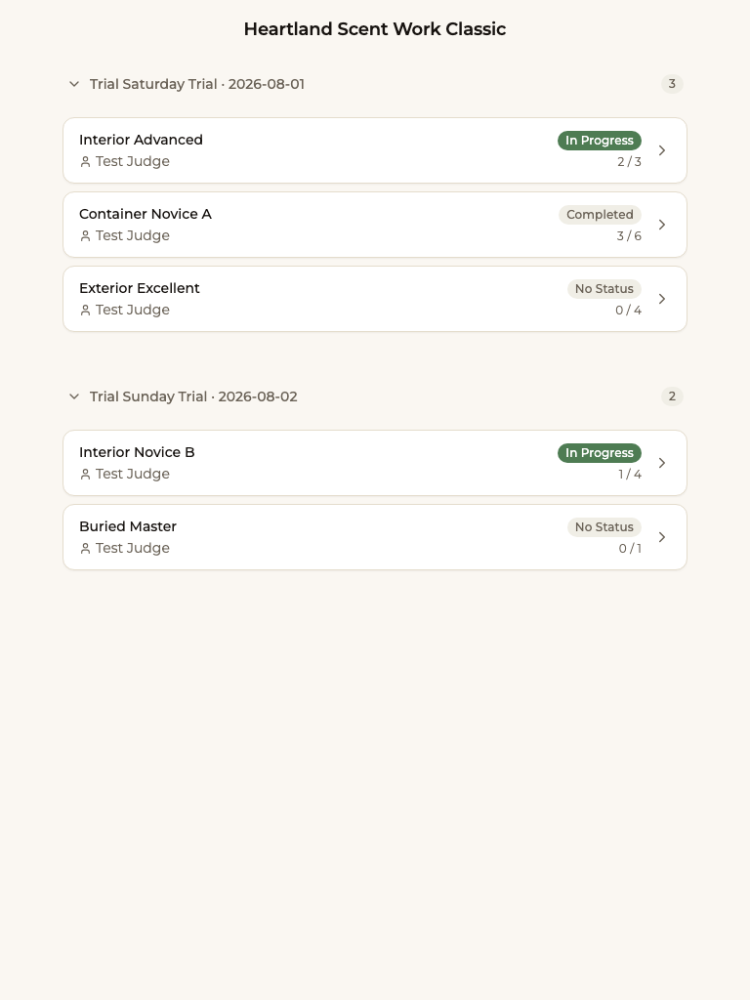
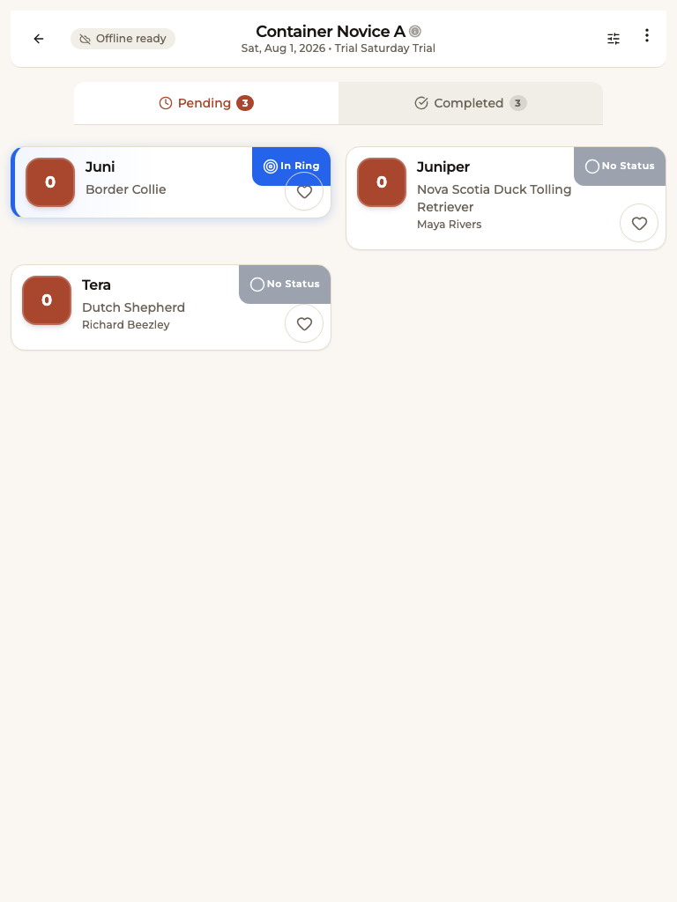
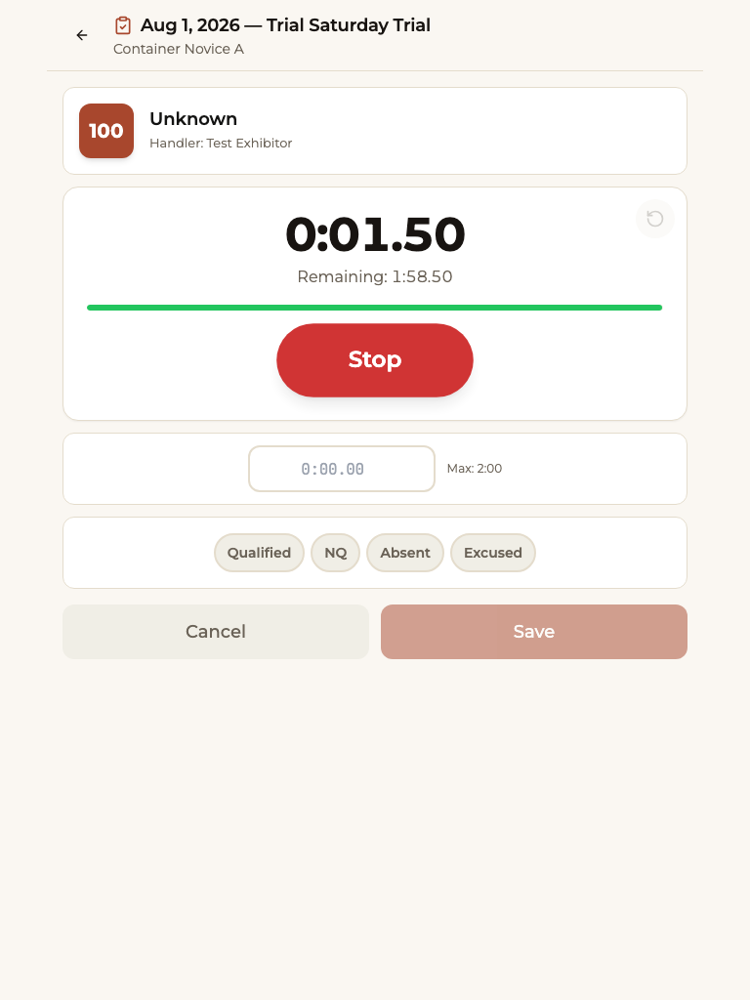
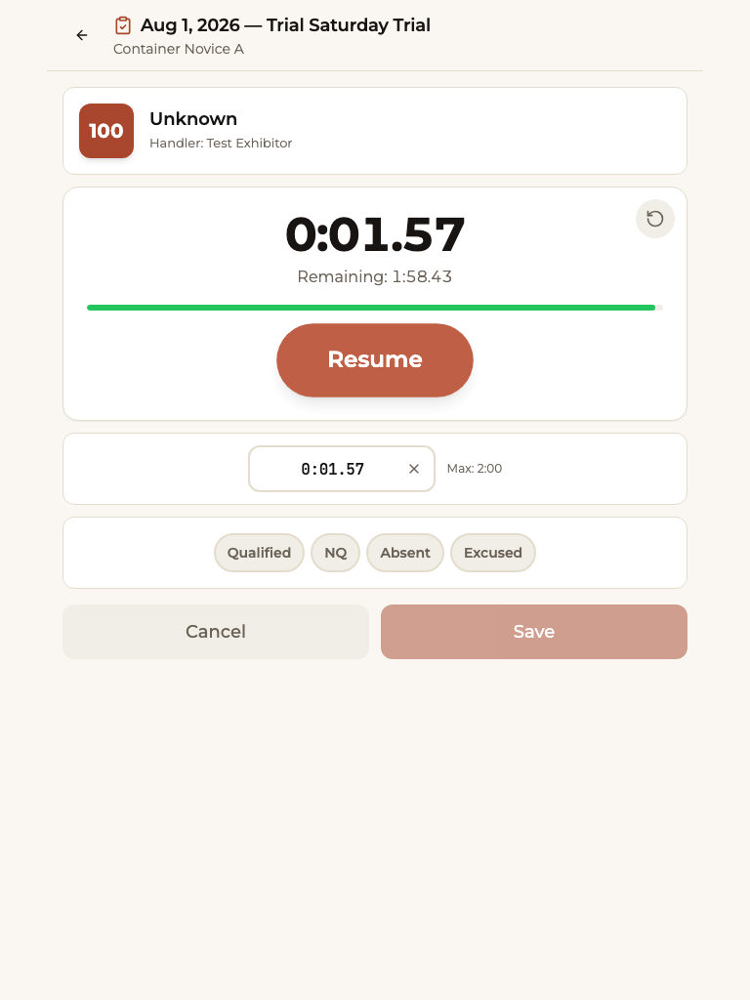
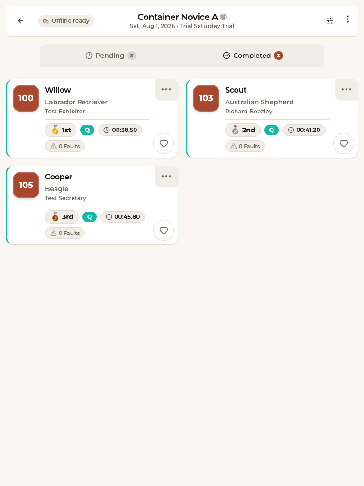

# Judge and Steward Ringside Quickstart

**Status:** `qa-draft`
**Audience:** Judges and ring stewards
**Last verified:** 2026-06-25 — screenshots J-01…J-06 and `at-show-access-paths` diagram complete; non-author reviewer still pending
**Verified by:** draft against outline (`docs/user-guides/judge-steward-quickstart-outline.md`); screenshots and diagram captured against staging 2026-06-25

> **Note:** This is a QA-draft guide written as a testing instrument. Screenshots (J-01…J-06) and the access-paths diagram are captured; a non-author reviewer pass is still needed — see the checklist at the end. Do not publish to customers until status is `verified`.

> **For volunteers:** This page is meant to print on a single sheet. Steps only. Keep your eyes on the dog — the app stays out of your way.

---

## Get into ringside

There are three ways in. Use whichever fits you.

**If you signed in with a myK9Show account** (assigned judges, secretaries):
1. Tap **Ringside** in the sidebar — it takes you straight to today's show.
2. You're in. No passcode needed.

**If the secretary gave you a show passcode or QR code** (guest judges, stewards, volunteers):
1. Open myK9Show in your browser.
2. Enter the **show passcode**, or scan the **QR code**.
3. You're in. No account needed.

**Don't have a passcode?** Ask the trial secretary before the show starts. They share it from the show desk under **Show Access Codes**.

---

## Find your class

After you're in, you land on the **Class List** — every trial and class for today.

1. Each row shows the **class name**, **level**, **judge**, and **entry count**.
2. Tap a class to open it.

**Classes that run two sections together** (for example, Novice A and Novice B) appear as **one combined list** — all the dogs are in a single run order.

---

## See the run order

Tapping a class opens its **Entry List** — the dogs in run order.

1. Each entry shows the **dog's call name**, **armband number**, and **handler**.
2. Tap the **star** on an entry to pin it to the top. It stays pinned even if the page reloads.
3. Tap an entry to open its **Scoresheet**.

---

## Score a dog

Record the result as soon as the dog finishes — it reaches the secretary instantly.

1. Tap the entry to open the **Scoresheet**.
2. Tap **Start Timer** when the dog begins.
3. Tap **Stop** when the dog finishes or time is called.
4. Choose the result: **Q**, **NQ**, or **Absent**.
5. Tap **Save**.

The entry list updates to show the saved result. The secretary sees it right away — they don't re-enter anything.

> **The timer is not the score.** Stopping the timer does not save anything. The result is only recorded when you tap **Save**.

---

## When the signal drops

Show venues often have weak signal. The app is built for it.

- Scoring, pinning, and viewing the run order **all keep working offline**.
- An **Offline** banner appears at the top. This is normal at most venues.
- Your work is saved on the device and **syncs automatically** when signal returns.
- **Stay in the app.** Don't refresh the page while offline — your saved data is safe as long as you don't leave.

**Scores not showing for the secretary after signal returns?** Reload the page once you have a solid connection. If entries are still missing, find the trial secretary.

---

## If something goes wrong

| What you see | What to do |
|---|---|
| You can't find your class | Check with the secretary — the class may not be published yet |
| The passcode doesn't work | Ask the secretary for the current code; they can regenerate it |
| Your scores aren't reaching the secretary | Check the **Offline** banner — scores sync when the connection returns |
| The timer reset itself | Restart timing, then tap **Save** — scores are saved by hand, not automatically |
| The app stops responding | Close the browser tab and reopen it. If you came in by QR code, scan it again |

---

## Still need help?

Find the trial secretary at the show desk. They control access codes, the run order, and results.

---

## Screenshot Checklist

Shots from `docs/training/screenshot-shot-list.md`. All captured 2026-06-25 against staging.

| Shot ID | Section | Description | Viewport | Status |
|---|---|---|---|---|
| J-01 | Get into ringside | Passcode entry screen | Mobile | captured 2026-06-25 |
| J-02 | Find your class | Class list by trial | Tablet | captured 2026-06-25 |
| J-03 | See the run order | Entry list in run order | Tablet | captured 2026-06-25 |
| J-04 | Score a dog | Scoresheet — timer running | Tablet | captured 2026-06-25 |
| J-05 | Score a dog | Q / NQ / Absent buttons | Tablet | captured 2026-06-25 |
| J-06 | Score a dog | Entry list with a saved result | Tablet | captured 2026-06-25 |
| `at-show-access-paths` (diagram) | Get into ringside | The two ways into ringside | — | drawn 2026-06-25 |
