# Secretary Guide

**Status:** `qa-draft`
**Audience:** Trial secretaries
**Last verified:** 2026-06-25 — S-03 and S-05 screenshots added; non-author reviewer still pending
**Verified by:** walkthrough against outline (`docs/user-guides/secretary-guide-outline.md`); S-03/S-05 captured against staging 2026-06-25

> **Note:** This is a QA-draft guide — written against the live app as a testing instrument. Ready screenshots are embedded; shots marked `blocked:` in the checklist below require specific seed data or conditions before they can be captured. Do not publish to customers until status is `verified`.

---

## What this guide covers

This guide walks you through every phase of running a dog show on myK9Show: creating your show, managing entries, communicating with exhibitors, running show day, releasing results, and submitting to AKC.

If you are coming from a spreadsheet or from mySWT, the biggest change is that the wizard handles your show, trials, classes, and judge assignments all at once. You don't create them separately.

---

## Section 1 — Dashboard

When you sign in, you land on the Secretary Dashboard. It shows all your active shows with their entry counts, entry open and close dates, and a status badge for each.

**If you have exactly one active show,** myK9Show routes you directly to that show's workbench instead of the dashboard. Use the breadcrumb at the top left or the sidebar to navigate back to the dashboard if needed.

Click any show to open its workbench.

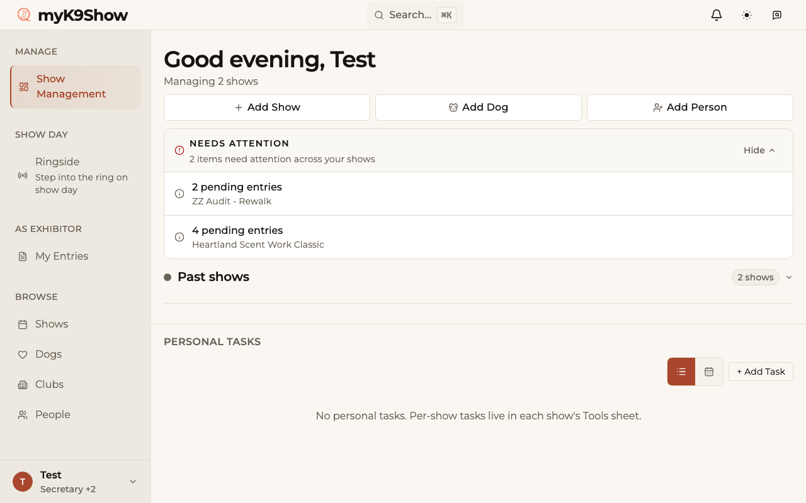

---

## Section 2 — Create a Show

The wizard walks you through four steps: show details, trial configuration, class selection, and a review screen. It creates your show, trials, and classes in one pass — there's no separate step for each.

**Before you start,** have these ready:

- Show name, sanctioning organization (AKC, UKC, or Other)
- Start and end dates
- Entry fee per class
- Entry open and close dates
- Each trial's date, time, and AKC event number
- Judge assignments for each class

**Steps:**

1. From the Dashboard, click **Create Show**.

2. **Step 1 — Show Details.** Enter the show name, sanctioning organization, start and end dates, entry fee, and entry open and close dates. Click **Next**.

   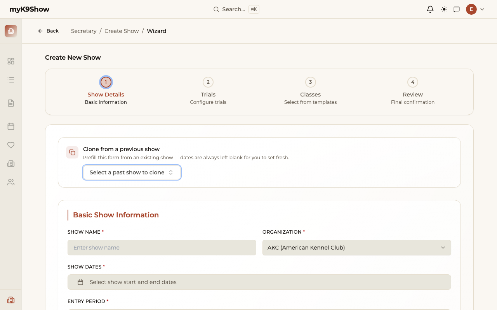

3. **Step 2 — Trial Configuration.** Add each trial with its date/time and AKC event number. Click **Add Trial** for each additional trial. Click **Next**.

   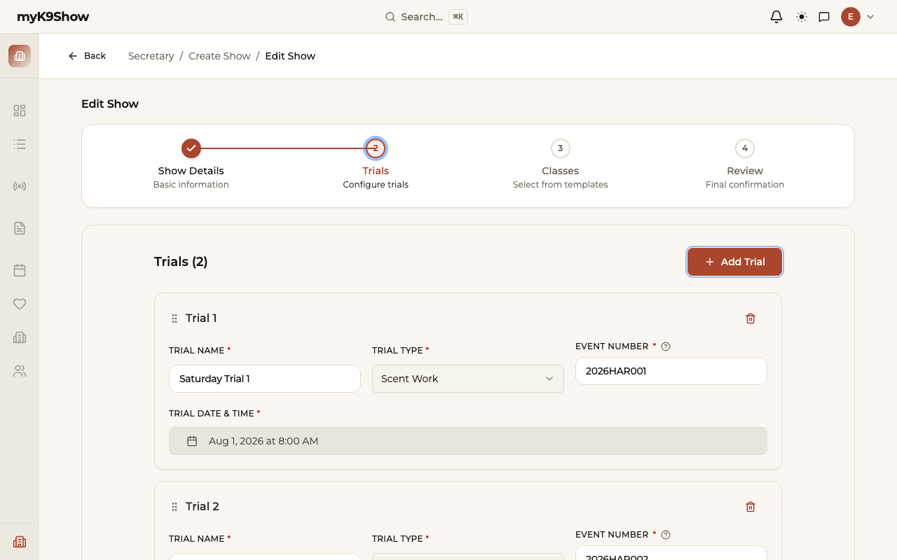

4. **Step 3 — Class Selection.** For each trial, choose which classes to offer and assign a judge to each class. Click **Next**.

   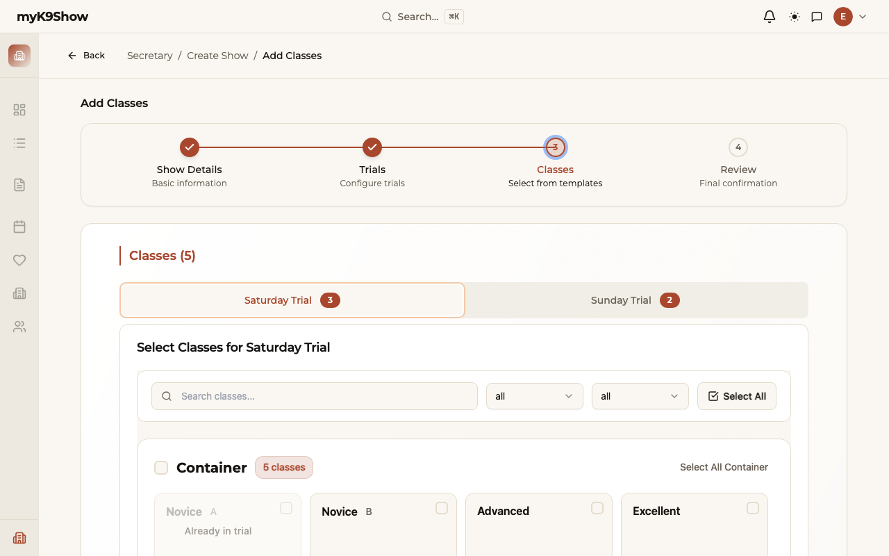

5. **Step 4 — Review.** Scan the full structure. If anything looks wrong, click **Back** to correct it. When everything is correct, click **Create and Publish**.

   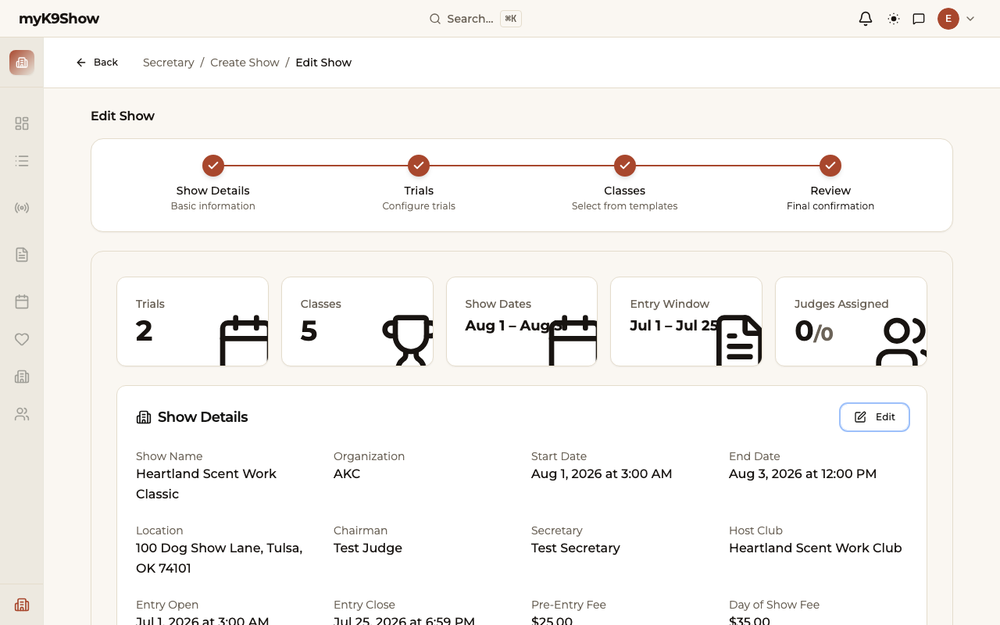

6. Your show is now live and accepting entries. Exhibitors can find it on the Shows page immediately.

**What if I need to change something after publishing?**
Open the show from the Dashboard → click the **Setup** tab → click **Edit** next to the field you want to change.

---

## Section 3 — Show Setup and Configuration

After creating your show, you can edit any part of its structure from the **Setup** tab on the Show Workbench.

**Edit show details:**

1. Click the **Setup** tab.
2. Click **Edit Show** (or the pencil icon next to the field you want to change).
3. Make your changes → click **Save**.

**Change a judge assignment:**

1. Click the **Setup** tab.
2. Find the class row → click the judge assignment → select a new judge from the dropdown.

**Add a trial after the fact:**
This is not available in the Setup tab after publication. If you need to add a trial, contact support — a data correction may be needed.

---

## Section 4 — Entry Management

Entry Management is where you review Show Registrations, find individual Entries quickly, add mail-in or walk-in Entries, and manage Exceptions.

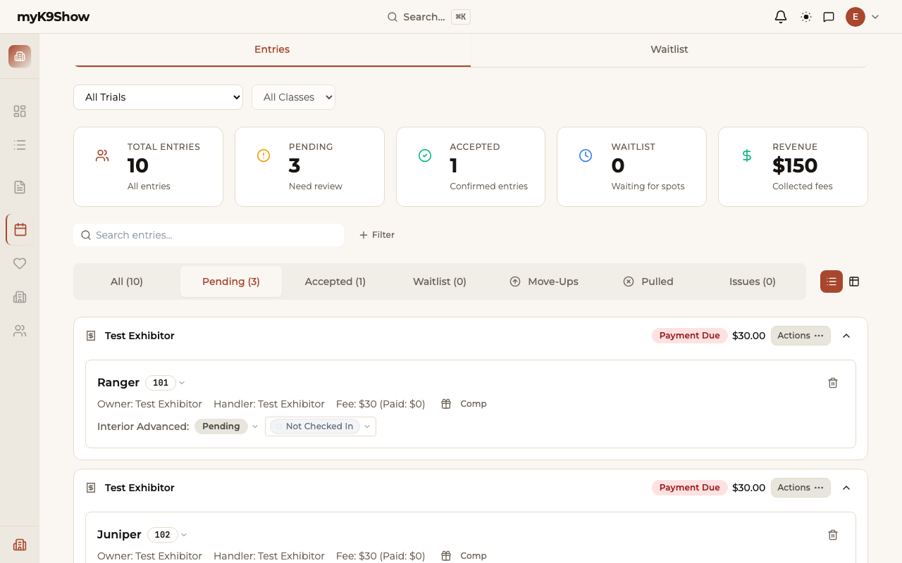

### Approving an online entry

1. Open **Entry Management** from the sidebar or from the Show Workbench.
2. Start in **Needs review**, or search the whole Show by Exhibitor, Dog, Handler, Armband, confirmation, Entry number, or Class.
3. Select the Show Registration to open it in the focused pane.
4. Expand the Dog and choose **Accept** for the affected child Entry. Payment is already recorded for online Entries paid through the registration wizard.

**To approve many registrations at once:** Check each Show Registration. A compact floating toolbar appears with both the registration count and affected Entry count. Choose the available Accept action; only eligible child Entries are changed.

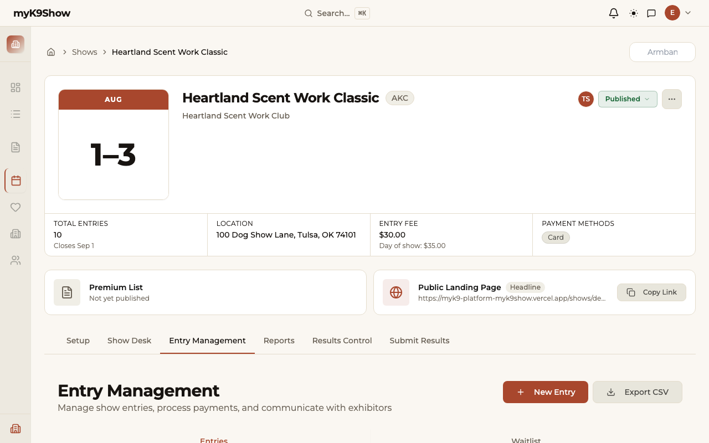

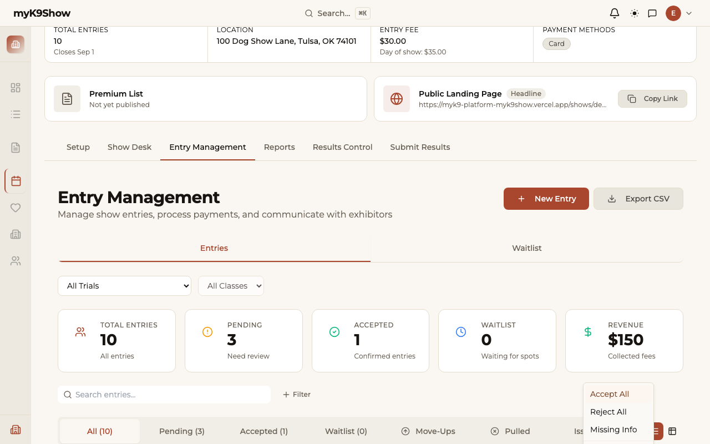

### Rejecting an entry

1. Search for or select the Show Registration, then expand the affected Dog.
2. Choose **Reject** for the child Entry. The Entry changes to Rejected and the exhibitor is notified.

### Adding a mail-in or walk-in entry

1. Click **Add entry**.
2. Search for the exhibitor by name or email. If they're not in the system, click **Create Exhibitor** and enter their details.
3. Search for their dog. If the dog isn't in the system, click **Add Dog** and enter AKC registration number, breed, and name.
4. Select the class, enter the check number and amount paid.
5. Click **Save** → the entry appears as Accepted with payment recorded.

### Managing the waitlist

When a Class is full, manage its waitlist through the dedicated Exceptions workflow. The child Entry status menu does not create waitlist membership or position.

When a spot opens (someone scratches or is pulled):

1. Open **Entry Management** → **Exceptions** → **Waitlist**.
2. Find the next exhibitor in line → click **Offer Spot**.
3. The exhibitor is notified. If they don't confirm within the notice window, move to the next person.

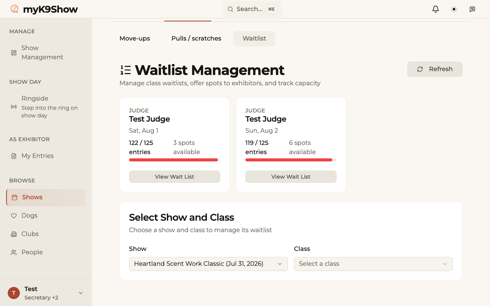

---

## Section 5 — Communications

### Send an announcement to all accepted exhibitors

1. Open the **Message Center** (bell icon in the top bar, or **Messages** in the sidebar).
2. Click **New Message**.
3. Select your show from the dropdown.
4. Choose **All accepted exhibitors** as the recipient.
5. Write a subject and message body → click **Send**.

Exhibitors receive the announcement in their myK9Show inbox and as a push notification on their device.

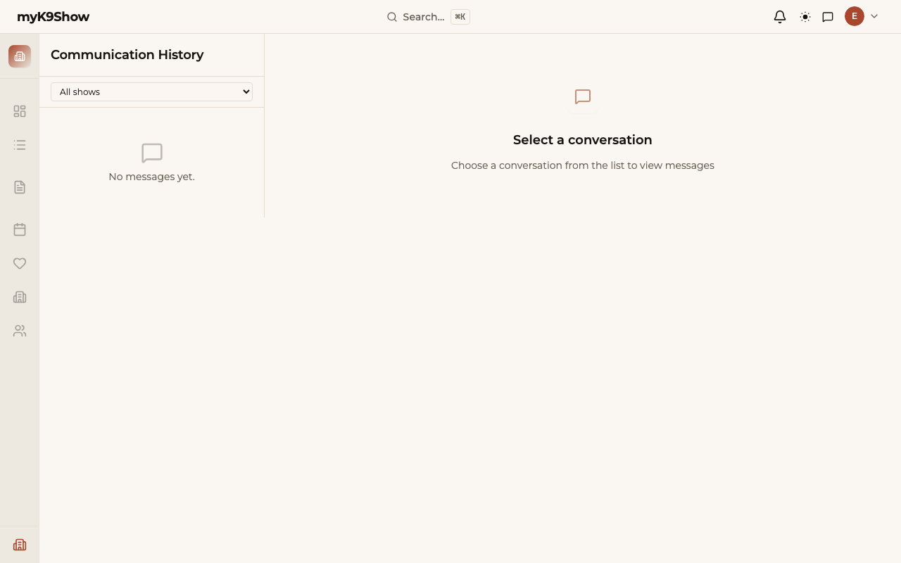

### Email one exhibitor about an entry decision

**From Entry Management (fastest):**

1. Focus the Show Registration and open **Communication and history** → click **Email Exhibitor**.
2. The decision-email editor opens with the registration and exhibitor already selected.

**From the Message Center:**

1. Open the Message Center → click **New Message**.
2. Search for the exhibitor by name or email.

### What about email delivery?

Messages in myK9Show send push notifications. Email delivery to exhibitors who haven't installed the app is dependent on the Resend email integration being active for your show. If you're unsure whether exhibitors are receiving email, use the Message Center and follow up directly for time-sensitive communications.

---

## Section 6 — Reports (Pre-Show)

Run these reports before the show to prepare your rings, judges, and stewards.

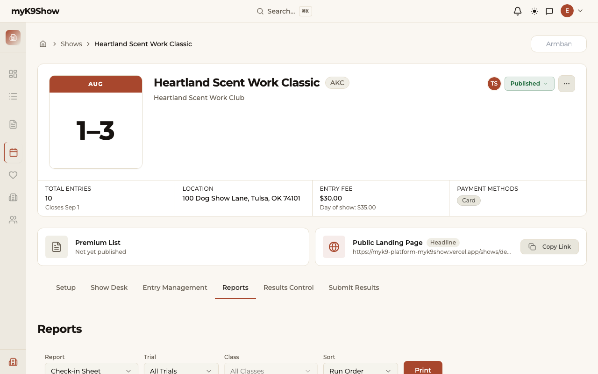

1. Open **Reports** from the Show Workbench sidebar or from the Show Desk.
2. Select the trial from the dropdown.
3. Select a report type:

| Report           | When to run           | Who gets it                   |
| ---------------- | --------------------- | ----------------------------- |
| Check-in Sheet   | Morning of show day   | Ring steward / check-in table |
| Steward's Report | Before each class     | Steward, posted at ring       |
| Scoresheets      | Before judges arrive  | Each judge                    |
| Armband Labels   | Before check-in opens | Print on Avery 18262 stock    |

4. Print or download the report.

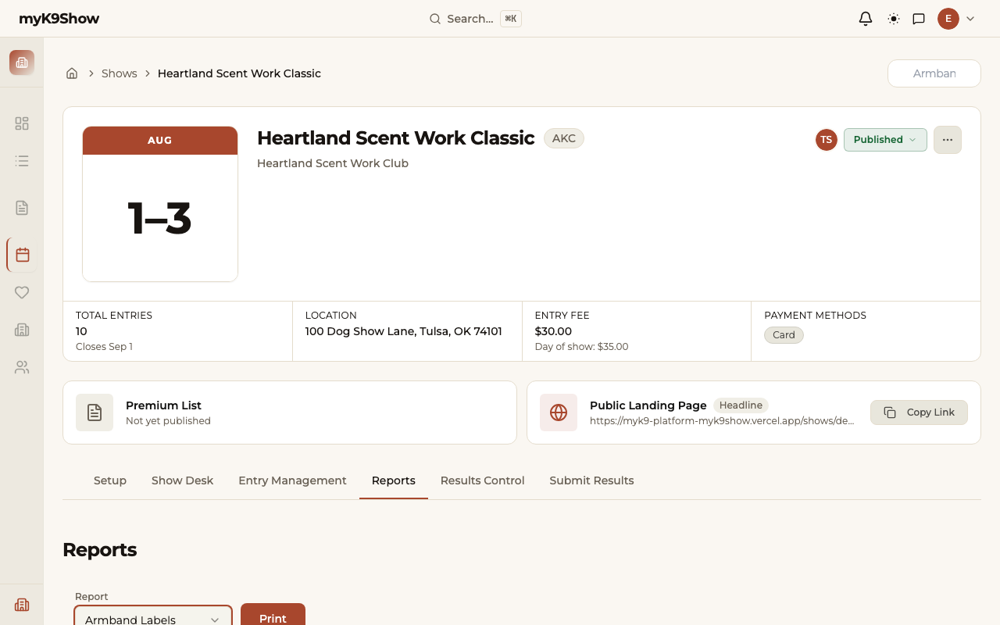

**Note on run order:** The run order shows dog names, handler names, and armband numbers. Volunteer names are not included — those are managed separately outside the app.

---

## Section 7 — Show Desk (Day-of Operations)

The Show Desk is your headquarters on show day. Check-in, scratches, move-ups, late entries, and announcements are all here.

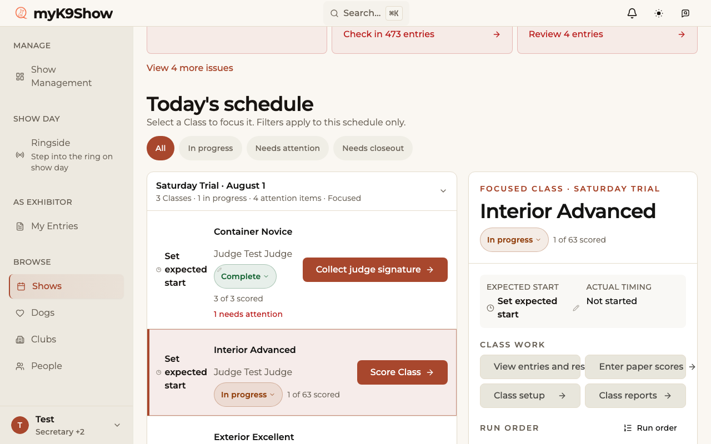

**Getting there:** From the Show Workbench, click the **Show Desk** tab. On a show running today, the Dashboard will route you here automatically.

### Check in an exhibitor

1. In the Show Map, find the exhibitor's class row → expand it.
2. Locate the exhibitor's entry by armband number or name.
3. Click **Check In** → the row updates to show checked-in status.

### Scratch / pull an exhibitor

There are two different actions depending on the reason:

**Show-day withdrawal (stays in records):** Go to **Entry Management**, search for and focus the Show Registration, then change the affected child Entry from **Pending** or **Accepted** to **Pulled**. The Entry remains available under **Exceptions** → **Pulls / Scratches** and counts correctly in AKC results submission.

**Remove a mistaken or duplicate entry (deletes from records):**

1. Go to **Entry Management**.
2. Search for and focus the Show Registration, then expand the Dog containing the mistaken Entry.
3. Open the child Entry's secondary actions and choose **Remove entry** → the "Remove entry?" dialog appears.
4. Confirm → the class entry is deleted from records.

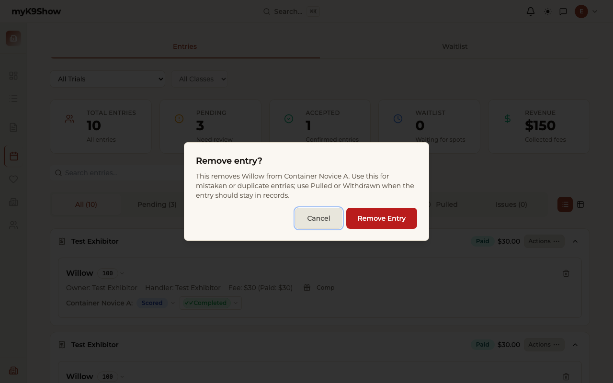

> **Note:** Use Pulled for a real show-day scratch. Use Remove only for true mistakes (wrong dog, duplicate submission). The dialog text confirms the distinction.

### Process a move-up

A move-up promotes a qualifying dog to a higher-level class in the same element.

1. Find the entry in the Show Map.
2. Open the three-dot menu → click **Move Up**.
3. Select the destination class from the picker (only eligible classes are shown — same element, higher level, same trial).
4. Confirm → the entry appears in the new class and is removed from the original.

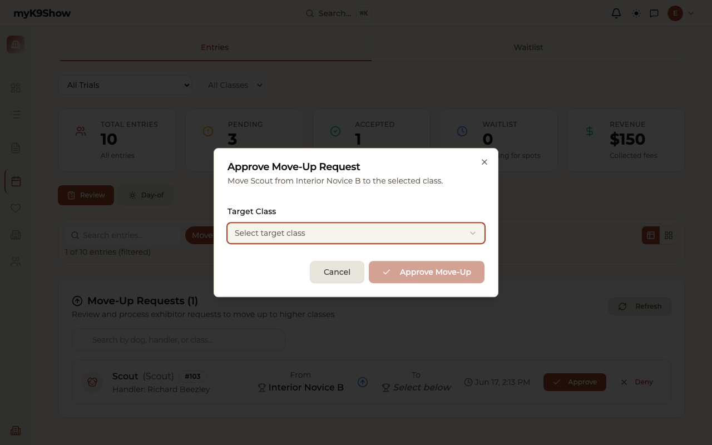

### Add a late entry (walk-in)

1. Open the **Tools** panel (button at the top right of the Show Desk).
2. Click **Add late entry** — the Late Entry registration wizard opens.
3. Step 1: search for the dog (or create a new dog record).
4. Steps 2–4: select the class, assign a handler, and record payment.
5. Confirm → the entry is added and the class count updates.

### Enter scores from paper scoresheets

When judges are scoring on paper rather than using the ringside app:

1. From the Show Map, click the class row → **Enter Scores** (or click into the class directly from the results section).
2. For each dog in run order: select **Q**, **NQ**, or **Absent** → enter the time if the dog qualified → click **Save**.

### Tools panel

Open the Tools panel from the Show Desk for:

- **Late entries** — add a walk-in entry without leaving Show Desk
- **Judge hospitality** — track judge meals, breaks, and show-day notes
- **Incident log** — record any show-day incidents
- **Delay scripts** — draft calm wording for schedule slips
- **Access codes** — share judge and ringside entry codes
- **Volunteers** — track helper assignments and gaps
- **Tasks and notes** — your personal show-day checklist

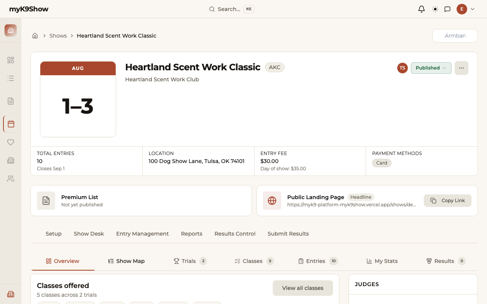

---

## Section 8 — Results & Check-In

Results & Check-In lets you choose when exhibitors can see their results. Open it from the **Results & Check-In** tab on the show workbench.

There are three visibility settings — pick the one that fits your show:

| Setting          | What exhibitors see                                                                               |
| ---------------- | ------------------------------------------------------------------------------------------------- |
| **Immediately**  | Q/NQ, time, and faults appear as each dog finishes. Placement appears when the class is complete. |
| **After Class**  | Q/NQ appears as dogs run. Time, faults, and placement wait until the full class is done.          |
| **After Review** | All results are hidden until you manually release them.                                           |

Click the card for the setting you want. It applies to all classes at once.

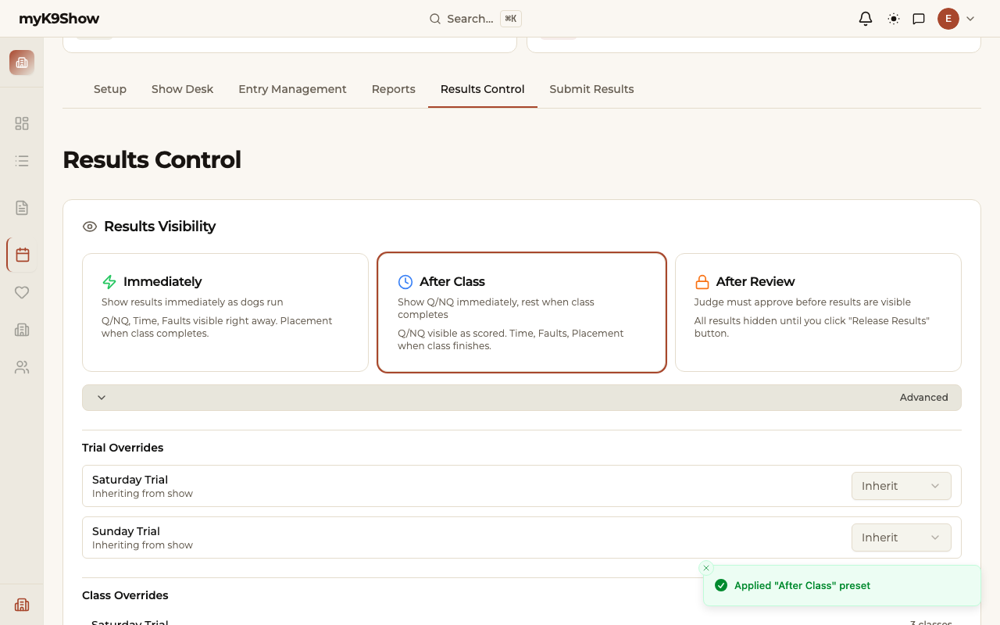

**To release results when using "After Review":**

1. Check the box next to each class you are ready to release — or click **Select All**.
2. In the bar that appears at the bottom of the screen, click **Release Results**.

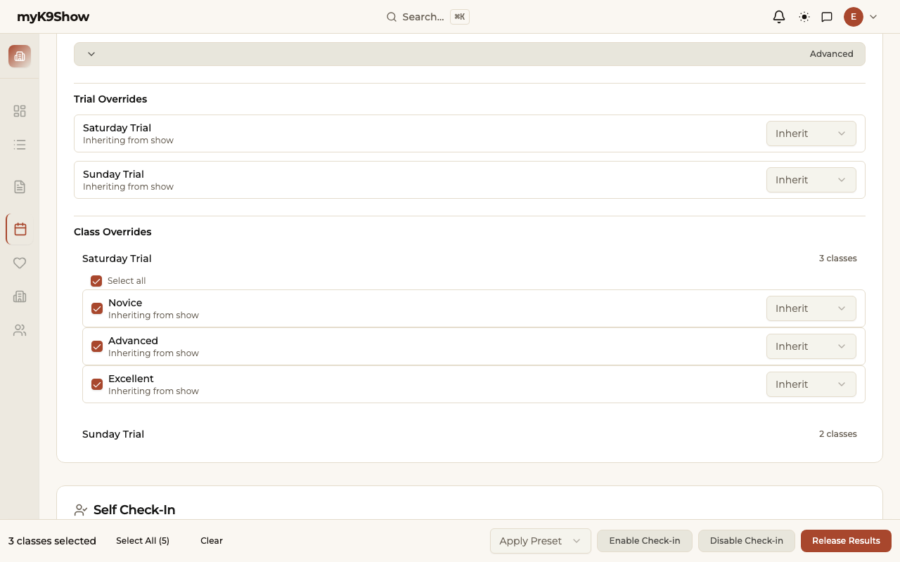

Once released, exhibitors can see their results in **My Shows** immediately.

**Can I un-release results?**
Yes — select the classes and apply **After Review** again from the action bar. Results will be hidden until you release them again. Use this if a scoring correction is needed after an initial release.

---

## Section 9 — Submit Results to AKC

After results are released, generate the electronic submission file and email it to AKC.

1. From the Show Desk closeout section (or from **Reports**), click **Submit Results**.
2. The page shows a preflight summary: number of entries ready for submission and any warnings.
3. **If a warning appears about missing AKC registration numbers:** Contact those exhibitors to provide their dog's registration number before submitting. You can still download and submit without them, but AKC may return the file.

   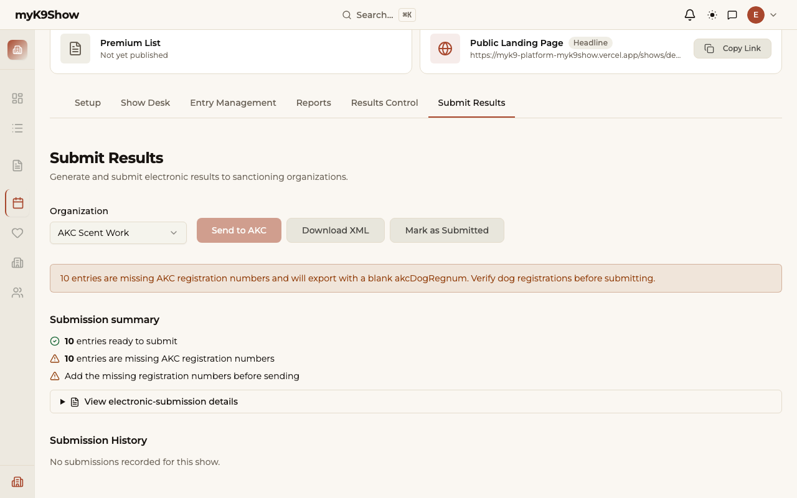

4. Click **Download XML** to download the submission file.

   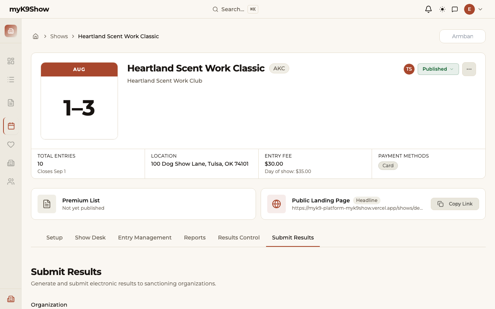
   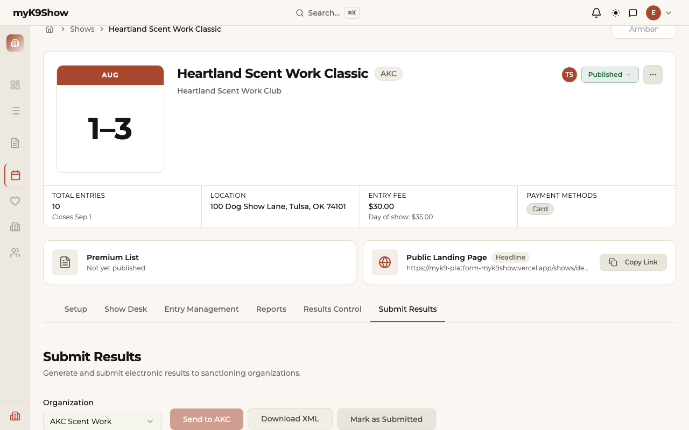

5. Email the file to `eresults@akc.org`. Include in your message:
   - Club name
   - Event dates
   - AKC event numbers (one per trial)

AKC processes the file and updates their records. You will receive a confirmation or error reply from AKC directly.

---

## Section 10 — Post-Show Reports

After the show closes, generate the official reports for judges, the club chairman, and your AKC submission packet.

1. Open **Reports** from the Show Desk closeout section or sidebar.
2. Select the trial.
3. Generate each report in order:

| Report                 | Recipient                          | When           |
| ---------------------- | ---------------------------------- | -------------- |
| Results Catalog        | Club chairman, your records        | After closeout |
| Judge Report           | Each judge + AKC submission packet | One per trial  |
| Trial Secretary Report | AKC submission packet              | One per trial  |
| Result Labels          | Qualifying dogs' ribbons           | One per show   |

**Note on PDF submission:** The downloaded reports are formatted for printing. The AKC results file (Section 9) is the electronic submission — the Judge and Trial Secretary reports are paper supplements for your own records and the judge's copy.

---

## Section 11 — Closeout

> **Status: Walkthrough needed** — The Show Desk **Close Out Show** action now marks the show, open trials, and open classes completed. This guide section still needs a seeded walkthrough with reports, result submission history, closeout, and sync evidence before final publication.

Draft flow:

1. Open the Show Desk closeout section.
2. Review Results & Check-In, Reports, Submit Results, and the closeout summary.
3. Click **Close Out Show**.
4. Review any concerns shown by myK9.
5. Confirm the action to mark the show completed.

---

## Still need help?

- [KB: create-a-show](#) — detailed step-by-step for wizard configuration
- [KB: approve-entries](#) — entry management quick reference
- [KB: handle-a-scratch](#) — scratch and pull procedures
- [KB: handle-move-up](#) — move-up eligibility and process
- [Show-day triage runbook](../support/show-day-triage-outline.md) — live show incident prioritization
- Support contact: [placeholder — email or contact page]

---

## Screenshot Checklist

All shots from `docs/training/screenshot-shot-list.md`. Status as of 2026-06-25:

| Shot ID | Section | Description                                                                        | Status              |
| ------- | ------- | ---------------------------------------------------------------------------------- | ------------------- |
| S-01    | § 1     | Dashboard — one active show                                                        | ready               |
| S-02    | § 2     | Wizard Step 1 (show details)                                                       | ready               |
| S-03    | § 2     | Wizard Step 2 (trial configuration)                                                | captured 2026-06-25 |
| S-04    | § 2     | Wizard Step 3 (class selection)                                                    | ready               |
| S-05    | § 2     | Wizard Step 4 (review)                                                             | captured 2026-06-25 |
| S-06    | § 3     | Show Workbench — Setup tab                                                         | ready               |
| S-07    | § 4     | Entry Management — Needs review queue and focused registration                     | needs recapture     |
| S-08    | § 4     | Focused registration with child Entry actions                                      | needs recapture     |
| S-09    | § 4     | Registration selection and floating toolbar                                        | needs recapture     |
| S-10    | § 4     | Exceptions — Waitlist                                                              | needs recapture     |
| S-11    | § 5     | Message Center — compose                                                           | ready               |
| S-12    | § 6     | Reports — Check-in Sheet                                                           | ready               |
| S-13    | § 6     | Reports — Steward's Report selected                                                | ready               |
| S-14    | § 6     | Reports — Armband Labels                                                           | ready               |
| S-15    | § 7     | Show Desk — task queue with "Show in progress" banner and Next Best Action         | ready               |
| S-16    | § 7     | Entry Management — "Remove entry?" dialog                                          | ready               |
| S-17    | § 7     | Move-up dialog                                                                     | ready               |
| S-18    | § 7     | Late Entry wizard (Step 1: Select Dogs)                                            | ready               |
| S-19    | § 7     | Tools panel                                                                        | ready               |
| S-20    | § 8     | Results & Check-In — three preset cards, "After Class" active                      | ready               |
| S-21    | § 8     | Results & Check-In — classes selected, sticky "Release Results" action bar visible | ready               |
| S-22    | § 9     | Submit Results — preflight summary                                                 | ready               |
| S-23    | § 9     | XML download button                                                                | ready               |
| S-24    | § 9     | Preflight warning — missing AKC numbers                                            | ready               |
