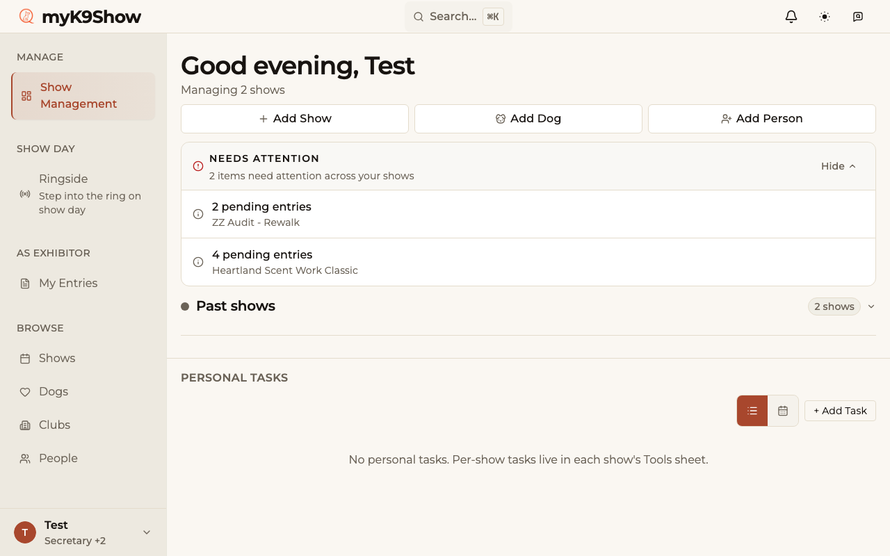
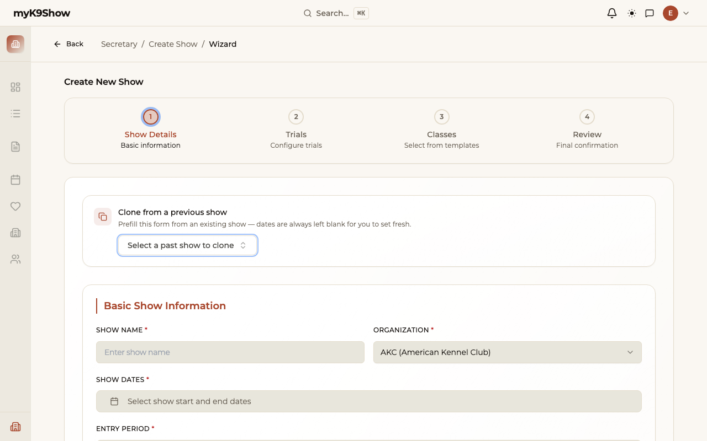
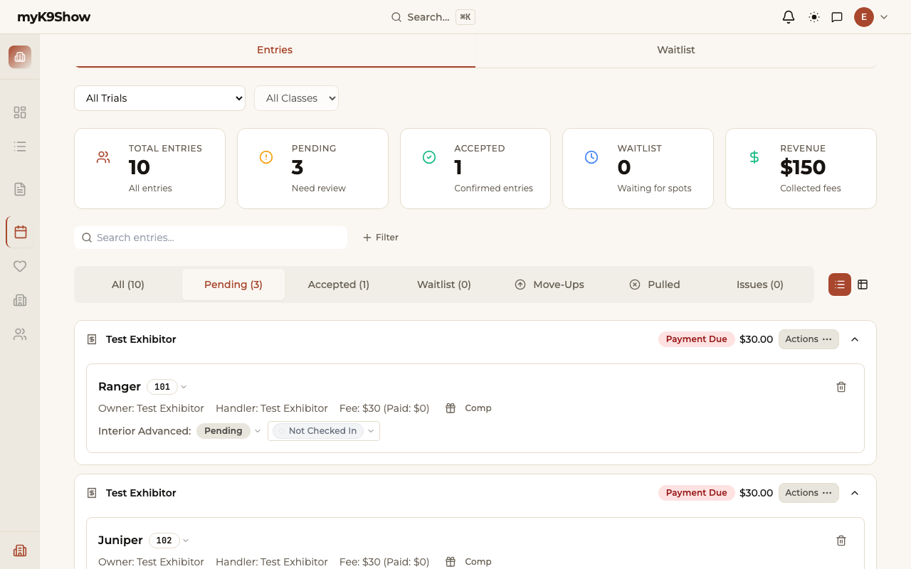
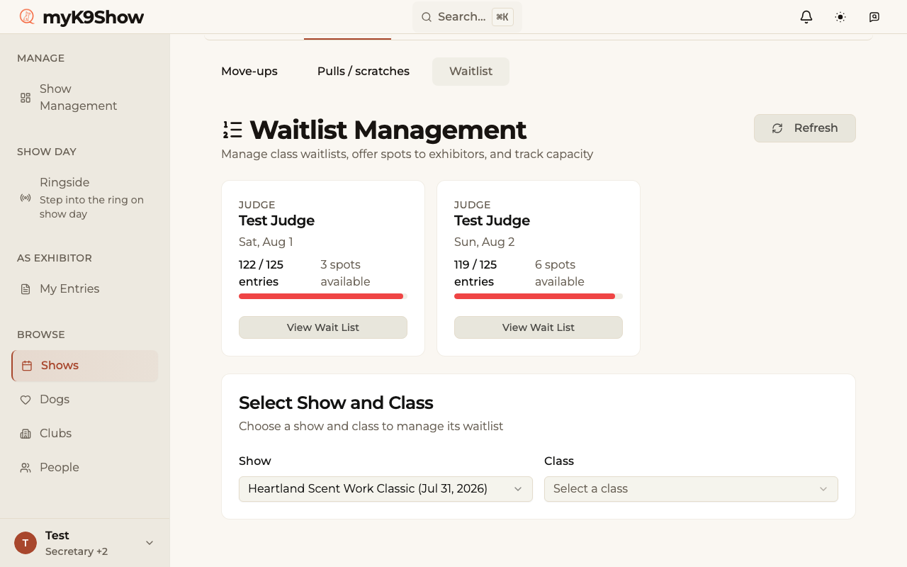
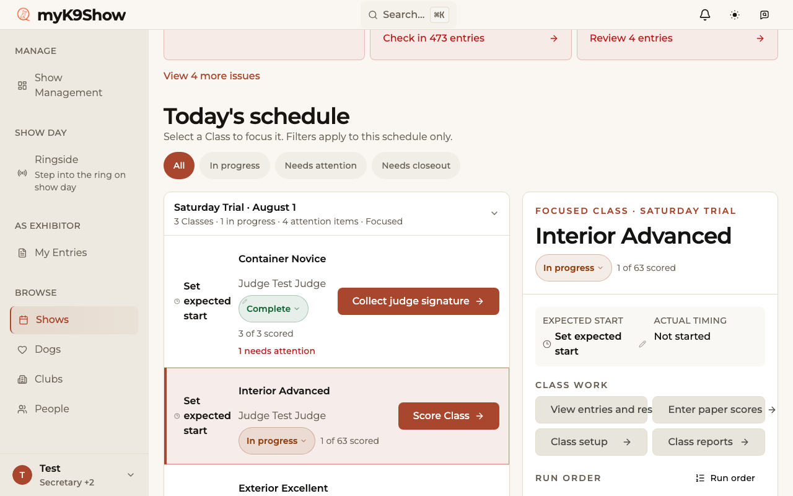
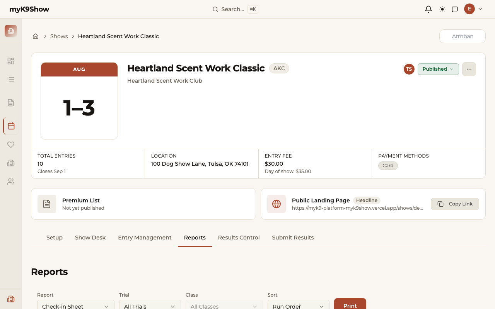
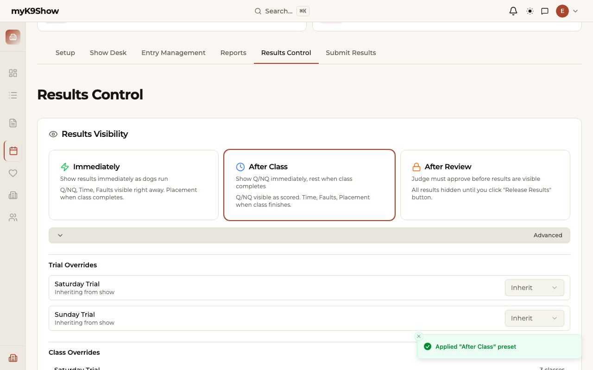
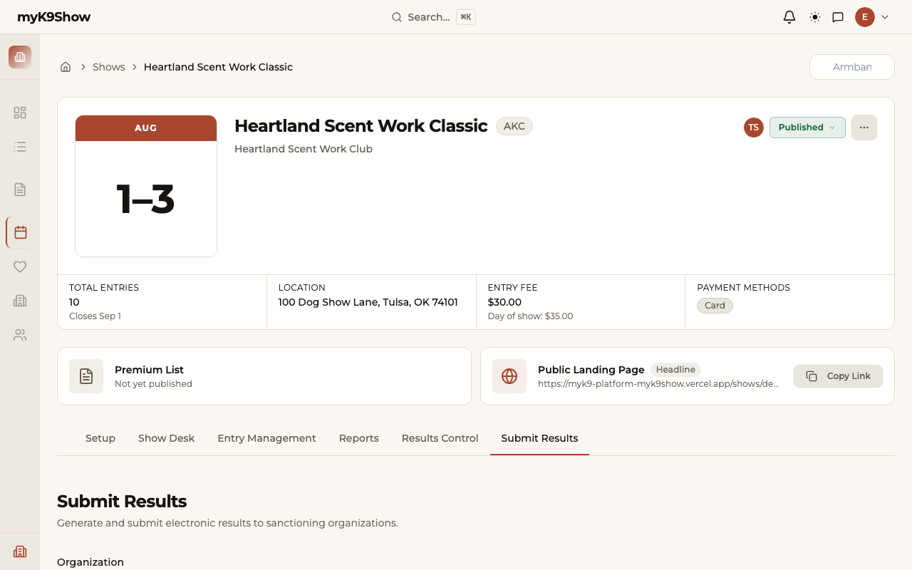

# Secretary Guide

**Status:** `active`
**Audience:** Trial secretaries
**Last verified:** 2026-10-04 — card 7 (the waitlist) walked in a browser on localhost against the Heartland demo show and read against the code; every other card was last checked label by label against the code on 2026-10-03 (four-tab show home, MYK9-957, and the layout A class cards, #2698). The previous full browser walk was 2026-08-30.
**Verified by:** the secretary task walk (`docs/audits/2026-08-28-secretary-task-walk.md`), its 2026-08-29 verification pass, and a 2026-10-03 label-by-label code check

> **What "verified" covers here.** Each card's path, tab and button label was checked against the
> current code on 2026-10-03. Card 7 was also walked in a browser on 2026-10-04, but only as far
> as the app allows today: a class cannot yet be set to take a wait list (MYK9-998), so no dog could be
> put on one and the offer step has still never run on real data. Submitting results to a registry
> is the other flow not exercised end to end (that is a real submission).

> **About the screenshots.** The screenshots below predate the October 2026 show home and are
> being regenerated. Where a screenshot and the words disagree, the words are current.

> **How this guide is organised.** One card per job, in the order you'll do them. Each card tells you where to go, what to do, and what to watch for. If you only need one thing, jump to its card — they don't depend on each other.

---

## Before you start

**Sign in** at the show's URL and you land on your Secretary Dashboard. It lists the shows you manage with entry counts and anything needing attention.

Open a show and you get **one row of four tabs**. Everything in this guide lives on one of them:

| Tab          | What it is                                                                                                                                                 |
| ------------ | ---------------------------------------------------------------------------------------------------------------------------------------------------------- |
| **Overview** | Your show home: a **Needs attention** strip, the schedule by trial and day, and the selected class's panel with its status, timing, checklist and actions. |
| **Entries**  | Everything to do with entries, in view tabs: Needs review, Missing info, Payment due, All, Waitlist, Pulls, Move-ups.                                      |
| **Results**  | Three steps: review and release results, submit them to the registry, then close the show.                                                                 |
| **Reports**  | Printing: labels, check-in sheets, score sheets, catalogs and registry reports.                                                                            |

**Overview → Tools** holds the rest, in two groups:

| Show day                                                                    | Show logistics                                        |
| --------------------------------------------------------------------------- | ----------------------------------------------------- |
| **People at show** — look up exhibitors, armbands and check-in status       | **Volunteers** — helper assignments and gaps          |
| **Self check-in** — turn exhibitor self check-in on by show, trial or class | **Judge hospitality** — meals, breaks, show-day notes |
| **Access codes** — judge and ringside codes                                 | **Tasks and notes** — show-specific reminders         |
| **Emergency trial packet** — the printed paper fallback                     | **Incident log** — record incidents while fresh       |

### Reading the schedule

Each class on **Overview** is one card: the start time, the class name with its status, the judge and entry count, and a row of small squares — one per checklist item (green done, grey not done, amber needs reprint, outlined unknown) — over "N of 7 done". **Click anywhere on a card** to open that class in the panel on the right. The "N pending" link on the card opens those entries for review.

> **Changed, October 2026.** Setup and Show Day are now part of **Overview** — one view before,
> during and after the show. Show closeout is the last step of **Results**, and adding entries
> (including late entries) lives on **Entries**. Old bookmarks still work — they redirect to the
> matching place.

---

# Setting up

## 1 · Create a show, its trials, and its classes

The wizard creates all three in one pass. **Dashboard → Add Show.**

1. **Step 1 — Show Details.** Name, organization (AKC/UKC/ASCA), dates, location, host club, entry fee, and the entry open/close dates. Add your **chairman** and **secretary**.
2. **⚠️ Also on Step 1: add every judge** in the _Show Judges_ field. It looks optional. It is not — see the warning below.
3. **Step 2 — Trials.** One row per trial: date, time, and (for AKC) the event number.
4. **Step 3 — Classes.** Pick a template, then tick the classes each trial offers. Assign a judge per class.
5. **Step 4 — Review.** Check the summary, then **Add Show**. The show stays private until you publish it (card 2).

> **Adding your judges on Step 1 is still the smoothest path**, but no longer a trap: if you reach Step 3 without any, it now offers a way back to add them.

> **Entries closing on the show's first day is allowed** — normal for day-of entry.

## 2 · Publish the show

On the show page, open the **status pill** in the header and choose **Publish Show**. Exhibitors can find and enter the show once it is published.

> Publishing needs the club's Stripe payouts set up. If it is refused, the message says what is missing.

## 3 · Edit a show, or reassign a judge

- **Show details:** **Actions → Edit show** (the Actions button sits in the top bar, left of the bell; on a phone it is the lightning icon), or **Edit show** on the _About this show_ bar. The edit panel opens over the section you are on, with tabs **Basic Info**, **Officials**, **Judges** and **Fees**.
- **Add a judge to the show:** open **Edit show**, then the **Judges** tab.
- **Add classes to a show that already exists:** on **Overview**, choose **Add Classes** on the trial's heading (or on the trial's own page). The wizard opens on the **Classes** step with Show Details and Trials locked, because you are only adding classes. To add a trial instead, use **Add Trial** at the top of **Overview**.
- **Edit or delete a trial or class:** on **Overview**, open the **⋮** menu on a trial's heading and choose **Edit Trial** or **Delete Trial**; for a class, click it and use **Edit class** or **Delete class** in its panel. Deleting a trial or class also deletes its entries, so read the confirmation before you accept it.
- **Change a class's judge, or several classes at once:** **Overview → Select classes**, then the judge dropdown on that class's row. To set many classes in one trial to the same status, export them or delete them, tick their checkboxes and use the bar that appears. **Done** returns you to the schedule.

> A class's judge dropdown only offers judges already attached to the show. If the one you want isn't listed, add them on the **Judges** tab first, then come back.

---

# Taking entries

## 4 · Approve or accept online entries

**Entries → Needs review.** Each registration shows the dog, the entry count, and payment status. Choose **Review registration** to accept, decline, or ask for a correction.

The view tabs across the top — _Needs review_, _Missing info_, _Payment due_, _All_ — show the count of each, so you can see what's waiting. A short sentence under them says how many you're looking at.

## 5 · Add a mail-in entry

**Entries → Add Entry → Add entry for someone else.** Pick the dog and handler (or create them), choose classes, and record payment. (**Add entry for my dog** is for entering your own dog.)

> This works **after entries close** — you're the trial secretary, so the deadline doesn't block you.

> **A dog needs a registration number** for the trial's registry. The entry form will
> let you continue without one — it shows a warning, not a block — but the save is
> refused by the database, so get the number first rather than expecting to fix it
> later.
>
> **One exception:** conformation puppy classes. AKC allows a puppy to be entered while
> its registration is still processing, and those entries are allowed through.

> The payment reference you enter shows on the registration's card in **Entries**,
> so you can look a cheque number up later.

## 6 · Take a late or walk-in entry on show day

**Entries → Add Entry → Add late entry.** Same flow as entering for someone else.

## 7 · Manage the waitlist

**Entries → Waitlist.**

**Turn it on first.** A class only queues people when its wait list is on. On the show home, click the class, then **Edit class**, and in **Entry limit and wait list** switch on **Allow wait list** (and set an **Entry limit**, or leave it blank for no class limit). Whether open spots are offered automatically, the judge's daily capacity, how long an offer lasts, and the mail-in hold are under **Wait list settings** at the top of this tab.

1. Each judge-day shows as a card — the judge's name, the date, and how full it is (for example _3 / 200 entries_). A day at or over its limit reads **Full** with 0 spots available. It can read over the limit (for example _3 / 2_) when the limit was lowered after entries came in, or when a late entry was added with the capacity override.
2. **View Wait List** on a card opens the queue for the **first class** of that judge-day, not the whole day. Use the **Class** menu below the cards to look at another class.
3. When a spot opens, who offers it depends on **Offer open spots automatically** under **Wait list settings**. It is on for every show until you turn it off, and it saves the moment you flip it.
   - **On:** within 15 minutes the system offers the spot to the dog at the top of the queue (the order people joined), and you get a notification in the bell naming the dog and the class, with a **View** link back to this tab. It makes one offer per class at a time and never offers a mail-in entry; when the dog at the top joined by mail, offer it yourself. You can still offer a spot yourself, and the system never adds a second offer to a class that already has one.
   - **Off:** nothing is offered for you. Click **Offer Spot** on the dog at the top of the queue (the button only appears while the class has a free spot).

   Either way the dog moves off the queue and the exhibitor gets an email, a push notification and an in-app message; your own offer's message carries a payment link, and an automatic one sends them to My Entries to pay. The spot is held for the offer window (48 hours unless you change it under **Wait list settings**) and counts as taken until it is paid or lapses.

4. **Remove** takes a dog off the queue for good. The exhibitor is not told.

> **Capacity is enforced by the server, not just displayed.** Since 2026-07-12 an online entry that would put a class or a judge's day over its limit is refused or, where the class takes a wait list, queued. The numbers on the cards are a view of that limit. Only a late entry added with the capacity override, or lowering the limit after entries exist, can take a day past it.

> **When an offer lapses.** If an offer is not paid in time it lapses and no money is taken. With automatic offers on, the next dog in line is offered at the same 15-minute check and you are notified; with them off, the spot waits for you to offer it.

> **Not working yet (MYK9-971 findings).** A dog you have offered a spot disappears from this tab, and you cannot withdraw an offer from it (MYK9-1001). Offers and removals need a connection.

## 8 · Handle pulls, scratches and refunds

**Entries → Pulls** (the page heading reads _Pull Management_).

Pending and pulled entries sit together. Each pulled entry shows one of:

- **Issue refund** — opens _Refund entry payment_; its **Issue refund** button refunds the exhibitor's card through Stripe straight away ("Refunded $X to the exhibitor's card").
- **Deny refund** — records that you did not refund, per your published policy. No money moves.
- **Refund issued** — a label, not a button: this entry has already been refunded.
- **No online payment** — nothing to refund through Stripe (paid by cash or check, for example). Refund those by hand.

> Record a decision on every pulled entry as you go. Closeout counts pulls with no decision as a concern.

> Refunds the system queues on its own (an overfilled cart, a payment link, an abandoned cart) are different: since October 2026 they wait for a site administrator to approve them. A secretary's **Issue refund** is not queued — it refunds immediately.

## 9 · Email your exhibitors

**Message Center** — the bell icon in the header.

1. Open **Message Center** and choose **Compose**.
2. Write the message and choose who it goes to — the whole show, or a class. When you open it from a show's pages, that show is already picked.
3. Send the message.

## 10 · Payments

Payment status shows on every registration row in **Entries**; **Entries → Payment due** lists the ones still owing.

> **The label tells you how it was paid, when the app knows.** An entry recorded as a cheque reads **Paid by check**, cash reads **Paid by cash**, and one you marked paid yourself reads **Paid — recorded by secretary**.
>
> **An entry that just says "Paid" means the channel was never recorded** — not that it came through Stripe. Older entries taken before the app captured a method read this way, so don't count a plain "Paid" as an online payment when you reconcile against your payout.

---

# Getting ready for show day

## 11 · Set the run order

**Overview → click the class → Run order.**

Choose **Armband ↑**, **Armband ↓**, or **Random**. The order applies immediately and appears on check-in sheets and at ringside. The menu appears once a class has two or more entries.

> You can also reach this from a class's page — **Set run order** takes you straight to that class on **Overview**.

To put one dog in a specific spot, open **Run order → Reorder manually...**. Each dog has **Move up**, **Move down** and **Move to...** controls. A dog that has run, or is in the ring, keeps its place and shows why; other dogs move around it. **Undo** appears for a few seconds after any run-order change.

> Armband ↑, Armband ↓ and Random sort every dog that has not run again, so they replace anything you placed by hand. Place dogs last.

## 12 · Print check-in sheets

**Reports → Check-in Sheet.** Scope it to a trial or a single class, then print. Columns are Gate Order, Armband, Call Name, Breed, and Handler. **Order** is the dog's position on the sheet (1, 2, 3 and so on), counted for each class.

## 13 · Print scoresheets

**Reports → Score Sheet.** One page per dog, with the registry's own fault and scoring layout.

> Your registry may have its own named version — **UKC Nosework Trial Score Sheet**, **ASCA Scent Detection Score Sheet**. Pick the one matching the trial's registry.

## 14 · Track each class's paperwork

**Overview → click the class → Class checklist.** Seven items: Check-in sheet, Score sheets, Class started, Scoring complete, Preliminary results, Ribbon labels, and Judge signature collected. The squares on the class's schedule card mirror it.

- Print items have **Print** (or **Reprint**) and **Record as printed** — use the second when you printed outside the app, so the checklist knows.
- An item that changed after printing reads **Needs reprint** (an amber square) — for example score sheets after a move-up.
- Items can be done in any order; nothing blocks anything else.

## 15 · Ringside access codes

**Overview → Tools → Access codes.** Separate codes for Admin, Judge, Steward, and Exhibitor. Copy a code, copy a share link, print a slip, or generate new codes if one gets out.

## 16 · Volunteers, judge hospitality, and the paper fallback

All under **Overview → Tools**:

- **Volunteers** — add volunteers and assign them to per-class slots grouped by trial.
- **Judge hospitality** — judge meals, breaks and show-day notes.
- **Tasks and notes** — reminders for this show.
- **Emergency trial packet** — prepare or confirm the printed paper fallback, in case devices or signal fail on the day.

---

# Show day

## 17 · Run a class: status, start time, delays

**Overview → click the class.** At the top of its panel:

- **Status** — Not started, In progress, Complete, or Cancelled. Marking a class complete with scores still unentered asks you to confirm.
- **Expected start → Set expected start** — a revised start time when a class runs late or early.
- **Announce the delay** — appears before a class starts when it is running late; it opens the delay message already filled in with the class and the minutes.

## 18 · Check dogs in

To check in an exhibitor's dog:

- **Overview → Tools → People at show** — look the exhibitor up, then **Check in** (or **Check in all eligible**).
- Or for one class: **Overview → click the class → View entries and results** opens the class's run sheet, with a check-in status on every dog's row.
- **Overview → Tools → Self check-in** lets exhibitors check themselves in, by show, trial or class.

## 19 · Move a dog up

**Overview → click the class → Entries → Move up** on that dog's row.

Choose the target class and give a reason. Targets are restricted to the same element at a strictly higher level, so you can't move a dog somewhere ineligible.

> The original entry stays on the books as _moved_ and keeps its fee; the new entry is created at no extra charge.

> An exhibitor can also _request_ a move-up before the show. Those arrive in **Entries → Move-ups** for you to approve, deny, or waitlist.

## 20 · Enter results from paper scoresheets

**Overview → click the class → Enter paper scores.**

Per dog, record the result (Q, NQ, ABS, EX), the search time, and any faults. Search time is digit-masked — type `4520` for 45.20 seconds.

> Placements are calculated for you once every dog in the class is scored. You don't enter them.

## 21 · Log an incident

**Overview → Tools → Incident log.** Record what happened while the details are fresh. Closeout reads the log and lists reportable incidents as a concern.

## 22 · Print the results sheet

**Reports → Results Sheet** (or **Print** on the class's _Preliminary results_ checklist item). Element, level, trial, date, and judge, with each dog's result and placement.

---

# After the show

## 23 · Release results to exhibitors

**Results → Review & release.**

Each class can release its results **Immediately**, **After Class**, **After Review**, or **Inherit** the show's setting. Set the show-level default, then override any class that needs it.

> This is what decides whether an exhibitor can see a score yet. If results are not appearing for exhibitors, this is the first place to look — a class set to _After Review_ stays hidden until you review it.

> Closeout expects results to be released, so set this before card 26.

## 24 · Submit results to the registry

**Results → Submit to registry.** Submitting is the second step of the Results tab, not a page of its own. What you see here depends on the registry.

**If the registry accepts electronic submission (AKC):**

1. Check **Closeout guidance** for anything outstanding — most often entries missing a registration number.
2. **Send to AKC** emails the results file for you. This is the normal path.
3. If you already filed through AKC's portal, use **Mark as submitted** instead — that only records it here.

**Download XML** gives you the file itself if you want a copy or need to file it another way.

> **If Send to AKC is greyed out**, the preflight found blocking problems — usually missing registration numbers. It stays disabled until they're fixed, and the download is labelled **Download draft XML** while that's true, so you can see the draft without being able to file it.

**If the registry files manually (UKC, ASCA):** there is no Send action and no XML download. Submit through the registry's own process, then use **Mark as submitted** to log it here. **AKC Downloadable Forms** links registry paperwork where it applies.

> **Mark as submitted records _your_ action** — it does not confirm the registry received anything. Keep their acknowledgement as your proof.

## 25 · Registry reports

**Reports**, filtered to your registry. The main ones:

| Registry | Reports                                                                                                                                                                |
| -------- | ---------------------------------------------------------------------------------------------------------------------------------------------------------------------- |
| All      | Steward's Report · Financial Report                                                                                                                                    |
| AKC      | AKC Trial Secretary Report · AKC Trial Secretary Certification · AKC Trial Chairman Report · AKC Judge's Report · AKC Judge's Certification Report · AKC High in Trial |
| ASCA     | ASCA Scent Detection Trial Report · Trial Roster · Gross Receipts Report · Post-Event Evaluation                                                                       |
| UKC      | UKC Nosework Trial Report · UKC Nosework Judges Book: Element Trial · UKC Nosework Judges Book: Handler Discrimination                                                 |

Each renders the registry's own instructions and layout.

## 26 · Close out the show

**Results → Close the show.**

1. Read the reconciliation — entries, day-of entries, collected at the show, waived, and pulled or no-show — and check the totals match what you took.
2. Choose **Close out show** and confirm.

> If the readiness check has concerns, the confirm button reads **Close anyway**. That's your decision to make, but read what it's flagging first — it's usually results not released, pulls with no refund decision recorded, or reportable incidents.

> **The show stays open until you do this.** Reading the summary is not closing the show.

## 27 · High in Trial

**Reports → AKC High in Trial**, then narrow it to a trial. AKC trials only.

The report works out who is eligible and ranks them for you. One section per difficulty level, showing the elements counted, each team's faults and time per element, and the totals they were ranked on.

> **A level only gets a High in Trial if the trial ran more than one element at it** (Container, Interior, Exterior, Buried). A level running a single element is listed as excluded rather than left out silently.

> **Eligibility is all-or-nothing.** A team must have entered _every_ element offered at its level and qualified in each. Handler Discrimination never counts, even when you offer it.

> **A tie is shown as a tie.** If two teams match on both faults and time, the report says so and tells you a coin flip decides it. It will not pick a winner for you — record the outcome by hand.

> **Wait for PROVISIONAL to clear.** While any entry at that level has no result, the level is labelled provisional and the standing can still change. Don't hand out the trophy until it's gone.

> Per-class placements (1–4) are calculated separately and automatically — see card 20.

> **High Combined Division is not calculated** (MYK9-973). If you offer Handler Discrimination alongside High in Trial, AKC requires you to confer HCD as well, and you'll need to work that one out by hand.

---

## Known gaps and rough edges

Honest list, so nothing surprises you mid-show.

| What                          | Status                                                                                                                                 |
| ----------------------------- | -------------------------------------------------------------------------------------------------------------------------------------- |
| High Combined Division (HCD)  | Not built — calculate by hand when you offer Handler Discrimination (card 27, MYK9-973)                                                |
| Wait lists can't be turned on | No screen sets a class's entry limit or "allow wait list", so a full class refuses entries instead of queueing them (card 7, MYK9-998) |
| Waitlist offers               | Never run on real data; offers can't be tracked or withdrawn from the tab, and the deadline isn't shown (card 7, MYK9-1001, MYK9-1002) |

---

## Still need help?

Full findings behind this guide, including anything fixed recently: `docs/audits/2026-08-28-secretary-task-walk.md`.
